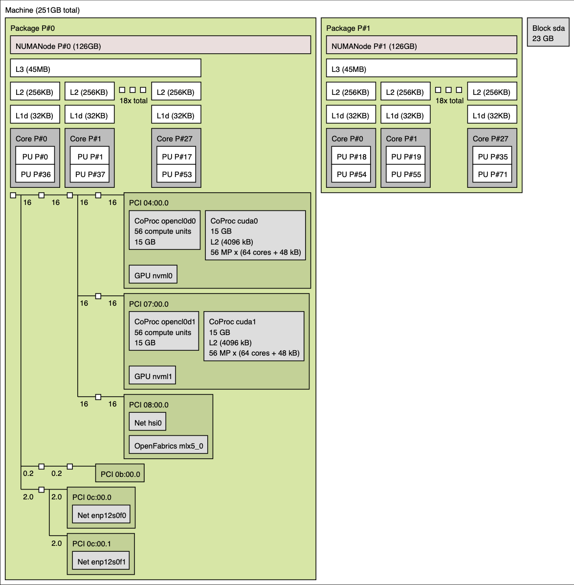
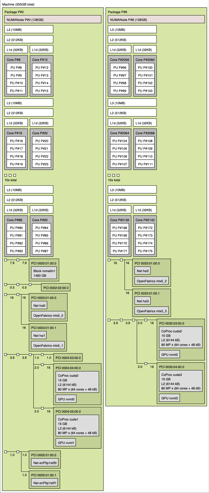
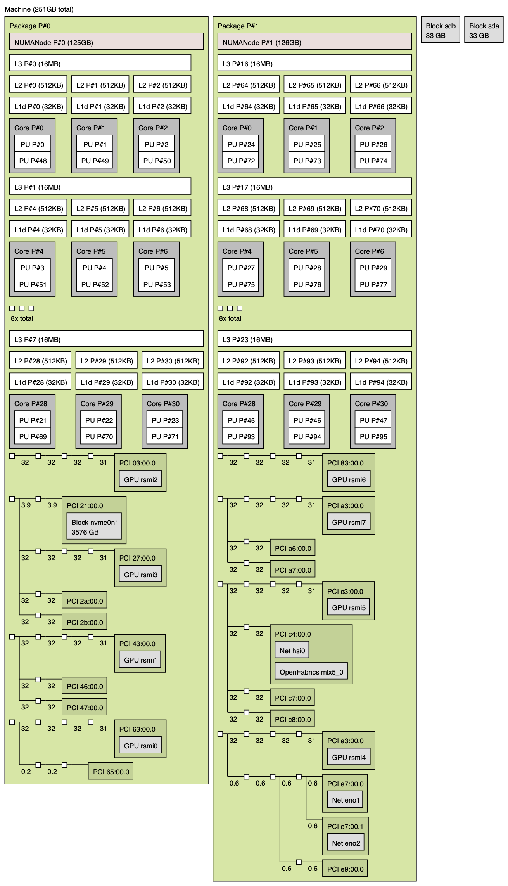
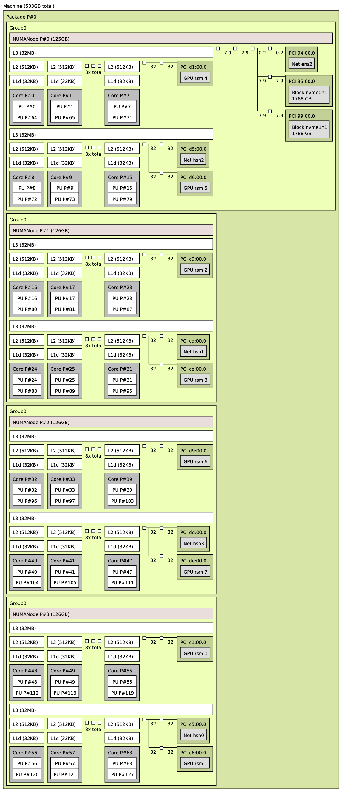

# Example architectures

Here is the node architecture of a few Livermore Computing supercomputers from our collaboration zone: `Pascal`, `Lassen`, `Corona`, and `Tioga`. A summary of key features for these machines are summarized in the table below, with images depicting the topology of each below that. In particular, notice that each of the machines has different numbers of GPUs, cores, and that `Lassen` has `2x` as many hardware threads per core as either `Pascal` or `Corona`. 

<table>
  <tr>
    <th></th>
    <th>Pascal</th>
    <th>Lassen</th>
    <th>Corona</th>
    <th>Tioga</th>
  </tr>
  <tr>
    <td rowspan="2">Per node</td>
    <td>2 Intel Broadwell processors</td>
    <td>2 IBM Power9 processors</td>
    <td>2 AMD Rome processors</td>
    <td>1 AMD Trento processor</td>
  </tr>
  <tr>
    <td>2 NVIDIA Pascal GPUs</td>
    <td>4 NVIDIA Volta GPUs</td>
    <td>8 AMD MI50 GPUs</td>
    <td>4 AMD MI250X GPUs</td>
  </tr>
  <tr>
    <td rowspan="3">Per processor</td>
    <td>1 NUMA domain</td>
    <td>1 NUMA domain</td>
    <td>1 NUMA domain</td>
    <td>4 NUMA domains</td>
  </tr>
  <tr>
    <td>1 L3, 18 L2s, 18 L1s</td>
    <td>10 L3s, 10 L2s, 20 L1s</td>
    <td>8 L3s, 24 L2s, 24 L1s</td>
    <td>8 L3s, 64 L2s, 64 L1s</td>
  </tr>
  <tr>
    <td>18 cores</td>
    <td>20 cores</td>
    <td>24 cores</td>
    <td>64 cores</td>
  </tr>
  <tr>
    <td>Per core</td>
    <td>2 hardware threads</td>
    <td>4 hardware threads</td>
    <td>2 hardware threads</td>
    <td>2 hardware threads</td>
  </tr>
</table>

|<b> Pascal </b>|
|:--:|
||

| <b> Lassen  </b> |
|:--:|
||

|<b> Corona </b>|
|:--:|
||

|<b> Tioga </b>|
|:--:|
||

<!-- Commenting out since Gitlab does not display PDFs
<object data="../hwloc/ruby.pdf" type="application/pdf" width="800px" height="800px">
</object>

<object data="../hwloc/mammoth.pdf" type="application/pdf" width="800px" height="800px">
</object>

<object data="../hwloc/corona.pdf" type="application/pdf" width="800px" height="800px">
</object>
-->
