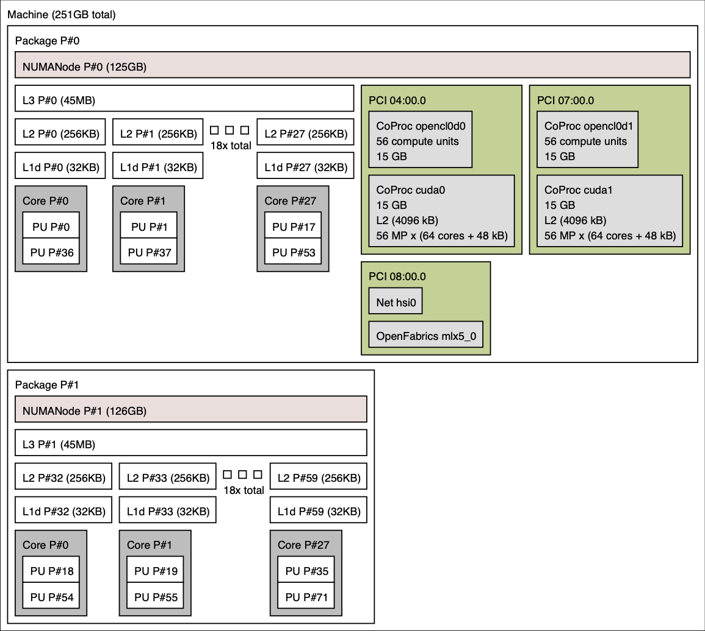

# Example architectures

Here is the node architecture of several Livermore Computing supercomputers. A summary of key features for these machines, including differing numbers of processors, NUMA domains, GPUs, and cores, are summarized in the table below, with images depicting the topology of each below that.

<table style="text-align: center">
  <tr>
    <th></th>
    <th colspan="2">Per node</th>
    <th colspan="3">Per processor</th>
    <th>Per core</th>
  </tr>
  <tr>
    <th>Corona</th>
    <td>2 AMD Rome processors</td>
    <td>8 AMD MI50 GPUs</td>
    <td>1 NUMA domain</td>
    <td>8 L3s, 24 L2s, 24 L1s</td>
    <td>24 cores</td>
    <td>2 HW threads</td>    
  </tr>
  <tr>
    <th>Lassen</th>
    <td>2 IBM Power9 processors</td>
    <td>4 NVIDIA Volta GPUs</td>
    <td>1 NUMA domain</td>
    <td>10 L3s, 10 L2s, 20 L1s</td>
    <td>20 cores</td>
    <td>4 HW threads</td>    
  </tr>
  <tr>
    <th>Pascal</th>
    <td>2 Intel Broadwell processors</td>
    <td>2 NVIDIA Pascal GPUs</td>
    <td>1 NUMA domain</td>
    <td>1 L3, 18 L2s, 18 L1s</td>
    <td>18 cores</td>
    <td>2 HW threads</td>    
  </tr>
  <tr>
    <th>Poodle</th>
    <td>2 Intel Sapphire Rapids processors</td>
    <td></td>
    <td>4 NUMA domains</td>
    <td>1 L3, 56 L2s, 56 L1s</td>
    <td>56 cores</td>
    <td>2 HW threads</td>    
  </tr>
  <tr>
    <th>RZAdams</th>
    <td colspan="2">4 AMD Instinct MI300A APUs: 
      4 processors + 4 GPUs</td>
    <td>1 NUMA domain</td>
    <td>3 L3s, 24 L2s, 24 L1s</td>
    <td>24 cores</td>
    <td>2 HW threads</td>    
  </tr>
  <tr>
    <th>Tioga</th>
    <td>1 AMD 3rd Gen EPYC processor</td>
    <td>8 AMD Instinct MI250X GPUs</td>
    <td>4 NUMA domains</td>
    <td>8 L3s, 64 L2s, 64 L1s</td>
    <td>64 cores</td>
    <td>2 HW threads</td>
  </tr>
  <tr>
    <th></th>
    <td></td>
    <td></td>
    <td></td>
    <td></td>
    <td></td>
    <td></td>    
  </tr>
</table>

|<b> Tioga </b>|
|:--:|
|")|

|<b> RZAdams </b>|
|:--:|
|")|

|<b> Corona </b>|
|:--:|
||

|<b> Pascal </b>|
|:--:|
||

|<b> Poodle </b>|
|:--:|
||

|<b> Lassen </b>|
|:--:|
||

<!-- Commenting out since Gitlab does not display PDFs
<object data="../hwloc/ruby.pdf" type="application/pdf" width="800px" height="800px">
</object>

<object data="../hwloc/mammoth.pdf" type="application/pdf" width="800px" height="800px">
</object>

<object data="../hwloc/corona.pdf" type="application/pdf" width="800px" height="800px">
</object>
-->
