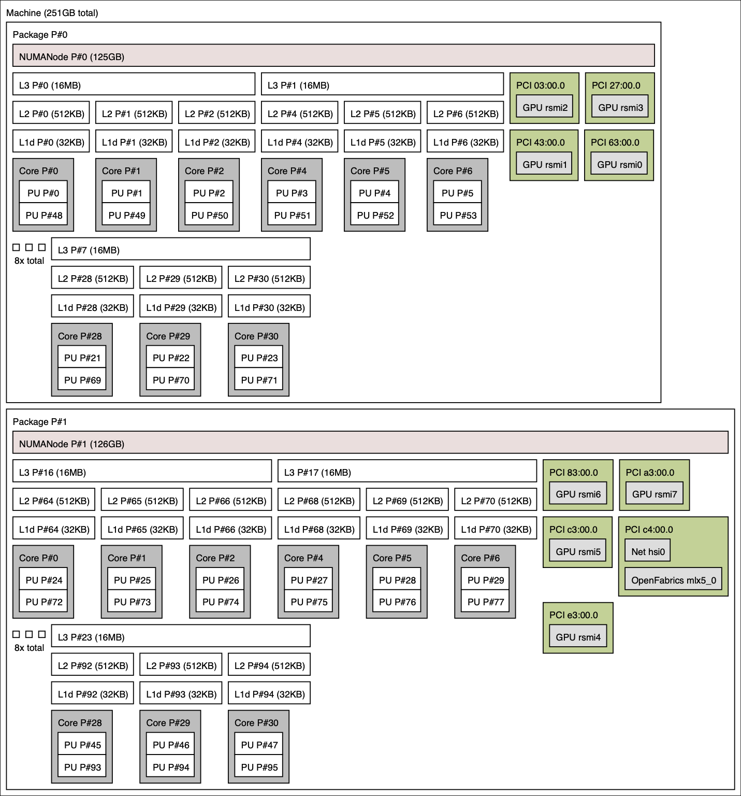
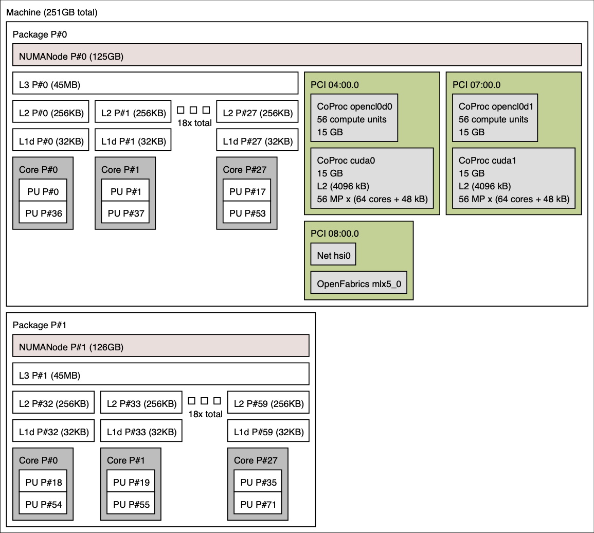

# Example architectures

Here is the node architecture of a few Livermore Computing supercomputer: `Tioga`, `RZAdams`, `Corona`, and `Pascal`. A summary of key features for these machines, including differing numbers of processors, NUMA domains, GPUs, and cores, are summarized in the table below, with images depicting the topology of each below that.

In particular, note that `Tioga` includes MI250X GPUs and `RZAdams` is composed of MI300A APUs.

<table>
  <tr>
    <th></th>
    <th>Tioga</th>
    <th>RZAdams</th>
    <th>Corona</th>
    <th>Pascal</th>
  </tr>
  <tr>
    <td rowspan="2">Per node</td>
    <td>1 AMD 3rd Gen EPYC processor</td>
    <td rowspan="2">4 AMD Instinct MI300A APUs:
    	4 processors + 4 GPUs</td>
    <td>2 AMD Rome processors</td>
    <td>2 Intel Broadwell processors</td>
  </tr>
  <tr>
    <td>8 AMD Instinct MI250X GPUs</td>
    <td>8 AMD MI50 GPUs</td>
    <td>2 NVIDIA Pascal GPUs</td>
  </tr>
  <tr>
    <td rowspan="3">Per processor</td>
    <td>4 NUMA domains</td>
    <td>1 NUMA domain</td>
    <td>1 NUMA domain</td>
    <td>1 NUMA domain</td>
  </tr>
  <tr>
    <td>8 L3s, 64 L2s, 64 L1s</td>
    <td>3 L3s, 24 L2s, 24 L1s</td>
    <td>8 L3s, 24 L2s, 24 L1s</td>
    <td>1 L3, 18 L2s, 18 L1s</td>
  </tr>
  <tr>
    <td>64 cores</td>
    <td>24 cores</td>
    <td>24 cores</td>
    <td>18 cores</td>
  </tr>
  <tr>
    <td>Per core</td>
    <td>2 hardware threads</td>
    <td>2 hardware threads</td>
    <td>2 hardware threads</td>
    <td>2 hardware threads</td>
  </tr>
</table>

|<b> Tioga </b>|
|:--:|
|")|

|<b> RZAdams </b>|
|:--:|
|")|

|<b> Corona </b>|
|:--:|
||

|<b> Pascal </b>|
|:--:|
||

<!-- Commenting out since Gitlab does not display PDFs
<object data="../hwloc/ruby.pdf" type="application/pdf" width="800px" height="800px">
</object>

<object data="../hwloc/mammoth.pdf" type="application/pdf" width="800px" height="800px">
</object>

<object data="../hwloc/corona.pdf" type="application/pdf" width="800px" height="800px">
</object>
-->
