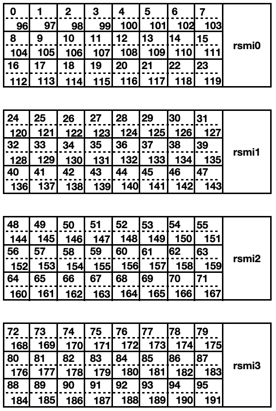
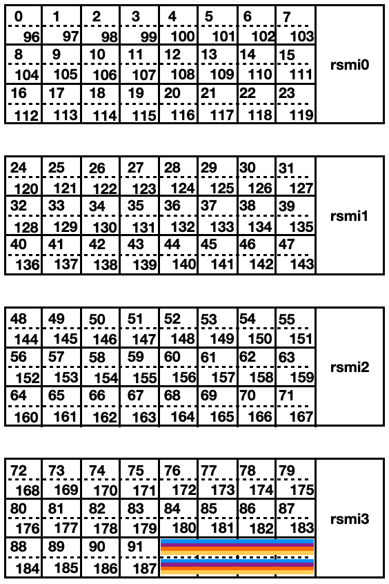
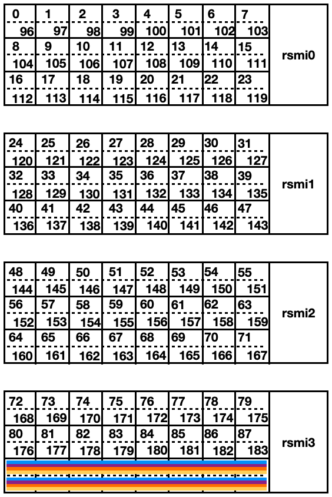
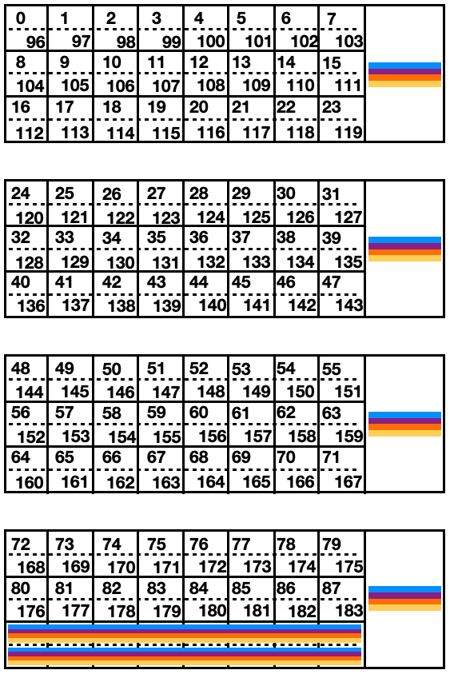
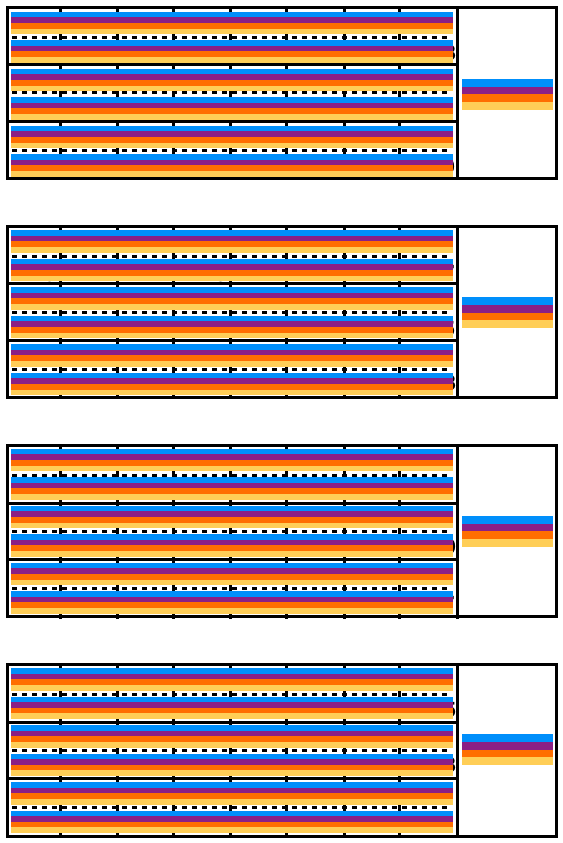
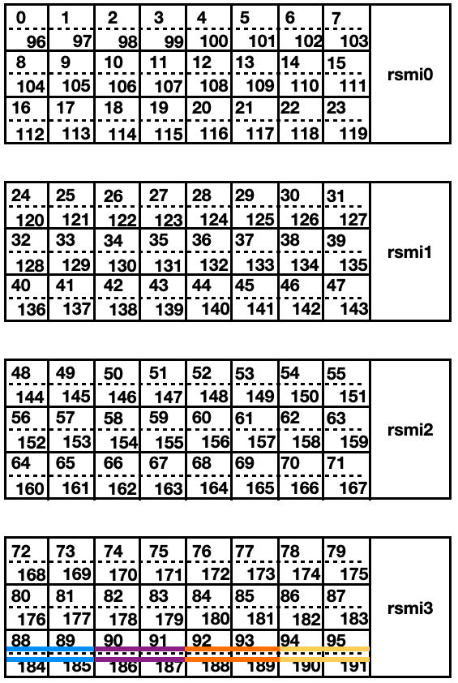
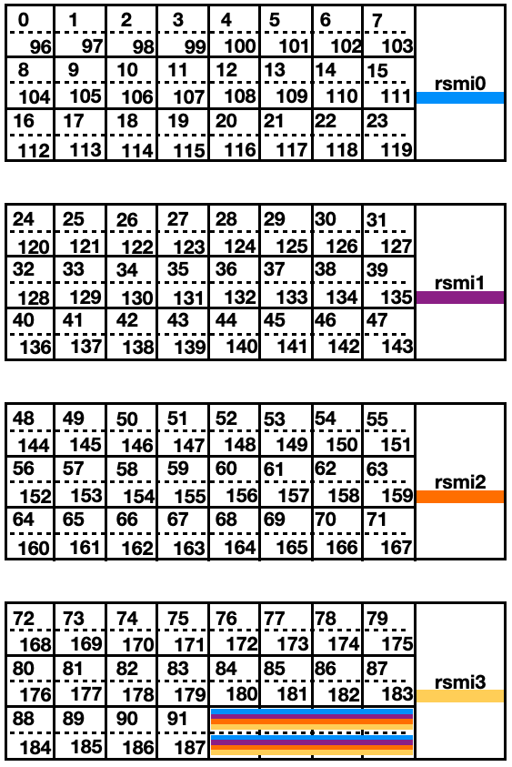
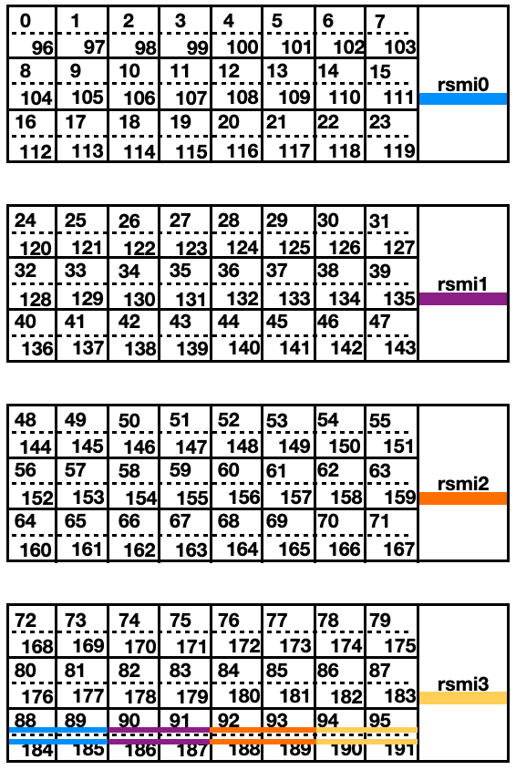
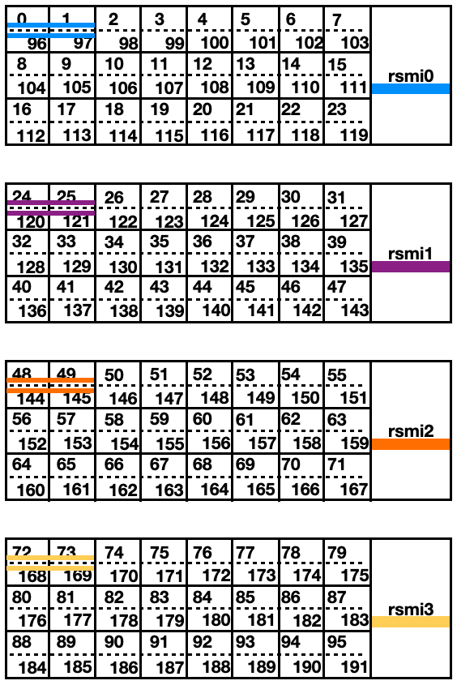
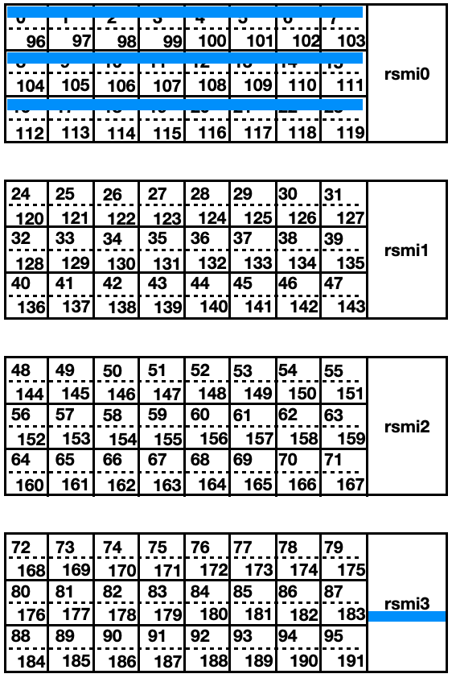

<!--
Todos
Regenerate machine diagrams 
--> 

# Module 4: Flux affinity on the AMD MI300A APU

*Edgar A. León* and *Jane E. Herriman*<br>
Lawrence Livermore National Laboratory

## Table of Contents

1. Making sense of affinity: [Discovering the node architecture topology](module1.md)
2. Exerting resource manager affinity: [Process affinity with Slurm](module2.md)
3. Putting it all together: [Adding in GPUs](module3.md)
4. Flux affinity on the AMD MI300A APU
   1. [Learning objectives](#learning-objectives)
   1. [Machine topology](#machine-topology)
   1. [Flux basics and default affinity](#flux-basics-and-default-affinity)
   1. [Controlling affinity with Flux](#controlling-affinity-with-flux)
   1. [References](#references)

## Learning objectives

* Understand locality on the MI300A APU
* Get acquainted with common flux commands like `flux alloc` and `flux run`
* Observe how tasks in Flux are assigned to CPU & GPU resources by default
* Learn how to change affinity policies in flux for CPU & GPU resources to
   * force tasks to spread out across available resources
   * map to particular, user-specified resources

## Machine topology

Before talking about binding and affinity, let's make sure we
understand the machine topology. There are a few example
architectures [here](archs.md). In this document, we focus on the
`RZAdams` MI300A architecture.

RZAdams has 4 NUMA domains, each with 24 cores, 3 `L3` caches and 1
GPU. Each GPU is closest (local) to the 24 cores on the same NUMA
domain.  This is shown in the following schematic that we'll be using
to visualize a node on RZAdams: 

<p align="center">
   
</p>

Each of the four panels represents a NUMA domain; the resources in
each row are associated with a different `L3` cache. Dashed lines
separate the two hardware threads associated with each core. Later,
tasks will be shown as colored rectangles that span one or more cores
or GPUs (with different colors representing distinct tasks). 

Since the affinity programs used in this document use PCI IDs to
identify GPUs, the following table provides the equivalent ordinal
numbers and their associated NUMA domains.


<table style="text-align:center;margin-left:auto;margin-right:auto;">
  <tr>
    <td colspan="3">NUMA 0</td>
    <td colspan="3">NUMA 1</td>
    <td colspan="3">NUMA 2</td>
    <td colspan="3">NUMA 3</td>
  </tr>
  <tr>
    <td>L3</td>
    <td>L3</td>
    <td>L3</td>
    <td>L3</td>
    <td>L3</td>
    <td>L3</td>
    <td>L3</td>
    <td>L3</td>
    <td>L3</td>
    <td>L3</td>
    <td>L3</td>
    <td>L3</td>
  </tr>
  <tr>
    <td>Cores<br>0-7</td>
    <td>Cores<br>8-15</td>
    <td>Cores<br>16-23</td>
    <td>Cores<br>24-31</td>
    <td>Cores<br>32-39</td>
    <td>Cores<br>40-47</td>
    <td>Cores<br>48-55</td>
    <td>Cores<br>56-63</td>
    <td>Cores<br>64-71</td>
    <td>Cores<br>72-79</td>
    <td>Cores<br>80-87</td>
    <td>Cores<br>88-95</td>
  </tr>
  <tr>
    <td colspan="3">GPU 0<br>0x0000:02</td>
    <td colspan="3">GPU 1<br>0x0001:02</td>
    <td colspan="3">GPU 2<br>0x0002:02</td>
    <td colspan="3">GPU 3<br>0x0003:02</td>    
  </tr>
</table>


## Flux basics and default affinity 

[Flux](#references) is a modern resource manager for heterogeneous
supercomputers. While Flux has many features, we focus on
the following simple and commonly used options:

```
-N<nnodes>
-n<ntasks>
-c<ncores-per-task>
-g<ngpus-per-task>
--exclusive
```

First, let's obtain a node allocation to demonstrate some of these
options.

<!--
Not needed when using a topology file via MPIBIND_TOPOFILE

Make sure that the appropriate GPU libraries are loaded
in. For Tioga, which has AMD GPUs, load the ROCm library.
$ module load rocm
-->

```
# For clusters with exclusive nodes
$ flux alloc -N1

# For clusters with shared nodes, use --exclusive the get the whole node
$ flux alloc -N1 --exclusive
```

Once a node has been allocated for us, let's launch a simple program:

<details>
<summary>

```
$ flux run -N1 -n4 ./mpi+gpu
```
</summary>

```
rzadams1004 Task   3/  4 running on 8 CPUs: 92-95,188-191
            Task   3/  4 has 0 GPUs:
rzadams1004 Task   1/  4 running on 8 CPUs: 92-95,188-191
            Task   1/  4 has 0 GPUs:
rzadams1004 Task   0/  4 running on 8 CPUs: 92-95,188-191
            Task   0/  4 has 0 GPUs:
rzadams1004 Task   2/  4 running on 8 CPUs: 92-95,188-191
            Task   2/  4 has 0 GPUs:
```



</details>

The `mpi+gpu` program shows the CPUs and GPUs assigned to each
task. This is helpful to understand the affinity policies implemented
by Flux. By default Flux allocates one core per
task (two hardware threads or CPUs per task). With 4 tasks we get `4 tasks = 4 cores = 4 cores x 2 CPU/core = 8 CPUs = 8 hardware threads`. But, note that
each task can run on any of the assigned cores.

Let's change the number of cores per task with `-c`:

<details>
<summary>

```
$ flux run -N1 -n4 -c2 ./mpi+gpu
```
</summary>

```
rzadams1004 Task   3/  4 running on 16 CPUs: 88-95,184-191
            Task   3/  4 has 0 GPUs:
rzadams1004 Task   2/  4 running on 16 CPUs: 88-95,184-191
            Task   2/  4 has 0 GPUs:
rzadams1004 Task   0/  4 running on 16 CPUs: 88-95,184-191
            Task   0/  4 has 0 GPUs
rzadams1004 Task   1/  4 running on 16 CPUs: 88-95,184-191
            Task   1/  4 has 0 GPUs:
```



</details>

We now got 16 CPUs, because we asked for 4 tasks with 2 cores each (`8 cores = 16 CPUs`).


Now let's ask for one GPU per task:

<details>
<summary>

```
$ flux run -N1 -n4 -c2 -g1 ./mpi+gpu
```
</summary>

```
rzadams1004 Task   0/  4 running on 16 CPUs: 88-95,184-191
            Task   0/  4 has 4 GPUs: 0000:02 0001:02 0002:02 0003:02 
rzadams1004 Task   1/  4 running on 16 CPUs: 88-95,184-191
            Task   1/  4 has 4 GPUs: 0000:02 0001:02 0002:02 0003:02 
rzadams1004 Task   2/  4 running on 16 CPUs: 88-95,184-191
            Task   2/  4 has 4 GPUs: 0000:02 0001:02 0002:02 0003:02 
rzadams1004 Task   3/  4 running on 16 CPUs: 88-95,184-191
            Task   3/  4 has 4 GPUs: 0000:02 0001:02 0002:02 0003:02
```



</details>

Since we asked for 4 tasks, we got 4
GPUs. But, note that each task is assigned to all four GPUs. And, if
the user does not specify a GPU, the default GPU for all the tasks is
GPU `0x0000:02`.

Finally, let's ask for all of the resources of the node with `--exclusive`:

<details>
<summary>

```
flux run -N1 -n4 --exclusive ./mpi+gpu
```
</summary>

```
rzadams1004 Task   0/  4 running on 192 CPUs: 0-191
            Task   0/  4 has 4 GPUs: 0000:02 0001:02 0002:02 0003:02
rzadams1004 Task   1/  4 running on 192 CPUs: 0-191
            Task   1/  4 has 4 GPUs: 0000:02 0001:02 0002:02 0003:02
rzadams1004 Task   3/  4 running on 192 CPUs: 0-191
            Task   3/  4 has 4 GPUs: 0000:02 0001:02 0002:02 0003:02
rzadams1004 Task   2/  4 running on 192 CPUs: 0-191
            Task   2/  4 has 4 GPUs: 0000:02 0001:02 0002:02 0003:02
```



</details>

We got 96 cores (96x2 CPUs) and all 4 GPUs.

This is a dangerous configuration to run under, because each task can
run on any CPUs and any GPUs. The Operating System (OS) may decide to
migrate processes
from one CPU to another, losing cache and main memory locality
resulting in cache-to-cache transfers and remote memory accesses. For
the GPUs, if processes do not specify a GPU, kernels from all the
processes will run on a single GPU: `0x0000:02`.

When using `--exclusive`, make sure to also use `-N<nnodes>`,
otherwise Flux will complain.


## Controlling affinity with Flux

Now that we reviewed some basic Flux commands and pitfalls, let's see
what type of affinity and binding we can use with the `flux
run` interface. Here are the options we will use:

```
-o cpu-affinity=per-task
-o cpu-affinity=map:<list>
-o gpu-affinity=per-task
-o gpu-affinity=map:<list>
```

In the following example, we use `cpu-affinity` in conjuction with `-c`
to ask Flux to bind each task to two cores. Note that if
`cpu-affinity` is not used, each task is bound to all of the
requested cores (4x2) as we saw above.


<details>
<summary>

```
$ flux run -N1 -n4 -c2 -o cpu-affinity=per-task ./mpi+gpu
```
</summary>

```
rzadams1004 Task   3/  4 running on 4 CPUs: 94-95,190-191
rzadams1004 Task   2/  4 running on 4 CPUs: 92-93,188-189
rzadams1004 Task   1/  4 running on 4 CPUs: 90-91,186-187
rzadams1004 Task   0/  4 running on 4 CPUs: 88-89,184-185
            Task   3/  4 has 0 GPUs:
            Task   2/  4 has 0 GPUs:
            Task   1/  4 has 0 GPUs:
            Task   0/  4 has 0 GPUs:
```



</details>


Things are getting better! Each task has a unique set of
2 cores to run under.

Let's apply a similar strategy for GPUs using `gpu-affinity`:

<details>
<summary>

```
$ flux run -N1 -n4 -g1 -o gpu-affinity=per-task ./mpi+gpu
```
</summary>

```
rzadams1004 Task   3/  4 running on 8 CPUs: 92-95,188-191
rzadams1004 Task   2/  4 running on 8 CPUs: 92-95,188-191
rzadams1004 Task   1/  4 running on 8 CPUs: 92-95,188-191
rzadams1004 Task   0/  4 running on 8 CPUs: 92-95,188-191
           Task   3/  4 has 1 GPUs: 0003:02
           Task   2/  4 has 1 GPUs: 0002:02
           Task   1/  4 has 1 GPUs: 0001:02
           Task   0/  4 has 1 GPUs: 0000:02
```



</details>

We asked for 1 GPU per task and each task got a unique GPU!

Putting the CPU and GPU affinity options together:

<details>
<summary>

```
$ flux run -N1 -n4 -c2 -g1 -o cpu-affinity=per-task -o gpu-affinity=per-task ./mpi+gpu
```
</summary>

```
rzadams1004 Task   3/  4 running on 4 CPUs: 94-95,190-191
rzadams1004 Task   2/  4 running on 4 CPUs: 92-93,188-189
rzadams1004 Task   1/  4 running on 4 CPUs: 90-91,186-187
rzadams1004 Task   0/  4 running on 4 CPUs: 88-89,184-185
            Task   3/  4 has 1 GPUs: 0003:02
            Task   2/  4 has 1 GPUs: 0002:02
            Task   1/  4 has 1 GPUs: 0001:02
            Task   0/  4 has 1 GPUs: 0000:02
```




</details>


Nice. But, *locality* is not a primary consideration here:
Only process 3 is using a local GPU. Ay.

Okay, we keep going: Let's ask Flux for one GPU per task and then we choose CPUs that are local to those GPUs. For this purpose, we will use the `map` clause
of `cpu-affinity`. 

As we saw earlier, the assigned GPUs are local to cores 0-23, 24-47, 48-71,
and 72-95, respectively. So, let's pick 2 cores (4 CPUs), one from each set and assign them to the appropriate MPI tasks.

<details>
<summary>

```
flux run -N1 -n4 -g1 -o gpu-affinity=per-task -o cpu-affinity='map:0-1,96-97;24-25,120-121;48-49,144-145;72-73,168-169' ./mpi+gpu
```
</summary>

```
rzadams1004 Task   3/  4 running on 4 CPUs: 72-73,168-169
            Task   3/  4 has 1 GPUs: 0003:02
rzadams1004 Task   1/  4 running on 4 CPUs: 24-25,120-121
            Task   1/  4 has 1 GPUs: 0001:02
rzadams1004 Task   0/  4 running on 4 CPUs: 0-1,96-97
            Task   0/  4 has 1 GPUs: 0000:02
rzadams1004 Task   2/  4 running on 4 CPUs: 48-49,144-145
            Task   2/  4 has 1 GPUs: 0002:02
```



</details>

Voilà. That's better.

Similarly, we can use the `map` clause of `gpu-affinity` to request arbitrary GPUs. Combined with `map` of `cpu-affinity`, we can construct arbitrary mappings, which may be useful on a variety of scenarios such as benchmarking local or remote memory transfers.

For example, let's say we want to measure the data transfer rate between NUMA domain 0 and memory on GPU 3 (0x0003:02). We would place our benchmark like this:

<details>
<summary>

```
flux run -N1 -n1 -o cpu-affinity='map:0-23' -o gpu-affinity='map:3' ./mpi+gpu
```
</summary>

```
rzadams1004 Task   0/  1 running on 24 CPUs: 0-23
            Task   0/  1 has 1 GPUs: 0003:02
```



</details>


## References

* [Exercising affinity in Flux](https://github.com/LLNL/mpibind/tree/master/tutorials/flux)
* [Intro to Flux](https://hpc-tutorials.llnl.gov/flux/)
* [flux-run](https://flux-framework.readthedocs.io/projects/flux-core/en/latest/man1/flux-run.html)
* [flux-shell](https://flux-framework.readthedocs.io/projects/flux-core/en/latest/man1/flux-shell.html)
* [Flux documentation](https://flux-framework.readthedocs.io/en/latest/)
* [Flux tutorials](https://github.com/flux-framework/Tutorials)


