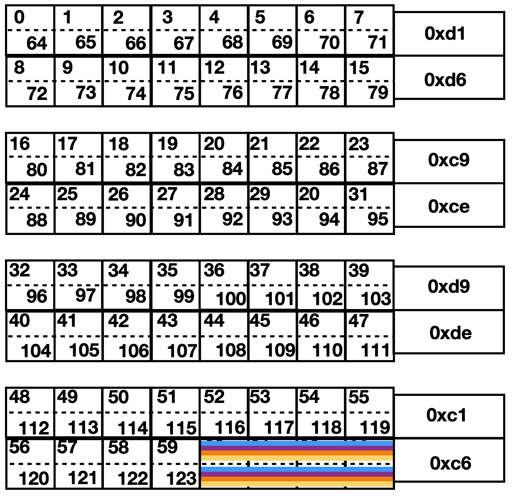

<!--
Built mpibind for TOSS 4 (rzalastor,
use compatibility flags, e.g., march...)
-->

# Exercising Affinity in Flux

**Edgar A. Leon** and **Jane E. Herriman**<br>
Lawrence Livermore National Laboratory

<!-- Livermore Computing<br> 19 October 2022 -->
<!-- Livermore Computing User Forum<br>13 December 2022 -->
<!-- El Capitan Center of Excellence<br> -->

*Updated March 27, 2023*

## Table of contents

1. [Machine topology](#1-machine-topology)
1. [Flux basics](#2-flux-basics)
1. [Basic affinity with Flux](#3-basic-affinity-with-flux)
1. [Affinity with mpibind](#4-affinity-with-mpibind)
    1. [Is mpibind enabled?](#4i-is-mpibind-enabled)
    1. [If nothing else, ask for the whole node!](#4ii-if-nothing-else-ask-for-the-whole-node)
    1. [Remote memory accesses is a no, no,
    but...](#4iii-remote-memory-accesses-is-a-no-no-but)
    1. [I want more (hardware threads)!](#4iv-i-want-more-hardware-threads)
    1. [Let me drive (your OpenMP)](#4v-let-me-drive-your-openmp)
    1. [How about system noise?](#4vi-how-about-system-noise)
1. [References](#references)

## 1. Machine topology

Before talking about binding and affinity, let's make sure we
understand the machine topology. There are a few example
architectures [here](../common/archs.md). In this document, we focus on the
`Tioga` architecture.

Tioga has 4 NUMA domains, each with 16 cores, 2 `L3` caches and 2
GPUs. Each GPU is closest (local) to the 8 cores with which it shares an `L3`
cache.  This is shown in the following schematic that we'll be using to visualize a node on Tioga:

<p align="center">
   
</p>

Each of the four panels represents a NUMA domain; the resources in each row are associated with a different `L3` cache. Dashed lines separate the two hardware threads associated with each core. Later, tasks will be shown as colored rectangles that span one or more cores or GPUs (with different colors representing distinct tasks).

Since the affinity programs used in this document use PCI IDs to
identify GPUs, the following table provides the equivalent ordinal
numbers and their associated NUMA domains.


<table style="text-align:center;margin-left:auto;margin-right:auto;">
  <tr>
    <td colspan="2">NUMA 0</td>
    <th colspan="2">NUMA 1</th>
    <td colspan="2">NUMA 2</td>
    <td colspan="2">NUMA 3</td>
  </tr>
  <tr>
    <td>L3</td>
    <td>L3</td>
    <th>L3</th>
    <th>L3</th>
    <td>L3</td>
    <td>L3</td>
    <th>L3</th>
    <td>L3</td>
  </tr>
  <tr>
    <td>Cores<br>0-7</td>
    <td>Cores<br>8-15</td>
    <th>Cores<br>16-23</th>
    <th>Cores<br>24-31</th>
    <td>Cores<br>32-39</td>
    <td>Cores<br>40-47</td>
    <th>Cores<br>48-55</th>
    <td>Cores<br>56-63</td>
  </tr>
  <tr>
    <td>GPU 4<br>0xd1</td>
    <td>GPU 5<br>0xd6</td>
    <th>GPU 2<br>0xc9</th>
    <th>GPU 3<br>0xce</th>
    <td>GPU 6<br>0xd9</td>
    <td>GPU 7<br>0xde</td>
    <th>GPU 0<br>0xc1</th>
    <td>GPU 1<br>0xc6</td>
  </tr>
</table>


## 2. Flux basics

[Flux](#references) is a modern resource manager for heterogeneous
supercomputers. While Flux has many features, we focus on
the following simple and commonly used options:

```
-N<nnodes>
-n<ntasks>
-c<ncores-per-task>
-g<ngpus-per-task>
--exclusive
```

First, let's obtain a node allocation to demonstrate some of these
options.

<!--
Not needed when using a topology file via MPIBIND_TOPOFILE

Make sure that the appropriate GPU libraries are loaded
in. For Tioga, which has AMD GPUs, load the ROCm library.
$ module load rocm
-->

```
# For clusters with exclusive nodes
$ flux alloc -N1

# For clusters with shared nodes, use --exclusive the get the whole node
$ flux alloc -N1 --exclusive
```

Once a node has been allocated for us, let's launch a simple program:

<details>
<summary>

```
$ flux run -N1 -n4 ./mpi-tioga
```
</summary>

```
tioga19    Task   2/  4 running on 8 CPUs: 60-63,124-127
           Task   2/  4 has 0 GPUs:
tioga19    Task   1/  4 running on 8 CPUs: 60-63,124-127
           Task   1/  4 has 0 GPUs:
tioga19    Task   3/  4 running on 8 CPUs: 60-63,124-127
           Task   3/  4 has 0 GPUs:
tioga19    Task   0/  4 running on 8 CPUs: 60-63,124-127
           Task   0/  4 has 0 GPUs:
```



</details>

The `mpi-tioga` program shows the CPUs and GPUs assigned to each
task. This is helpful to understand the affinity policies implemented
by Flux and those by mpibind. By default Flux allocates one core per
task (two hardware threads, or CPUs, per task). With 4 tasks we get `4 tasks = 4 cores = 4 cores x 2 CPU/core = 8 CPUs = 8 hardware threads`. But, note that
each task can run on any of the assigned cores.

Let's change the number of cores per task with `-c`:

<details>
<summary>

```
$ flux run -N1 -n4 -c2 ./mpi-tioga
```
</summary>

```
tioga19    Task   2/  4 running on 16 CPUs: 56-63,120-127
tioga19    Task   3/  4 running on 16 CPUs: 56-63,120-127
tioga19    Task   1/  4 running on 16 CPUs: 56-63,120-127
tioga19    Task   0/  4 running on 16 CPUs: 56-63,120-127
```


</details>

We now got 16 CPUs, because we asked for 4 tasks with 2 cores each (`8 cores = 16 CPUs`).


Now let's ask for one GPU per task:

<details>
<summary>

```
$ flux run -N1 -n4 -c2 -g1 ./mpi-tioga
```
</summary>

```
tioga19    Task   2/  4 running on 16 CPUs: 56-63,120-127
           Task   2/  4 has 4 GPUs: 0xd1 0xd6 0xd9 0xde
tioga19    Task   3/  4 running on 16 CPUs: 56-63,120-127
           Task   3/  4 has 4 GPUs: 0xd1 0xd6 0xd9 0xde
tioga19    Task   1/  4 running on 16 CPUs: 56-63,120-127
           Task   1/  4 has 4 GPUs: 0xd1 0xd6 0xd9 0xde
tioga19    Task   0/  4 running on 16 CPUs: 56-63,120-127
           Task   0/  4 has 4 GPUs: 0xd1 0xd6 0xd9 0xde
```


</details>

Since we asked for 4 tasks, we got 4
GPUs. But, note that each task is assigned to all four GPUs. And, if
the user does not specify a GPU, the default GPU for all the tasks is
GPU `0xd1`.

Finally, let's ask for all of the resources of the node with `--exclusive`:

<details>
<summary>

```
flux run -N1 -n4 --exclusive ./mpi-tioga
```
</summary>

```
tioga19    Task   2/  4 running on 128 CPUs: 0-127
           Task   2/  4 has 8 GPUs: 0xc1 0xc6 0xc9 0xce 0xd1 0xd6 0xd9 0xde
tioga19    Task   1/  4 running on 128 CPUs: 0-127
           Task   1/  4 has 8 GPUs: 0xc1 0xc6 0xc9 0xce 0xd1 0xd6 0xd9 0xde
tioga19    Task   3/  4 running on 128 CPUs: 0-127
           Task   3/  4 has 8 GPUs: 0xc1 0xc6 0xc9 0xce 0xd1 0xd6 0xd9 0xde
tioga19    Task   0/  4 running on 128 CPUs: 0-127
           Task   0/  4 has 8 GPUs: 0xc1 0xc6 0xc9 0xce 0xd1 0xd6 0xd9 0xde
```


</details>

We got 64 cores (64x2 CPUs) and all 8 GPUs.

This is a dangerous configuration to run under, because each task can
run on any CPUs and any GPUs. The Operating System (OS) may decide to
migrate processes
from one CPU to another, losing cache and main memory locality
resulting in cache-to-cache transfers and remote memory accesses. For
the GPUs, if processes do not specify a GPU, kernels from all the
processes will run on a single GPU: `0xc1`.

When using `--exclusive`, make sure to also use `-N<nnodes>`,
otherwise Flux will complain.


## 3. Basic affinity with Flux

Now that we reviewed some basic Flux commands and pitfalls, let's see
what type of affinity and binding we can use with the `flux
run` interface. Here are the options we will use:

```
-o cpu-affinity=off|per-task
-o gpu-affinity=off|per-task
```

<!--
-o cpu-affinity=map:<list-of-cpus>
-->

In the following example, we use `cpu-affinity` in conjuction with `-c`
to ask Flux to bind each task to two cores. Note that if
`cpu-affinity` is not used, each task is bound to all of the
requested cores (4x2) as we saw above.


<details>
<summary>

```
$ flux run -N1 -n4 -c2 -o cpu-affinity=per-task ./mpi-tioga
```
</summary>

```
tioga19    Task   2/  4 running on 4 CPUs: 60-61,124-125
tioga19    Task   1/  4 running on 4 CPUs: 58-59,122-123
tioga19    Task   3/  4 running on 4 CPUs: 62-63,126-127
tioga19    Task   0/  4 running on 4 CPUs: 56-57,120-121
```


</details>


Things are getting better! Each task has a unique set of
2 cores to run under.

Let's apply a similar strategy for GPUs using `gpu-affinity`:

<details>
<summary>

```
$ flux run -N1 -n4 -g1 -o gpu-affinity=per-task ./mpi-tioga
```
</summary>

```
tioga19    Task   1/  4 running on 8 CPUs: 60-63,124-127
           Task   1/  4 has 1 GPUs: 0xd6
tioga19    Task   3/  4 running on 8 CPUs: 60-63,124-127
           Task   3/  4 has 1 GPUs: 0xde
tioga19    Task   0/  4 running on 8 CPUs: 60-63,124-127
           Task   0/  4 has 1 GPUs: 0xd1
tioga19    Task   2/  4 running on 8 CPUs: 60-63,124-127
           Task   2/  4 has 1 GPUs: 0xd9
```


</details>

We asked for 1 GPU per task and each task got a unique GPU!

Putting the CPU and GPU affinity options together:

<details>
<summary>

```
$ flux run -N1 -n4 -c2 -g1 -o cpu-affinity=per-task -o gpu-affinity=per-task ./mpi-tioga
```
</summary>

```
tioga19    Task   2/  4 running on 4 CPUs: 60-61,124-125
           Task   2/  4 has 1 GPUs: 0xd9
tioga19    Task   1/  4 running on 4 CPUs: 58-59,122-123
           Task   1/  4 has 1 GPUs: 0xd6
tioga19    Task   3/  4 running on 4 CPUs: 62-63,126-127
           Task   3/  4 has 1 GPUs: 0xde
tioga19    Task   0/  4 running on 4 CPUs: 56-57,120-121
           Task   0/  4 has 1 GPUs: 0xd1
```


</details>


Nice. But, *locality* is not a primary consideration here:
None of the processes are using local GPUs: The only local GPU to
cores 56-63 is 0xc6, which is not being used. Ay.


<!--
Case 1: Based on Flux's selection of GPUs, choose the right CPUs.
We can't use the `map` clause as I thought we would, because it would
require allocating the node exclusively with `--exclusive`. When
allocating the node exclusively, options like `-g1` does not work
anymore.

Case 2: Select the right CPUs and then let mpibind select the GPUs. 
We would have to use the `--excluisve` option to use the `map` clause
of `cpu-affinity`. Even if this is successful, mpibind disables
`cpu-affinity` so the selected set of CPUs would be ignored.

There are a few associated Flux issues with this:
https://github.com/flux-framework/flux-core/issues/5342
https://github.com/flux-framework/flux-core/issues/5351
https://github.com/flux-framework/flux-core/issues/5352

This is what I was going to write...

To get local CPUs to the assigned GPUs, we will use the `map` clause
of `cpu-affinity`. 

First, the assigned GPUs are local to cores 0-7, 8-15, 32-39,
and 40-47. So, let's pick 4 CPUs, one from each set and assign them to
the appropriate MPI tasks.

flux run -N1 -n4 -o mpibind=off -x -g1 -o cpu-affinity='map:0-1;8-9;32-33;40-41' -o gpu-affinity=per-task ./mpi-tioga
-->


## 4. Affinity with mpibind

<br>


<br>

`mpibind` is a memory-driven algorithm to map parallel hybrid
applications to the underlying hardware resources transparently,
efficiently, and portably. Unlike other mappings, its primary design
point is the memory system, including the cache hierarchy. Compute
elements are selected based on a memory mapping and not vice versa. In
addition, mpibind embodies a global awareness of hybrid programming
abstractions as well as heterogeneous systems with accelerators.

Key design principles:

* Generate mappings automatically with minimum user input
* Maximize cache and memory per worker
* Leverage resource locality based on node topology
* Optimize mappings based on a given type of resource
* Avoid remote memory accesses


In this document, we focus on the following options:

```
-o mpibind=off|on
-o mpibind=verbose:0|1
-o mpibind=greedy:0|1
-o mpibind=smt:<n>
-o mpibind=corespec_(first|numa):<n>
```

Multiple options can be specified by using commas, e.g.:

```
-o mpibind=verbose:1,smt:2
```

### 4.i. Is mpibind enabled?

If `mpibind` is enabled on your system, you should see the
mappings when enabling verbosity:

<details>
<summary>

```
$ flux run -N1 -n2 -o mpibind=verbose:1 /bin/true
```
</summary>

```
0.447s: flux-shell[0]: mpibind:
mpibind: task  0 nths  1 gpus 1 cpus 62
mpibind: task  1 nths  1 gpus 1 cpus 63
```
</details>

If, on the other hand, the output is empty, then you need to tell Flux
to use mpibind. Here's one way to do it:

```
export FLUX_SHELL_RC_PATH=<mpibind-prefix-dir>/share/mpibind:$FLUX_SHELL_RC_PATH
```

Where `<mpibind-prefix-dir>` is the top-level directory of your
[mpibind installation](#references).

For example:
```
export FLUX_SHELL_RC_PATH=/collab/usr/global/tools/mpi/mpibind/hwloc2.8-fluxcore0.43/share/mpibind
```

Once `FLUX_SHELL_RC_PATH` is set in your environment, mpibind will be
active by default. One thing to watch out for (on non Livermore
Computing systems) is to turn off mpibind
when allocating nodes, e.g., `flux alloc -N<nnodes> -o
mpibind=off`. In other words, you want to use mpibind only on your
Flux `run` commands.


### 4.ii. If nothing else, ask for the whole node!

mpibind has been running on production systems with Slurm for many
years. There are distinct differences between Flux and Slurm,
particularly, how and which resources are given to user jobs by
default.

The best way to run mpibind with Flux, which resembles how mpibind works
with Slurm, is to always ask Flux for all of the resources of a node
(`--exclusive`) and let mpibind assign those resources to the
processes and threads in a job:

<details>
<summary>

```
$ flux run -N1 -n4 --exclusive ./mpi-tioga
```
</summary>

```
tioga18    Task   2/  4 running on 16 CPUs: 32-47
           Task   2/  4 has 2 GPUs: 0xd9 0xde
tioga18    Task   3/  4 running on 16 CPUs: 48-63
           Task   3/  4 has 2 GPUs: 0xc1 0xc6
tioga18    Task   1/  4 running on 16 CPUs: 16-31
           Task   1/  4 has 2 GPUs: 0xc9 0xce
tioga18    Task   0/  4 running on 16 CPUs: 0-15
           Task   0/  4 has 2 GPUs: 0xd1 0xd6

```


</details>


In this example, each task is running on a NUMA domain: 16 cores and 2
GPUs. Importantly, the 2 GPUs of a given task are local to the given
CPUs!

By default, mpibind assigns one hardware thread
(CPU) per core. This is by design allowing other hardware threads to
process system tasks and reduce their impact (OS noise) on application
threads. The number of CPUs per core available for application work is
a runtime parameter that can be changed, as we will show you later in
this document.


Let's now contrast this example with the behavior when we don't ask
for the whole node:

<details>
<summary>

```
$ flux run -N1 -n4 ./mpi-tioga
```
</summary>

```
tioga18    Task   2/  4 running on 1 CPUs: 62
           Task   2/  4 has 1 GPUs: 0xc6
tioga18    Task   1/  4 running on 1 CPUs: 61
           Task   1/  4 has 1 GPUs: 0xc6
tioga18    Task   3/  4 running on 1 CPUs: 63
           Task   3/  4 has 1 GPUs: 0xc6
tioga18    Task   0/  4 running on 1 CPUs: 60
           Task   0/  4 has 1 GPUs: 0xc6

```


</details>

Flux assigns four cores (60-63) to the job. mpibind uses those
resources to assign CPUs and GPUs to each task. In this case, each
task gets a CPU (remember one CPU per core by default) and a GPU. The
reason each task gets the same GPU is because GPU `0xc6` is the only
GPU local to cores 60-63.

In general, when a user asks for a subset of the resources of a node,
e.g., using `-c<ncores-per-task>`, mpibind is limited to those
resources allocated by Flux and, thus, it limits how much it can
leverage locality of the hardware topology!


The `mpi-tioga` program is nice, because it tells me where everything
is running. However, if you want to know what the mapping is for a
given program, then use the verbosity option:


<details>
<summary>

```
$ flux run -N1 -n4 --exclusive -o mpibind=verbose:1 <prog>
```
</summary>

```
0.450s: flux-shell[0]: mpibind:
mpibind: task  0 nths 16 gpus 4,5 cpus 0-15
mpibind: task  1 nths 16 gpus 2,3 cpus 16-31
mpibind: task  2 nths 16 gpus 6,7 cpus 32-47
mpibind: task  3 nths 16 gpus 0,1 cpus 48-63
...
```
</details>

The verbosity option shows the CPUs and GPUs each task is
using. In addition, it shows the number of threads (`nths`) that
would be used if this program has OpenMP in it.

For users that want full control over how their tasks, threads, and
GPU kernels are placed, then you can turn mpibind off and do your own
thing:


<details>
<summary>

```
$ flux run -N1 -n4 --exclusive -o mpibind=off ./mpi-tioga
```
</summary>

```
tioga18    Task   1/  4 running on 128 CPUs: 0-127
           Task   1/  4 has 8 GPUs: 0xc1 0xc6 0xc9 0xce 0xd1 0xd6 0xd9 0xde
tioga18    Task   2/  4 running on 128 CPUs: 0-127
           Task   2/  4 has 8 GPUs: 0xc1 0xc6 0xc9 0xce 0xd1 0xd6 0xd9 0xde
tioga18    Task   0/  4 running on 128 CPUs: 0-127
           Task   0/  4 has 8 GPUs: 0xc1 0xc6 0xc9 0xce 0xd1 0xd6 0xd9 0xde
tioga18    Task   3/  4 running on 128 CPUs: 0-127
           Task   3/  4 has 8 GPUs: 0xc1 0xc6 0xc9 0xce 0xd1 0xd6 0xd9 0xde
```


</details>

You can also apply Flux affinity on the same command where you
disabled mpibind:

<details>
<summary>

```
$ flux run -N1 -n4 --exclusive -o mpibind=off -o gpu-affinity=per-task ./mpi-tioga
```
</summary>

```
tioga18    Task   2/  4 running on 128 CPUs: 0-127
           Task   2/  4 has 2 GPUs: 0xd1 0xd6
tioga18    Task   3/  4 running on 128 CPUs: 0-127
           Task   3/  4 has 2 GPUs: 0xd9 0xde
tioga18    Task   0/  4 running on 128 CPUs: 0-127
           Task   0/  4 has 2 GPUs: 0xc1 0xc6
tioga18    Task   1/  4 running on 128 CPUs: 0-127
           Task   1/  4 has 2 GPUs: 0xc9 0xce

```


</details>


### 4.iii. Remote memory accesses is a *no, no*, but...

One of the design principles of mpibind is to avoid remote memory
accesses. Remote accesses can happen when a process or task spans more
than one NUMA domain: The task can be running on socket/package A
(with local memory A) and accessing memory associated with
socket/package B (with local memory B). This results in longer latency
fetching data from main memory. Therefore, mpibind limits the scope of
a task to the scope associated with a NUMA domain and no
more. Furthermore, mpibind will maximize the amount of cache per
task.

For example, for an 8-task job, each task gets a full L3
cache and its associated resources (one NUMA domain, one GPU, and 8
cores):

<details>
<summary>

```
$ flux run -N1 -n8 --exclusive ./mpi-tioga
```
</summary>

```
tioga18    Task   4/  8 running on 8 CPUs: 32-39
           Task   4/  8 has 1 GPUs: 0xd9
tioga18    Task   1/  8 running on 8 CPUs: 8-15
           Task   1/  8 has 1 GPUs: 0xd6
tioga18    Task   5/  8 running on 8 CPUs: 40-47
           Task   5/  8 has 1 GPUs: 0xde
tioga18    Task   3/  8 running on 8 CPUs: 24-31
           Task   3/  8 has 1 GPUs: 0xce
tioga18    Task   2/  8 running on 8 CPUs: 16-23
           Task   2/  8 has 1 GPUs: 0xc9
tioga18    Task   7/  8 running on 8 CPUs: 56-63
           Task   7/  8 has 1 GPUs: 0xc6
tioga18    Task   0/  8 running on 8 CPUs: 0-7
           Task   0/  8 has 1 GPUs: 0xd1
tioga18    Task   6/  8 running on 8 CPUs: 48-55
           Task   6/  8 has 1 GPUs: 0xc1
```
</details>


Since we have 4 NUMA domains, the assignment of processes to NUMA
domains is clear: Each task gets one domain. Moreover, 2 tasks share the
same NUMA domain.

What happens when we have more NUMA domains than tasks? The
nominal behavior is to assign a single NUMA to each task:

<details>
<summary>

```
$ flux run -N1 -n2 --exclusive -o mpibind=greedy:0 ./mpi-tioga
```
</summary>

```
tioga18    Task   1/  2 running on 16 CPUs: 16-31
           Task   1/  2 has 2 GPUs: 0xc9 0xce
tioga18    Task   0/  2 running on 16 CPUs: 0-15
           Task   0/  2 has 2 GPUs: 0xd1 0xd6
```


</details>


No remote memory accesses: Good! At the same time, the resources
associated with NUMA domains 2 and 3 are left idle, because a task
cannot span more than one NUMA domain. That's where the`greedy` option
of mpibind comes in.

There are times when users want to launch fewer tasks than NUMA
domains, and still they would like to access all of the
resources of a node. Most likely (hopefully), users will be managing the
underlying resources themselves through other runtimes, perhaps
Python.

To account for this use case, mpibind provides the `greedy`
option.
   * When `greedy` is `off` mpibind follows the *no remote memory accesses*
rule.
   * When `greedy` is `on` and the number of tasks is less than the
number of NUMA domains, mpibind will distribute the resouces evenly
among the tasks: A task will undoubtely get more than one NUMA
domain.


Let's see what happens when `greedy` is `on`:


<details>
<summary>

```
$ flux run -N1 -n2 --exclusive -o mpibind=greedy:1 ./mpi-tioga
```
</summary>

```
tioga18    Task   0/  2 running on 64 CPUs: 0-31,64-95
           Task   0/  2 has 4 GPUs: 0xd1 0xd6 0xc9 0xce
tioga18    Task   1/  2 running on 64 CPUs: 32-63,96-127
           Task   1/  2 has 4 GPUs: 0xd9 0xde 0xc1 0xc6
```


</details>


As expected, each task gets all the resources associated with 2 NUMA
domains.

By default `greedy` is `on` on Tioga. That's the reason we had to turn
off `greedy` above to get mpibind's nominal behavior when the number
of tasks is less than the number of NUMA domains.


### 4.iv. I want more (hardware threads)!

As mentioned earlier, mpibind, by default, uses only one hardware
thread per core to allow OS services to run on the other hardware
threads (on an SMT architecture) and reduce their impact on
application threads.

In some situations, users may benefit from exploiting all of the
hardware threads available. To enable this use case, mpibind provides
the `smt` option. Let's see how it works.

Tioga is an SMT-2 architecture. The first hardware threads from all cores
are numbered 0-63, while the second threads are numbered 64-127. The
following example shows mpibind is using only one hardware thread per core.

<details>
<summary>

```
$ flux run -N1 -n8 --exclusive ./mpi-tioga
```
</summary>

```
tioga18    Task   4/  8 running on 8 CPUs: 32-39
           Task   4/  8 has 1 GPUs: 0xd9
tioga18    Task   1/  8 running on 8 CPUs: 8-15
           Task   1/  8 has 1 GPUs: 0xd6
tioga18    Task   5/  8 running on 8 CPUs: 40-47
           Task   5/  8 has 1 GPUs: 0xde
tioga18    Task   3/  8 running on 8 CPUs: 24-31
           Task   3/  8 has 1 GPUs: 0xce
tioga18    Task   2/  8 running on 8 CPUs: 16-23
           Task   2/  8 has 1 GPUs: 0xc9
tioga18    Task   7/  8 running on 8 CPUs: 56-63
           Task   7/  8 has 1 GPUs: 0xc6
tioga18    Task   0/  8 running on 8 CPUs: 0-7
           Task   0/  8 has 1 GPUs: 0xd1
tioga18    Task   6/  8 running on 8 CPUs: 48-55
           Task   6/  8 has 1 GPUs: 0xc1
```
</details>

As expected only CPUs 0-63 are used.


Let's use the `smt` option to use two hardware threads. Since this is an
SMT-2 architecture, we only have two options: 1 or 2 threads.


<details>
<summary>

```
$ flux run -N1 -n8 --exclusive -o mpibind=smt:2 ./mpi-tioga
```
</summary>

```
$ flux run -N1 -n8 --exclusive -o mpibind=smt:2 ./mpi-tioga
tioga18    Task   5/  8 running on 16 CPUs: 40-47,104-111
           Task   5/  8 has 1 GPUs: 0xde
tioga18    Task   6/  8 running on 16 CPUs: 48-55,112-119
           Task   6/  8 has 1 GPUs: 0xc1
tioga18    Task   4/  8 running on 16 CPUs: 32-39,96-103
           Task   4/  8 has 1 GPUs: 0xd9
tioga18    Task   3/  8 running on 16 CPUs: 24-31,88-95
           Task   3/  8 has 1 GPUs: 0xce
tioga18    Task   2/  8 running on 16 CPUs: 16-23,80-87
           Task   2/  8 has 1 GPUs: 0xc9
tioga18    Task   1/  8 running on 16 CPUs: 8-15,72-79
           Task   1/  8 has 1 GPUs: 0xd6
tioga18    Task   7/  8 running on 16 CPUs: 56-63,120-127
           Task   7/  8 has 1 GPUs: 0xc6
tioga18    Task   0/  8 running on 16 CPUs: 0-7,64-71
           Task   0/  8 has 1 GPUs: 0xd1

```
</details>

Voilà, each task is using full cores!


### 4.v. Let me drive (your OpenMP)

When using OpenMP in a hybrid program, users usually need to
determine the number of threads to run based on the underlying
hardware available to each process. While OpenMP runtimes have a
default, its value may or may not be sensible.

With mpibind, users are encouraged to **not** set the number of OpenMP
threads (`OMP_NUM_THREADS`). mpibind calculates this number for you
based on the resources that have been allocated to each process and
binds each OpenMP thread to the hardware. If a user sets the number of
threads, mpibind honors the request, but it may not be the optimal number. In other
words, do not set the number of OpenMP threads unless you know what
you are doing.

Let's review some examples starting with the default behavior in Flux
and moving to mpibind.


<details>
<summary>

```
$ flux run -N1 -n2 -o mpibind=off ./mpi+omp-tioga
```
</summary>

```
tioga18 Task   0/  2 Thread   0/  4 with  2 cpus: 62,126
tioga18 Task   0/  2 Thread   1/  4 with  2 cpus: 62,126
tioga18 Task   0/  2 Thread   2/  4 with  2 cpus: 63,127
tioga18 Task   0/  2 Thread   3/  4 with  2 cpus: 63,127
tioga18 Task   1/  2 Thread   0/  4 with  2 cpus: 62,126
tioga18 Task   1/  2 Thread   1/  4 with  2 cpus: 62,126
tioga18 Task   1/  2 Thread   2/  4 with  2 cpus: 63,127
tioga18 Task   1/  2 Thread   3/  4 with  2 cpus: 63,127
```
</details>

In this example, there are four OpenMP threads per task, because each
task is bound to 2 cores. Remember that by default Flux allocates one
core per task. Note that resources are oversubscribed!

To improve this case, let's use Flux's affinity:

<details>
<summary>

```
$ flux run -N1 -n2 -o mpibind=off -o cpu-affinity=per-task ./mpi+omp-tioga
```
</summary>

```
tioga18 Task   0/  2 Thread   0/  2 with  2 cpus: 62,126
tioga18 Task   0/  2 Thread   1/  2 with  2 cpus: 62,126
tioga18 Task   1/  2 Thread   0/  2 with  2 cpus: 63,127
tioga18 Task   1/  2 Thread   1/  2 with  2 cpus: 63,127
```
</details>

Much better, resource are not oversubscribed anymore: 2 OpenMP threads
and 1 core (2 CPUs) per process. However, the OS may migrate the two
threads of each process within the core's hardware threads.

Let's see what mpibind does:

<details>
<summary>

```
$ flux run -N1 -n2 ./mpi+omp-tioga
```
</summary>

```
tioga18 Task   0/  2 Thread   0/  1 with  1 cpus: 62
tioga18 Task   1/  2 Thread   0/  1 with  1 cpus: 63
```
</details>

mpibind uses 1 OpenMP thread per core, because of its noise mitigation
strategy. However, if a user wants to use both hardware threads, then
use the `smt` option as explained above:


<details>
<summary>

```
$ flux run -N1 -n2 -o mpibind=smt:2 ./mpi+omp-tioga
```
</summary>

```
tioga18 Task   0/  2 Thread   0/  2 with  1 cpus: 62
tioga18 Task   0/  2 Thread   1/  2 with  1 cpus: 126
tioga18 Task   1/  2 Thread   0/  2 with  1 cpus: 63
tioga18 Task   1/  2 Thread   1/  2 with  1 cpus: 127
```
</details>


Nice: The OS cannot migrate threads because each thread is bound to a
hardware thread.

To complete this section, let's see what happens when we ask for
GPUs. Let's start with Flux affinity again:

<details>
<summary>

```
$ flux run -N1 -n2 -g1 -o mpibind=off -o cpu-affinity=per-task -o gpu-affinity=per-task ./mpi+omp-tioga
```
</summary>

```
tioga18 Task   0/  2 Thread   0/  2 with  1 gpus: 0xd9
tioga18 Task   0/  2 Thread   0/  2 with  2 cpus: 62,126
tioga18 Task   0/  2 Thread   1/  2 with  1 gpus: 0xd9
tioga18 Task   0/  2 Thread   1/  2 with  2 cpus: 62,126
tioga18 Task   1/  2 Thread   0/  2 with  1 gpus: 0xde
tioga18 Task   1/  2 Thread   0/  2 with  2 cpus: 63,127
tioga18 Task   1/  2 Thread   1/  2 with  1 gpus: 0xde
tioga18 Task   1/  2 Thread   1/  2 with  2 cpus: 63,127
```
</details>

In this case, we asked Flux for 1 GPU per task. Indeed, each task got
a GPU. Note, however, that both GPUs are remote to cores 62 and 63. As
mentioned above, locality is not a primary consideration here.

Let's look at mpibind:

<details>
<summary>

```
$ flux run -N1 -n2 -g1 -o mpibind=smt:2 ./mpi+omp-tioga
```
</summary>

```
tioga18 Task   0/  2 Thread   0/  2 with  1 cpus: 62
tioga18 Task   0/  2 Thread   0/  2 with  1 gpus: 0xc6
tioga18 Task   0/  2 Thread   1/  2 with  1 cpus: 126
tioga18 Task   0/  2 Thread   1/  2 with  1 gpus: 0xc6
tioga18 Task   1/  2 Thread   0/  2 with  1 cpus: 63
tioga18 Task   1/  2 Thread   0/  2 with  1 gpus: 0xc6
tioga18 Task   1/  2 Thread   1/  2 with  1 cpus: 127
tioga18 Task   1/  2 Thread   1/  2 with  1 gpus: 0xc6
```
</details>


Interesting: We only got one GPU!

The reason is that for cores 62-63
the only local GPU is 0xc6. For mpibind, *locality is king*. As
mentioned above, to avoid this type of scenario, it is best to
allocate all the resources of a node and let mpibind manage them for
you.

Alternatively, if you want 2 GPUs, make sure to ask Flux for at least
8 cores per task. In this architecture there's a GPU per L3 complex,
which has 8 cores.

<details>
<summary>

```
$ flux run -N1 -n2 -c8 ./mpi+omp-tioga
```
</summary>

```
tioga18 Task   0/  2 Thread   0/  8 with  1 cpus: 48
tioga18 Task   0/  2 Thread   0/  8 with  1 gpus: 0xc1
tioga18 Task   0/  2 Thread   1/  8 with  1 cpus: 49
tioga18 Task   0/  2 Thread   1/  8 with  1 gpus: 0xc1
tioga18 Task   0/  2 Thread   2/  8 with  1 cpus: 50
tioga18 Task   0/  2 Thread   2/  8 with  1 gpus: 0xc1
tioga18 Task   0/  2 Thread   3/  8 with  1 cpus: 51
tioga18 Task   0/  2 Thread   3/  8 with  1 gpus: 0xc1
tioga18 Task   0/  2 Thread   4/  8 with  1 cpus: 52
tioga18 Task   0/  2 Thread   4/  8 with  1 gpus: 0xc1
tioga18 Task   0/  2 Thread   5/  8 with  1 cpus: 53
tioga18 Task   0/  2 Thread   5/  8 with  1 gpus: 0xc1
tioga18 Task   0/  2 Thread   6/  8 with  1 cpus: 54
tioga18 Task   0/  2 Thread   6/  8 with  1 gpus: 0xc1
tioga18 Task   0/  2 Thread   7/  8 with  1 cpus: 55
tioga18 Task   0/  2 Thread   7/  8 with  1 gpus: 0xc1
tioga18 Task   1/  2 Thread   0/  8 with  1 cpus: 56
tioga18 Task   1/  2 Thread   0/  8 with  1 gpus: 0xc6
tioga18 Task   1/  2 Thread   1/  8 with  1 cpus: 57
tioga18 Task   1/  2 Thread   1/  8 with  1 gpus: 0xc6
tioga18 Task   1/  2 Thread   2/  8 with  1 cpus: 58
tioga18 Task   1/  2 Thread   2/  8 with  1 gpus: 0xc6
tioga18 Task   1/  2 Thread   3/  8 with  1 cpus: 59
tioga18 Task   1/  2 Thread   3/  8 with  1 gpus: 0xc6
tioga18 Task   1/  2 Thread   4/  8 with  1 cpus: 60
tioga18 Task   1/  2 Thread   4/  8 with  1 gpus: 0xc6
tioga18 Task   1/  2 Thread   5/  8 with  1 cpus: 61
tioga18 Task   1/  2 Thread   5/  8 with  1 gpus: 0xc6
tioga18 Task   1/  2 Thread   6/  8 with  1 cpus: 62
tioga18 Task   1/  2 Thread   6/  8 with  1 gpus: 0xc6
tioga18 Task   1/  2 Thread   7/  8 with  1 cpus: 63
tioga18 Task   1/  2 Thread   7/  8 with  1 gpus: 0xc6
```
</details>

`0xc1` is the local GPU of cores `48-55`, while `0xc6` is the local GPU of
cores `56-63`!


### 4.vi. How about system noise?

We will leverage the following options for this section:

```
-o mpibind=corespecfirst:<n>
-o mpibind=corespecnuma:<n>
-o mpibind=corespecbal:<k>
```

*System noise*&#8212;any process, hardware or software, that delays an
application's execution and is not directly controlled by the
application&#8212;can be a significant source of performance
degradation. There are several techniques to mitigate system noise,
one of them we already covered: **Thread Specialization**, which leaves
one or more hardware threads per core available for processing system
services. The one we cover in this section is **Core Specialization**.

As its name implies, core specialization dedicates a number of cores
for the processing of system services. This scheme partitions the
available cores into two categories: *OS Cores* and *Application
Cores*. With `mpibind`, one can specify the number of OS cores. Here
are a few examples.

Let's start with the default behavior:

<details>
<summary>

```
$ flux run -N1 -n4 --exclusive ./mpi-tioga
```
</summary>

```
tioga28    Task   0/  4 running on 16 CPUs: 0-15
           Task   0/  4 has 2 GPUs: 0xd1 0xd6
tioga28    Task   3/  4 running on 16 CPUs: 48-63
           Task   3/  4 has 2 GPUs: 0xc1 0xc6
tioga28    Task   2/  4 running on 16 CPUs: 32-47
           Task   2/  4 has 2 GPUs: 0xd9 0xde
tioga28    Task   1/  4 running on 16 CPUs: 16-31
           Task   1/  4 has 2 GPUs: 0xc9 0xce
```
</details>

Now, let's set aside 4 cores for system services:

<details>
<summary>

```
$ flux run -N1 -n4 --exclusive -o mpibind=corespecfirst:4 ./mpi-tioga
```
</summary>

```
tioga28    Task   0/  4 running on 12 CPUs: 4-15
           Task   0/  4 has 2 GPUs: 0xd1 0xd6
tioga28    Task   1/  4 running on 16 CPUs: 16-31
           Task   1/  4 has 2 GPUs: 0xc9 0xce
tioga28    Task   2/  4 running on 16 CPUs: 32-47
           Task   2/  4 has 2 GPUs: 0xd9 0xde
tioga28    Task   3/  4 running on 16 CPUs: 48-63
           Task   3/  4 has 2 GPUs: 0xc1 0xc6
```
</details>


Task 0 is no longer running on 16 cores, instead it runs on cores
4-15, because cores 0-3 are now the OS cores.

The `corespecfirst` option takes the first `n` cores away from the
application. This can create an imbalance in terms of how many cores
are available to each task. In the example above, tasks 1-3 got 16
cores, but task 0 got 12 cores.

To spread out the OS cores across NUMA domains, `mpibind` provides
the `corespecnuma` option:

<details>
<summary>

```
$ flux run -N1 -n4 --exclusive -o mpibind=corespecnuma:4 ./mpi-tioga
```
</summary>

```
tioga28    Task   0/  4 running on 15 CPUs: 1-15
           Task   0/  4 has 2 GPUs: 0xd1 0xd6
tioga28    Task   1/  4 running on 15 CPUs: 17-31
           Task   1/  4 has 2 GPUs: 0xc9 0xce
tioga28    Task   2/  4 running on 15 CPUs: 33-47
           Task   2/  4 has 2 GPUs: 0xd9 0xde
tioga28    Task   3/  4 running on 15 CPUs: 49-63
           Task   3/  4 has 2 GPUs: 0xc1 0xc6
```
</details>


Now, one core has been taken out from each NUMA domain resulting in
all tasks running on 15 cores!

Let's further our analysis and examine a common use case: One MPI task per GPU. What happens if we take away 8 cores across NUMA domains?

<details>
<summary>

```
$ flux run -N1 -n8 --exclusive -o mpibind=corespecnuma:8 ./mpi-gpu
```
</summary>

```
rzvernal15 Task   0/  8 running on 7 CPUs: 2-8
           Task   0/  8 has 1 GPUs: 0xd1 
rzvernal15 Task   1/  8 running on 7 CPUs: 9-15
           Task   1/  8 has 1 GPUs: 0xd6 
rzvernal15 Task   2/  8 running on 7 CPUs: 18-24
           Task   2/  8 has 1 GPUs: 0xc9 
rzvernal15 Task   3/  8 running on 7 CPUs: 25-31
           Task   3/  8 has 1 GPUs: 0xce 
rzvernal15 Task   4/  8 running on 7 CPUs: 34-40
           Task   4/  8 has 1 GPUs: 0xd9 
rzvernal15 Task   5/  8 running on 7 CPUs: 41-47
           Task   5/  8 has 1 GPUs: 0xde 
rzvernal15 Task   6/  8 running on 7 CPUs: 50-56
           Task   6/  8 has 1 GPUs: 0xc1 
rzvernal15 Task   7/  8 running on 7 CPUs: 57-63
           Task   7/  8 has 1 GPUs: 0xc6 
```
</details>


Since we have 4 NUMA domains and 8 OS cores, 2 cores per NUMA domain
are set aside for the OS. Unfortunately, this assignment breaks
locality as a result of taking out the first two cores of each NUMA
domain. For example, task 0 is assigned cores 2-8 and GPU 0xd1. Cores
2-7 are local to GPU 0xd1, but core 8 is not.   

To address this issue and provide a *balanced* assignment of OS
cores among tasks, mpibind provides the `corespecbal` option:

<details>
<summary>

```
$ flux run -N1 -n8 --exclusive -o mpibind=corespecbal:1 ./mpi-gpu
```
</summary>

```
rzvernal15 Task   0/  8 running on 7 CPUs: 1-7
           Task   0/  8 has 1 GPUs: 0xd1 
rzvernal15 Task   1/  8 running on 7 CPUs: 9-15
           Task   1/  8 has 1 GPUs: 0xd6 
rzvernal15 Task   2/  8 running on 7 CPUs: 17-23
           Task   2/  8 has 1 GPUs: 0xc9 
rzvernal15 Task   3/  8 running on 7 CPUs: 25-31
           Task   3/  8 has 1 GPUs: 0xce 
rzvernal15 Task   4/  8 running on 7 CPUs: 33-39
           Task   4/  8 has 1 GPUs: 0xd9 
rzvernal15 Task   5/  8 running on 7 CPUs: 41-47
           Task   5/  8 has 1 GPUs: 0xde 
rzvernal15 Task   6/  8 running on 7 CPUs: 49-55
           Task   6/  8 has 1 GPUs: 0xc1 
rzvernal15 Task   7/  8 running on 7 CPUs: 57-63
           Task   7/  8 has 1 GPUs: 0xc6 
```
</details>

Voilà. Locality is maintained! 

One core per task was set aside for the OS, balancing
the OS cores among tasks (rather than NUMA domains). Unlike the
integer parameter of `corespecfirst` and `corespecnuma`, the parameter
of `corespecbal` is the number of OS cores per task.

The core specialization option that may work best is application dependent.

Finally, `mpibind` makes sure the application does not run on the OS
cores, but does not enforce system services to run on the OS
cores: It is up to the OS itself to use the available OS cores. A
comprehensive strategy would involve having a system administrator pin
the OS and system services to these cores.


## References

* The `mpibind` affinity library
   * [Affinity programs](https://github.com/LLNL/mpibind/tree/master/affinity)
   * [GitHub repo](https://github.com/LLNL/mpibind)

* The `Flux` resource manager
   * [Intro to Flux](https://hpc-tutorials.llnl.gov/flux/)
   * [flux-run](https://flux-framework.readthedocs.io/projects/flux-core/en/latest/man1/flux-run.html)
   * [Documentation](https://flux-framework.readthedocs.io/en/latest/)
   * [Tutorials](https://github.com/flux-framework/Tutorials)


<!--

<details>
<summary>

```
```
</summary>

```
```
</details>
-->
