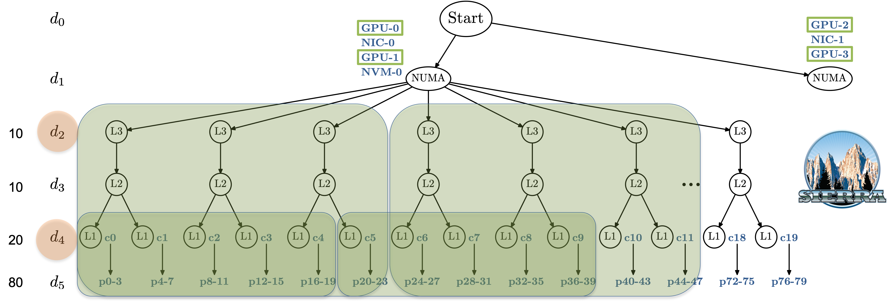

# Supercomputing Foundations 

*Edgar A. León*, Lawrence Livermore National Laboratory<br>
*Jane E. Herriman*, Lawrence Livermore National Laboratory<br>
*Fernando Posada-Correa*, Oak Ridge National Laboratory<br>
*Suzanne Parete-Koon*, Oak Ridge National Laboratory<br>
*Tony Ramirez*, Oak Ridge National Laboratory<br>

## Description

This workshop provides an interactive introduction to High-Performance Computing (HPC), focusing on foundational concepts, practical applications, and hands-on exercises. Attendees will explore the basics of supercomputers, learn essential Linux skills, and gain experience with parallel programming using MPI and OpenMP. Through guided exercises, participants will build and run serial and parallel programs, analyze differences in execution, and understand how to manage jobs in an HPC environment.

The workshop also introduces advanced topics, including node architecture and topology, where attendees will learn to identify compute and memory components, including GPUs, cores, cache hierarchies, memory domains, and network interfaces. Participants will develop skills to map applications efficiently to hardware resources using tools like hwloc, emphasizing locality and affinity masks.

Building on this foundation, attendees will explore techniques for running and mapping parallel programs using Slurm, including constructing CPU-based bindings and assigning GPUs to MPI processes. The workshop highlights strategies for managing CPU and GPU affinity concurrently to optimize resource utilization and minimize data movement.

Hands-on exercises conducted in an AWS cluster environment ensure practical exposure to real-world HPC systems, enabling attendees to apply learned concepts directly. This workshop is ideal for individuals seeking to learn about HPC and its applications in scientific computing.


## Requirements

* Attendees will need a laptop equipped with Wi-Fi, a shell terminal,
  and the ssh program. Users will be provided accounts
  to access a cluster environment required for
  demonstrations and hands-on exercises.

<!--
* Attendees should have a working knowledge of Unix-like systems. For
  example, they should know how to navigate a filesystem and launch
  applications from the command line.
  
* Attendees will also need some familiarity with high-level parallel
  programming concepts. For example, attendees should be comfortable
  with terms like thread, process, and GPU, but do not need experience
  writing parallel programs.
-->


## Schedule

<center>

| Begin | End | Topic |
|-:|-:|:-|
| 13:30 | 13:50 | Introduction to Supercomputing |
| 13:50 | 14:20 | Module 1: UNIX Basics | 
| 14:20 | 15:20 | Module 2: Parallel Computing with MPI |
| *15:20* | *15:35* | *Break* |
| 15:35 | 16:55 | Module 3: Computing Architecture and Topology |
| *16:55* | *17:10* | *Break* |
| 17:10 | 18:30 | Module 4: Hardware Affinity for Applications |

</center>


<!--
## AWS Cluster

Accounts: `user5`, `user6`, ..., `user35`

Password: 

```
ssh user5@

source /home/tutorial/scripts/user-env.sh

srun -N1 -n1 mpi
```
-->

## Notebook 

<br>
<p align="center">
   
</p>


1. UNIX Basics

   Learn the essentials of working in UNIX-like systems, which form the backbone of most HPC environments. This module introduces participants to foundational UNIX concepts, including navigating the file system, managing and searching files, and performing basic edits with the popular text editor vim. By the end, participants will be comfortable moving around a UNIX system and handling core tasks needed for effective HPC use.


1. [Parallel Computing with MPI](https://github.com/suzannepk/mpi_parallel)

   Learn how to develop parallel applications using MPI (Message Passing Interface), a foundational tool in high-performance computing. This module introduces the principles of parallel thinking and guides participants through the transformation of serial code into parallel implementations using MPI. Through hands-on examples you’ll explore data distribution, rank-based processing, and communication overhead, while gaining practical experience running programs across multiple processes. By the end, you'll understand how to analyze performance, improve efficiency, and apply these techniques to more complex real-world problems.

1. [Computing Architecture and Topology](module2.md)

   Learn how to identify the compute and memory components of a
   compute node using `hwloc`. A precise understanding of the hardware
   resources is needed to map an application to the machine
   efficiently. This includes identifying the node's GPUs, cores,
   hardware threads, cache hierarchy, NUMA domains, and network
   interfaces. Furthermore, attendees will be introduced to locality,
   will identify local hardware resources, and will select resources
   using affinity masks.  

1. Hardware Affinity for Applications

   Learn how to use the resource manager to map a parallel
   program to the
   hardware at runtime when submitting a job. Attendees will learn to
   construct CPU-based mappings using low-level and high-level
   abstractions as well as GPU-based mappings. Attendees will learn to
   manage CPU and GPU affinity concurrently to take advantage of local
   resources and reduce data movement.

   1. [Mapping Processes to the Hardware](../eurosys25/module2.md)
   
   1. [Adding in GPU kernels](../eurosys25/module3.md)


