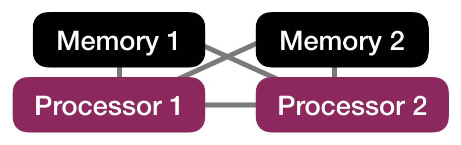
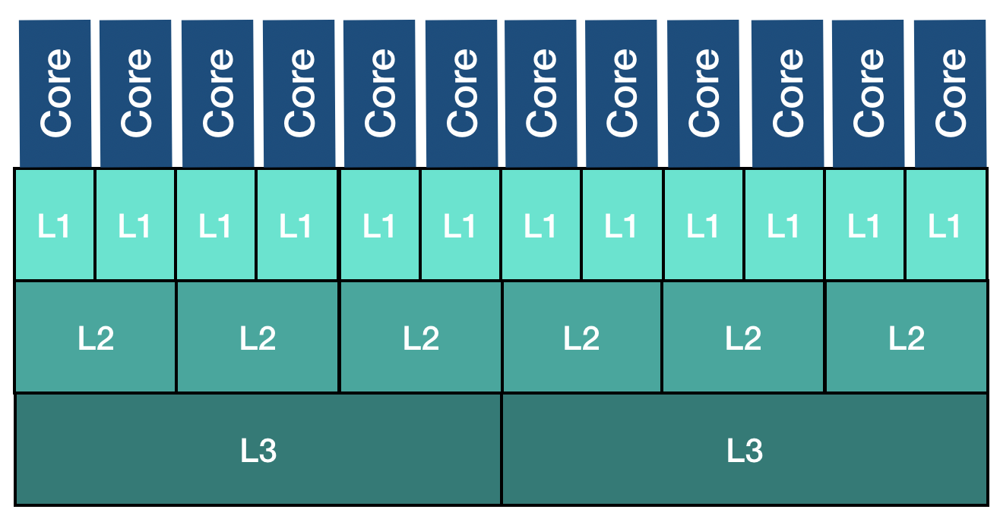
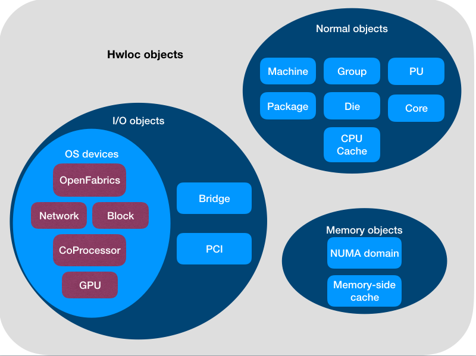
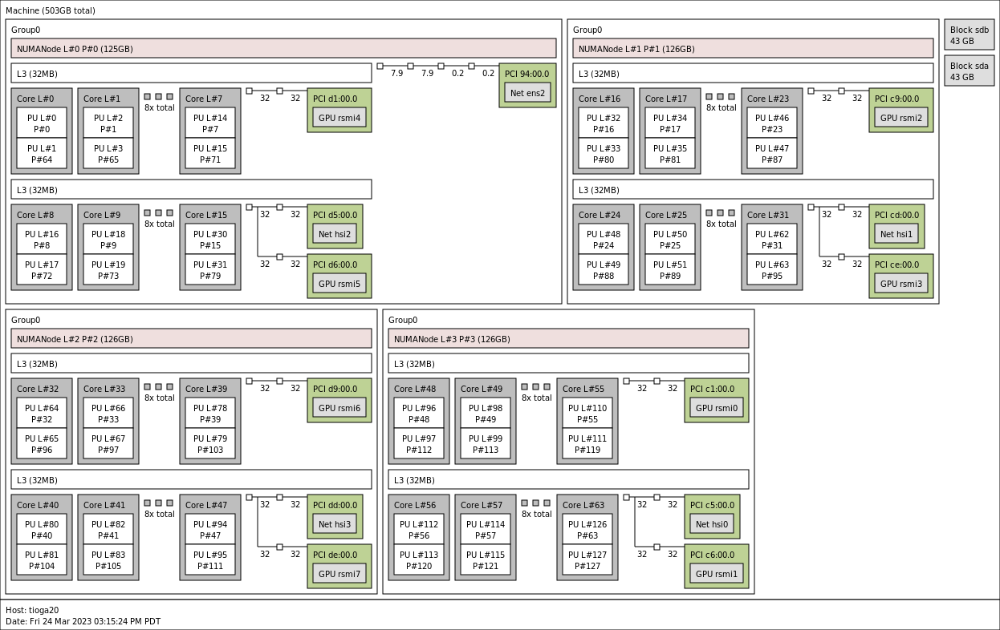
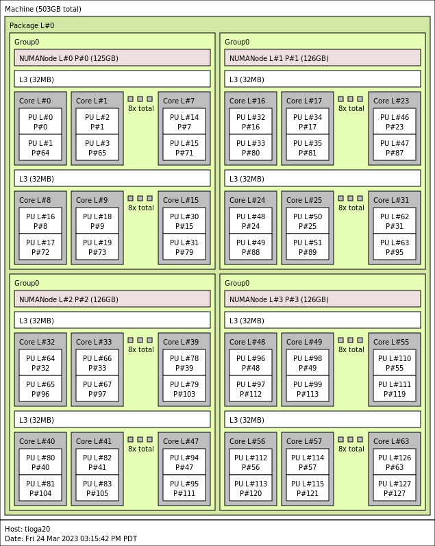
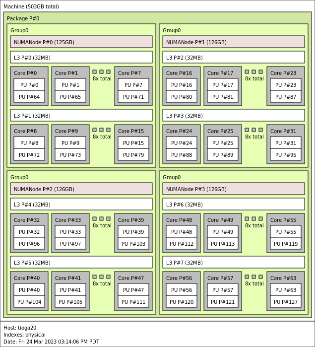
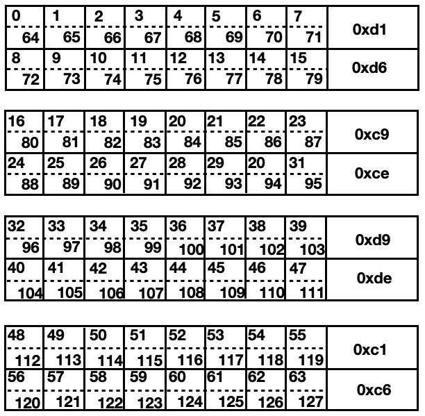
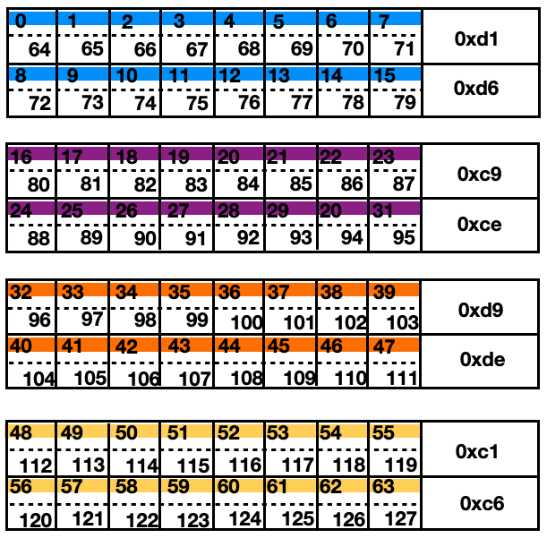
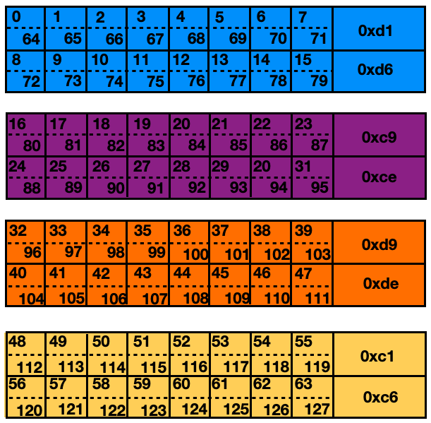
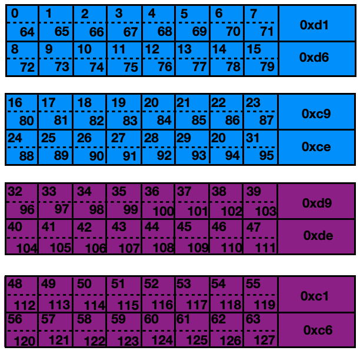

# Module 3: Computing architecture and topology

*Edgar A. León* and *Jane E. Herriman*<br>
Lawrence Livermore National Laboratory


## Table of contents

1. Unix Basics
1. Parallel Computing with MPI
1. [Computing architecture and topology](module2.md)
   1. [Learning objectives](#learning-objectives)
   1. [Background](#background)
   1. [Example architectures](#example-architectures)
   1. [The hwloc library](#the-hwloc-library)
   1. [Discovering the node topology](#discovering-the-node-topology)
   1. [Calculating CPU masks](#calculating-cpu-masks)
   1. [Binding to CPUs](#binding-to-cpus)
   1. [Binding vs. affinity vs. mappings](#definitions)
   1. [Example mappings](#example-mappings)
   1. [Reporting affinity](#reporting-affinity)
   1. [Extra exercises](#extra-exercises)
   1. [References](#references) 
1. Hardware Affinity for Applications


## Learning objectives

* Review basics of computer architecture, as needed for this module
* Learn how to use a few `hwloc` commands:
	* `lstopo` to explore node topology
	* `hwloc-calc` to calculate CPU masks
	* `hwloc-bind` to bind processes to CPUs (sometimes via CPU masks) 
* Begin to understand "locality"
* Understand the difference between affinity policies, binding, and mappings
* Use a simple tool to identify resources available to particular processes 

## Background

In this module, we'll start with an overview of some computer architecture terminology that's important for the concepts in this workshop.

We'll then introduce you to a library called `hwloc`, which will give us tools to explore the components of the nodes we see on our instances.

Once we better understand the hardware we're working with, we'll explore how we can attach software processes to hardware. 

### Computer architecture: Compute only

Let's start by considering compute resources only (and ignoring memory). 


At the bottom of the tree shown above, we see "Processing Units" denoted as "PU"s. A **PU** is the smallest processing unit that can handle a logical thread of execution, i.e. execute its own set of instructions. Multiple PUs are sometimes packaged together into a **core**. PUs have both dedicated and shared hardware resources on a core; for example, floating point units are shared by multiple PUs.

In our tree, we see **GPU**s, Graphical Processing Units, shown at the same level as cores. In contrast to cores and their PUs, GPUs allow for greater data parallelization by working on vectors of data at once.

Multiple cores and possibly one or more GPUs are included on a single processor. Each of these processors is a set of compute resources written onto a single piece of Silicon (a die).

Finally, at the top of our tree is a node, which you can think of as a stand-alone computer. Modern nodes are often built from multiple processors, and the example architectures we'll consider each have two processors. 

#### Comprehension question 1

The number of hardware threads on a processor is equal to

**A)** The number of cores per processor

**B)** The number of PUs per core

**C)** The number of cores per processor x the number of PUs per core

<details>
<summary>
Answer
</summary>
C!

Every core has one hardware thread per PU.

Every processor has one hardware thread for all the PUs across all cores.
</details>


### Computer architecture: Adding in memory

Once we throw memory into the picture, we need to consider not only what resources are available, but how they're physically arranged and, therefore, how easily they can talk to one another.

In the image below, consider a scenario where we have two processors and two stores of memory. In the layout shown, processor 1 is closer to memory 1 than to memory 2; similarly, processor 2 is closer to memory 2 than memory 1. This means that processor 1 can more easily and *more quickly* access data stored in memory 1 than data stored in memory 2 and vice versus. In this case, the processors have Non-Uniform Memory Access (NUMA) and we say that memory 1 and processor 1 are in the same NUMA domain. Processor 2 shares the second NUMA domain with memory 2 and will access data in memory 1 with higher latency.



We can imagine scenarios where memory is laid out to be equidistant from multiple processors and where multiple processors are in the same NUMA domain. In the architectures we'll consider, however, there will be a one-to-one mapping between NUMA domains and processors. So, all computing resources on a Silicon die will be in the same NUMA domain and will have the same "local" memory. 

Our references to "memory" above refer to memory that's transmitted over a frontside bus. In contrast, **cache memory** serves as a faster and closer source of memory, and different cores on the same processor and within the same NUMA domain may have access to different cache. 

In general, cache levels are denoted as `L<N>` where `<N>` denotes the cache level. Lower values of `N` denote smaller and faster levels of cache. In the figure below, we see an example of what the cache hierarchy and layout might look like on a single processor.



In this example cache layout, there are three levels of cache -- `L1`, `L2`, and `L3`. Each core has its own `L1` cache, every two cores share a `L2` cache, and sets of six cores each have a `L3` cache.

Throughout this tutorial, we'll be talking about "locality" and compute resources that are "local" to one another. For example, we might say that a given pair of resources "are local to one another". "Being local" means being on the same NUMA domain -- even if cache is not shared.

#### Comprehension question 2 

In the cache memory diagram above, how many cores are "local" with respect to a given L3 cache?

**A)** 2

**B)** 3

**C)** 6

<details>
<summary>
Answer
</summary>
C.

Each L3 cache has 6 cores.

Each L2 cache has 2 cores, and there are 3 L2 caches per L3 cache. 

</details>


## Example architectures

The topologies of a few example architectures are summarized and diagramed [here](https://github.com/LLNL/mpibind/blob/master/tutorials/cug24/archs.md).

We'll focus on `Tioga` and `RZAdams` --- early access systems for El Capitan --- in examples throughout the coming modules. `Tioga` has MI250X nodes (including MI250X GPUs) and `RZAdams` is composed of nodes with MI300A APUs!

## The hwloc library 

### What is hwloc?

The Hardware Locality (`hwloc`) software project is an open source toolkit that helps you better investigate and visualize the resources available to you on a given hardware architecture.

We'll explore some of the basic commands in the sections below.

Note that for this tutorial, `hwloc` is provided, so you won't need to install anything. Also note that a C API is also provied, though we'll be working with `hwloc` exclusively from the command line.

### hwloc objects and indexes 

We concentrate on three classes of objects reported by hwloc objects -- memory objects, normal objects, and I/O objects. The image below summarizes these classes and how they further subdivide into `hwloc` object types, though it is not comprehensive:



Note that the classification of objects in `hwloc` is not mutually exclusive: a single device can register as multiple objets with different classifications depending on how it is configured. For example, a single GPU might register as a GPU, a PCI, and a CoProcessor.

Also note that hwloc reports logical indices in reporting objects. This reporting is self consistent and so can be used when you're working exclusively with hwloc. On the other hand, the OS will report the physical index of objects, as you will encounter when you start working with bindings outside of hwloc.

*Definitions:*

**OS or physical index**: Index the operating system (OS) uses to
identify the object.

**Logical index**: Index, calculated by hwloc, to uniquely identify
  objects of the same type and depth.


## Discovering the node topology

### `hwloc` is your friend

You can discover the topology of a node with `lstopo` and `lstopo-no-graphics`. These tools are provided by a library called `hwloc` and respectively give graphical and textual descriptions of node topology.

The images used to visualize the topologies in the [Example Architectures](#example-architectures) section above were produced by `lstopo`. On the other hand, text output on a Tioga MI250X node, for example, looks like

<details>
<summary>

```
janeh@tioga20:~$ lstopo-no-graphics 
```

</summary>

```                           
Machine (503GB total)
  Package L#0
    Group0 L#0
      NUMANode L#0 (P#0 125GB)
      L3 L#0 (32MB)
        L2 L#0 (512KB) + L1d L#0 (32KB) + L1i L#0 (32KB) + Core L#0
          PU L#0 (P#0)
          PU L#1 (P#64)
        L2 L#1 (512KB) + L1d L#1 (32KB) + L1i L#1 (32KB) + Core L#1
          PU L#2 (P#1)
          PU L#3 (P#65)
        L2 L#2 (512KB) + L1d L#2 (32KB) + L1i L#2 (32KB) + Core L#2
          PU L#4 (P#2)
          PU L#5 (P#66)
        L2 L#3 (512KB) + L1d L#3 (32KB) + L1i L#3 (32KB) + Core L#3
          PU L#6 (P#3)
          PU L#7 (P#67)
        L2 L#4 (512KB) + L1d L#4 (32KB) + L1i L#4 (32KB) + Core L#4
          PU L#8 (P#4)
          PU L#9 (P#68)
        L2 L#5 (512KB) + L1d L#5 (32KB) + L1i L#5 (32KB) + Core L#5
          PU L#10 (P#5)
          PU L#11 (P#69)
        L2 L#6 (512KB) + L1d L#6 (32KB) + L1i L#6 (32KB) + Core L#6
          PU L#12 (P#6)
          PU L#13 (P#70)
        L2 L#7 (512KB) + L1d L#7 (32KB) + L1i L#7 (32KB) + Core L#7
          PU L#14 (P#7)
          PU L#15 (P#71)
        HostBridge
          PCIBridge
            PCI d1:00.0 (Display)
              GPU(RSMI) "rsmi4"
      L3 L#1 (32MB)
        L2 L#8 (512KB) + L1d L#8 (32KB) + L1i L#8 (32KB) + Core L#8
          PU L#16 (P#8)
          PU L#17 (P#72)
        L2 L#9 (512KB) + L1d L#9 (32KB) + L1i L#9 (32KB) + Core L#9
          PU L#18 (P#9)
          PU L#19 (P#73)
        L2 L#10 (512KB) + L1d L#10 (32KB) + L1i L#10 (32KB) + Core L#10
          PU L#20 (P#10)
          PU L#21 (P#74)
        L2 L#11 (512KB) + L1d L#11 (32KB) + L1i L#11 (32KB) + Core L#11
          PU L#22 (P#11)
          PU L#23 (P#75)
        L2 L#12 (512KB) + L1d L#12 (32KB) + L1i L#12 (32KB) + Core L#12
          PU L#24 (P#12)
          PU L#25 (P#76)
        L2 L#13 (512KB) + L1d L#13 (32KB) + L1i L#13 (32KB) + Core L#13
          PU L#26 (P#13)
          PU L#27 (P#77)
        L2 L#14 (512KB) + L1d L#14 (32KB) + L1i L#14 (32KB) + Core L#14
          PU L#28 (P#14)
          PU L#29 (P#78)
        L2 L#15 (512KB) + L1d L#15 (32KB) + L1i L#15 (32KB) + Core L#15
          PU L#30 (P#15)
          PU L#31 (P#79)
        HostBridge
          PCIBridge
            PCI d5:00.0 (Ethernet)
              Net "hsi2"
          PCIBridge
            PCI d6:00.0 (Display)
              GPU(RSMI) "rsmi5"
      HostBridge
        PCIBridge
          PCIBridge
            PCIBridge
              PCI 94:00.0 (Ethernet)
                Net "ens2"
    Group0 L#1
      NUMANode L#1 (P#1 126GB)
      L3 L#2 (32MB)
        L2 L#16 (512KB) + L1d L#16 (32KB) + L1i L#16 (32KB) + Core L#16
          PU L#32 (P#16)
          PU L#33 (P#80)
        L2 L#17 (512KB) + L1d L#17 (32KB) + L1i L#17 (32KB) + Core L#17
          PU L#34 (P#17)
          PU L#35 (P#81)
        L2 L#18 (512KB) + L1d L#18 (32KB) + L1i L#18 (32KB) + Core L#18
          PU L#36 (P#18)
          PU L#37 (P#82)
        L2 L#19 (512KB) + L1d L#19 (32KB) + L1i L#19 (32KB) + Core L#19
          PU L#38 (P#19)
          PU L#39 (P#83)
        L2 L#20 (512KB) + L1d L#20 (32KB) + L1i L#20 (32KB) + Core L#20
          PU L#40 (P#20)
          PU L#41 (P#84)
        L2 L#21 (512KB) + L1d L#21 (32KB) + L1i L#21 (32KB) + Core L#21
          PU L#42 (P#21)
          PU L#43 (P#85)
        L2 L#22 (512KB) + L1d L#22 (32KB) + L1i L#22 (32KB) + Core L#22
          PU L#44 (P#22)
          PU L#45 (P#86)
        L2 L#23 (512KB) + L1d L#23 (32KB) + L1i L#23 (32KB) + Core L#23
          PU L#46 (P#23)
          PU L#47 (P#87)
        HostBridge
          PCIBridge
            PCI c9:00.0 (Display)
              GPU(RSMI) "rsmi2"
      L3 L#3 (32MB)
        L2 L#24 (512KB) + L1d L#24 (32KB) + L1i L#24 (32KB) + Core L#24
          PU L#48 (P#24)
          PU L#49 (P#88)
        L2 L#25 (512KB) + L1d L#25 (32KB) + L1i L#25 (32KB) + Core L#25
          PU L#50 (P#25)
          PU L#51 (P#89)
        L2 L#26 (512KB) + L1d L#26 (32KB) + L1i L#26 (32KB) + Core L#26
          PU L#52 (P#26)
          PU L#53 (P#90)
        L2 L#27 (512KB) + L1d L#27 (32KB) + L1i L#27 (32KB) + Core L#27
          PU L#54 (P#27)
          PU L#55 (P#91)
        L2 L#28 (512KB) + L1d L#28 (32KB) + L1i L#28 (32KB) + Core L#28
          PU L#56 (P#28)
          PU L#57 (P#92)
        L2 L#29 (512KB) + L1d L#29 (32KB) + L1i L#29 (32KB) + Core L#29
          PU L#58 (P#29)
          PU L#59 (P#93)
        L2 L#30 (512KB) + L1d L#30 (32KB) + L1i L#30 (32KB) + Core L#30
          PU L#60 (P#30)
          PU L#61 (P#94)
        L2 L#31 (512KB) + L1d L#31 (32KB) + L1i L#31 (32KB) + Core L#31
          PU L#62 (P#31)
          PU L#63 (P#95)
        HostBridge
          PCIBridge
            PCI cd:00.0 (Ethernet)
              Net "hsi1"
          PCIBridge
            PCI ce:00.0 (Display)
              GPU(RSMI) "rsmi3"
    Group0 L#2
      NUMANode L#2 (P#2 126GB)
      L3 L#4 (32MB)
        L2 L#32 (512KB) + L1d L#32 (32KB) + L1i L#32 (32KB) + Core L#32
          PU L#64 (P#32)
          PU L#65 (P#96)
        L2 L#33 (512KB) + L1d L#33 (32KB) + L1i L#33 (32KB) + Core L#33
          PU L#66 (P#33)
          PU L#67 (P#97)
        L2 L#34 (512KB) + L1d L#34 (32KB) + L1i L#34 (32KB) + Core L#34
          PU L#68 (P#34)
          PU L#69 (P#98)
        L2 L#35 (512KB) + L1d L#35 (32KB) + L1i L#35 (32KB) + Core L#35
          PU L#70 (P#35)
          PU L#71 (P#99)
        L2 L#36 (512KB) + L1d L#36 (32KB) + L1i L#36 (32KB) + Core L#36
          PU L#72 (P#36)
          PU L#73 (P#100)
        L2 L#37 (512KB) + L1d L#37 (32KB) + L1i L#37 (32KB) + Core L#37
          PU L#74 (P#37)
          PU L#75 (P#101)
        L2 L#38 (512KB) + L1d L#38 (32KB) + L1i L#38 (32KB) + Core L#38
          PU L#76 (P#38)
          PU L#77 (P#102)
        L2 L#39 (512KB) + L1d L#39 (32KB) + L1i L#39 (32KB) + Core L#39
          PU L#78 (P#39)
          PU L#79 (P#103)
        HostBridge
          PCIBridge
            PCI d9:00.0 (Display)
              GPU(RSMI) "rsmi6"
      L3 L#5 (32MB)
        L2 L#40 (512KB) + L1d L#40 (32KB) + L1i L#40 (32KB) + Core L#40
          PU L#80 (P#40)
          PU L#81 (P#104)
        L2 L#41 (512KB) + L1d L#41 (32KB) + L1i L#41 (32KB) + Core L#41
          PU L#82 (P#41)
          PU L#83 (P#105)
        L2 L#42 (512KB) + L1d L#42 (32KB) + L1i L#42 (32KB) + Core L#42
          PU L#84 (P#42)
          PU L#85 (P#106)
        L2 L#43 (512KB) + L1d L#43 (32KB) + L1i L#43 (32KB) + Core L#43
          PU L#86 (P#43)
          PU L#87 (P#107)
        L2 L#44 (512KB) + L1d L#44 (32KB) + L1i L#44 (32KB) + Core L#44
          PU L#88 (P#44)
          PU L#89 (P#108)
        L2 L#45 (512KB) + L1d L#45 (32KB) + L1i L#45 (32KB) + Core L#45
          PU L#90 (P#45)
          PU L#91 (P#109)
        L2 L#46 (512KB) + L1d L#46 (32KB) + L1i L#46 (32KB) + Core L#46
          PU L#92 (P#46)
          PU L#93 (P#110)
        L2 L#47 (512KB) + L1d L#47 (32KB) + L1i L#47 (32KB) + Core L#47
          PU L#94 (P#47)
          PU L#95 (P#111)
        HostBridge
          PCIBridge
            PCI dd:00.0 (Ethernet)
              Net "hsi3"
          PCIBridge
            PCI de:00.0 (Display)
              GPU(RSMI) "rsmi7"
    Group0 L#3
      NUMANode L#3 (P#3 126GB)
      L3 L#6 (32MB)
        L2 L#48 (512KB) + L1d L#48 (32KB) + L1i L#48 (32KB) + Core L#48
          PU L#96 (P#48)
          PU L#97 (P#112)
        L2 L#49 (512KB) + L1d L#49 (32KB) + L1i L#49 (32KB) + Core L#49
          PU L#98 (P#49)
          PU L#99 (P#113)
        L2 L#50 (512KB) + L1d L#50 (32KB) + L1i L#50 (32KB) + Core L#50
          PU L#100 (P#50)
          PU L#101 (P#114)
        L2 L#51 (512KB) + L1d L#51 (32KB) + L1i L#51 (32KB) + Core L#51
          PU L#102 (P#51)
          PU L#103 (P#115)
        L2 L#52 (512KB) + L1d L#52 (32KB) + L1i L#52 (32KB) + Core L#52
          PU L#104 (P#52)
          PU L#105 (P#116)
        L2 L#53 (512KB) + L1d L#53 (32KB) + L1i L#53 (32KB) + Core L#53
          PU L#106 (P#53)
          PU L#107 (P#117)
        L2 L#54 (512KB) + L1d L#54 (32KB) + L1i L#54 (32KB) + Core L#54
          PU L#108 (P#54)
          PU L#109 (P#118)
        L2 L#55 (512KB) + L1d L#55 (32KB) + L1i L#55 (32KB) + Core L#55
          PU L#110 (P#55)
          PU L#111 (P#119)
        HostBridge
          PCIBridge
            PCI c1:00.0 (Display)
              GPU(RSMI) "rsmi0"
      L3 L#7 (32MB)
        L2 L#56 (512KB) + L1d L#56 (32KB) + L1i L#56 (32KB) + Core L#56
          PU L#112 (P#56)
          PU L#113 (P#120)
        L2 L#57 (512KB) + L1d L#57 (32KB) + L1i L#57 (32KB) + Core L#57
          PU L#114 (P#57)
          PU L#115 (P#121)
        L2 L#58 (512KB) + L1d L#58 (32KB) + L1i L#58 (32KB) + Core L#58
          PU L#116 (P#58)
          PU L#117 (P#122)
        L2 L#59 (512KB) + L1d L#59 (32KB) + L1i L#59 (32KB) + Core L#59
          PU L#118 (P#59)
          PU L#119 (P#123)
        L2 L#60 (512KB) + L1d L#60 (32KB) + L1i L#60 (32KB) + Core L#60
          PU L#120 (P#60)
          PU L#121 (P#124)
        L2 L#61 (512KB) + L1d L#61 (32KB) + L1i L#61 (32KB) + Core L#61
          PU L#122 (P#61)
          PU L#123 (P#125)
        L2 L#62 (512KB) + L1d L#62 (32KB) + L1i L#62 (32KB) + Core L#62
          PU L#124 (P#62)
          PU L#125 (P#126)
        L2 L#63 (512KB) + L1d L#63 (32KB) + L1i L#63 (32KB) + Core L#63
          PU L#126 (P#63)
          PU L#127 (P#127)
        HostBridge
          PCIBridge
            PCI c5:00.0 (Ethernet)
              Net "hsi0"
          PCIBridge
            PCI c6:00.0 (Display)
              GPU(RSMI) "rsmi1"
  Block(Disk) "sdb"
  Block(Disk) "sda"
```

</details>

#### Hands-on exercise A: `lstopo` vs. `lstopo-no-graphics`

When graphics are enabled, `lstopo` creates images and `lstopo-no-graphics` shows text outputs.

On systems where graphics aren't enabled -- like the AWS clusters where we're working today -- they both provide text output.

Try running

```
lstopo
```

and

```
lstopo-no-graphics
```

From here on out, we'll stick with `lstopo` on our AWS instances!

### Using synthetic topologies 

In the `lstopo(-no-graphics)` example above, `lstopo` was run on the same node being investigated. `lstopo` also allows you to explore topologies of other machines/systems simply by specifying as an input a `.xml` file that provides information about the system.

For example, you should see a series of `.xml` files in the directory `/home/tutorial/topo-xml`:

```
/home/tutorial/topo-xml$ ls
corona.xml
pascal.xml
tioga.xml
rzadams.xml
```

Using these files, you should be able to create the outputs for `lstopo-no-graphics` that you'd see on these respective machines, simply by adding `--input <machine name>.xml` to the commands shown above; as an example, 

```
lstopo --input /home/tutorial/topo-xml/rzadams.xml
```

should allow you to "see" `RZAdams`'s MI300A architecture, without needing access to `RZAdams` itself.

In another environment, `lstopo` would allow you to re-create the images shown above, but we only have the text-output version of this function working on AWS. For that reason, `lstopo` defaults to `lstopo-no-graphics` for this tutorial.

#### Hands-on exercise B: Experimenting with `lstopo`

By default, `lstopo` shows the topology of the machine you're logged into. Alternatively, you can pass an `.xml` file describing the topology of a *different* machine to see the topology of that machine.

From your AWS desktop, try the following:

```
lstopo --input /home/tutorial/topo-xml/rzadams.xml
```

See how this changes the outpput you get simply running `lstopo`!

#### Hands-on exercise C: Investigating AWS nodes with `lstopo`

Let's use `lstopo` again to show the topology of the nodes we can see through AWS. First, try running


```
lstopo
```

When you run `lstopo`, you're investigating the hardware of the "login node" -- the node you see immediately after logging in. The login node here doesn't have the most interesting topology, but we have a second type of node, with different hardware, waiting for you in the "queue". To see the topology of one of these nodes, use the following command:

```
srun lstopo
```

When you preceded a command with `srun`, you're choosing to grab one of the nodes from the queue -- which are normally more powerful -- to run your command.

The output from `srun lstopo` should be different than `lstopo` because the nodes have different hardware. Identify at least one way the features of the node described by `lstopo`'s output differ from those described by `srun lstopo`.

**What you should see**

<details>
<summary>

```
[username2@ip-10-0-0-13 scripts]$ lstopo
```

</summary>

```
Machine (124GB total)
  Package L#0
    NUMANode L#0 (P#0 124GB)
    L3 L#0 (36MB)
      L2 L#0 (1024KB) + L1d L#0 (32KB) + L1i L#0 (32KB) + Core L#0
        PU L#0 (P#0)
        PU L#1 (P#16)
      L2 L#1 (1024KB) + L1d L#1 (32KB) + L1i L#1 (32KB) + Core L#1
        PU L#2 (P#1)
        PU L#3 (P#17)
      L2 L#2 (1024KB) + L1d L#2 (32KB) + L1i L#2 (32KB) + Core L#2
        PU L#4 (P#2)
        PU L#5 (P#18)
      L2 L#3 (1024KB) + L1d L#3 (32KB) + L1i L#3 (32KB) + Core L#3
        PU L#6 (P#3)
        PU L#7 (P#19)
      L2 L#4 (1024KB) + L1d L#4 (32KB) + L1i L#4 (32KB) + Core L#4
        PU L#8 (P#4)
        PU L#9 (P#20)
      L2 L#5 (1024KB) + L1d L#5 (32KB) + L1i L#5 (32KB) + Core L#5
        PU L#10 (P#5)
        PU L#11 (P#21)
      L2 L#6 (1024KB) + L1d L#6 (32KB) + L1i L#6 (32KB) + Core L#6
        PU L#12 (P#6)
        PU L#13 (P#22)
      L2 L#7 (1024KB) + L1d L#7 (32KB) + L1i L#7 (32KB) + Core L#7
        PU L#14 (P#7)
        PU L#15 (P#23)
      L2 L#8 (1024KB) + L1d L#8 (32KB) + L1i L#8 (32KB) + Core L#8
        PU L#16 (P#8)
        PU L#17 (P#24)
      L2 L#9 (1024KB) + L1d L#9 (32KB) + L1i L#9 (32KB) + Core L#9
        PU L#18 (P#9)
        PU L#19 (P#25)
      L2 L#10 (1024KB) + L1d L#10 (32KB) + L1i L#10 (32KB) + Core L#10
        PU L#20 (P#10)
        PU L#21 (P#26)
      L2 L#11 (1024KB) + L1d L#11 (32KB) + L1i L#11 (32KB) + Core L#11
        PU L#22 (P#11)
        PU L#23 (P#27)
      L2 L#12 (1024KB) + L1d L#12 (32KB) + L1i L#12 (32KB) + Core L#12
        PU L#24 (P#12)
        PU L#25 (P#28)
      L2 L#13 (1024KB) + L1d L#13 (32KB) + L1i L#13 (32KB) + Core L#13
        PU L#26 (P#13)
        PU L#27 (P#29)
      L2 L#14 (1024KB) + L1d L#14 (32KB) + L1i L#14 (32KB) + Core L#14
        PU L#28 (P#14)
        PU L#29 (P#30)
      L2 L#15 (1024KB) + L1d L#15 (32KB) + L1i L#15 (32KB) + Core L#15
        PU L#30 (P#15)
        PU L#31 (P#31)
  HostBridge
    PCI 00:01.3 (Other)
    PCI 00:03.0 (VGA)
    PCI 00:04.0 (NVMExp)
      Block(Disk) "nvme0n1"
    PCI 00:05.0 (Ethernet)
      Net "ens5"
    PCI 00:1e.0 (3D)
      CoProc(CUDA) "cuda0"
      GPU(NVML) "nvml0"
    PCI 00:1f.0 (NVMExp)
      Block(Disk) "nvme1n1"
    CoProc(OpenCL) "opencl0d0"
```
</details>

<details>
<summary>

```
[username2@ip-10-0-0-13 scripts]$ srun lstopo
```

</summary>

```
Machine (378GB total)
  Package L#0
    NUMANode L#0 (P#0 189GB)
    L3 L#0 (36MB)
      L2 L#0 (1024KB) + L1d L#0 (32KB) + L1i L#0 (32KB) + Core L#0
        PU L#0 (P#0)
        PU L#1 (P#48)
      L2 L#1 (1024KB) + L1d L#1 (32KB) + L1i L#1 (32KB) + Core L#1
        PU L#2 (P#1)
        PU L#3 (P#49)
      L2 L#2 (1024KB) + L1d L#2 (32KB) + L1i L#2 (32KB) + Core L#2
        PU L#4 (P#2)
        PU L#5 (P#50)
      L2 L#3 (1024KB) + L1d L#3 (32KB) + L1i L#3 (32KB) + Core L#3
        PU L#6 (P#3)
        PU L#7 (P#51)
      L2 L#4 (1024KB) + L1d L#4 (32KB) + L1i L#4 (32KB) + Core L#4
        PU L#8 (P#4)
        PU L#9 (P#52)
      L2 L#5 (1024KB) + L1d L#5 (32KB) + L1i L#5 (32KB) + Core L#5
        PU L#10 (P#5)
        PU L#11 (P#53)
      L2 L#6 (1024KB) + L1d L#6 (32KB) + L1i L#6 (32KB) + Core L#6
        PU L#12 (P#6)
        PU L#13 (P#54)
      L2 L#7 (1024KB) + L1d L#7 (32KB) + L1i L#7 (32KB) + Core L#7
        PU L#14 (P#7)
        PU L#15 (P#55)
      L2 L#8 (1024KB) + L1d L#8 (32KB) + L1i L#8 (32KB) + Core L#8
        PU L#16 (P#8)
        PU L#17 (P#56)
      L2 L#9 (1024KB) + L1d L#9 (32KB) + L1i L#9 (32KB) + Core L#9
        PU L#18 (P#9)
        PU L#19 (P#57)
      L2 L#10 (1024KB) + L1d L#10 (32KB) + L1i L#10 (32KB) + Core L#10
        PU L#20 (P#10)
        PU L#21 (P#58)
      L2 L#11 (1024KB) + L1d L#11 (32KB) + L1i L#11 (32KB) + Core L#11
        PU L#22 (P#11)
        PU L#23 (P#59)
      L2 L#12 (1024KB) + L1d L#12 (32KB) + L1i L#12 (32KB) + Core L#12
        PU L#24 (P#12)
        PU L#25 (P#60)
      L2 L#13 (1024KB) + L1d L#13 (32KB) + L1i L#13 (32KB) + Core L#13
        PU L#26 (P#13)
        PU L#27 (P#61)
      L2 L#14 (1024KB) + L1d L#14 (32KB) + L1i L#14 (32KB) + Core L#14
        PU L#28 (P#14)
        PU L#29 (P#62)
      L2 L#15 (1024KB) + L1d L#15 (32KB) + L1i L#15 (32KB) + Core L#15
        PU L#30 (P#15)
        PU L#31 (P#63)
      L2 L#16 (1024KB) + L1d L#16 (32KB) + L1i L#16 (32KB) + Core L#16
        PU L#32 (P#16)
        PU L#33 (P#64)
      L2 L#17 (1024KB) + L1d L#17 (32KB) + L1i L#17 (32KB) + Core L#17
        PU L#34 (P#17)
        PU L#35 (P#65)
      L2 L#18 (1024KB) + L1d L#18 (32KB) + L1i L#18 (32KB) + Core L#18
        PU L#36 (P#18)
        PU L#37 (P#66)
      L2 L#19 (1024KB) + L1d L#19 (32KB) + L1i L#19 (32KB) + Core L#19
        PU L#38 (P#19)
        PU L#39 (P#67)
      L2 L#20 (1024KB) + L1d L#20 (32KB) + L1i L#20 (32KB) + Core L#20
        PU L#40 (P#20)
        PU L#41 (P#68)
      L2 L#21 (1024KB) + L1d L#21 (32KB) + L1i L#21 (32KB) + Core L#21
        PU L#42 (P#21)
        PU L#43 (P#69)
      L2 L#22 (1024KB) + L1d L#22 (32KB) + L1i L#22 (32KB) + Core L#22
        PU L#44 (P#22)
        PU L#45 (P#70)
      L2 L#23 (1024KB) + L1d L#23 (32KB) + L1i L#23 (32KB) + Core L#23
        PU L#46 (P#23)
        PU L#47 (P#71)
    HostBridge
      PCI 00:11.5 (SATA)
      PCI 00:17.0 (SATA)
    HostBridge
      PCIBridge
        PCI 18:00.0 (3D)
          CoProc(CUDA) "cuda0"
          CoProc(OpenCL) "opencl0d0"
          GPU(NVML) "nvml0"
      PCIBridge
        PCI 19:00.0 (3D)
          CoProc(CUDA) "cuda1"
          CoProc(OpenCL) "opencl0d1"
          GPU(NVML) "nvml1"
    HostBridge
      PCIBridge
        PCI 35:00.0 (3D)
          CoProc(CUDA) "cuda2"
          CoProc(OpenCL) "opencl0d2"
          GPU(NVML) "nvml2"
      PCIBridge
        PCI 36:00.0 (3D)
          CoProc(CUDA) "cuda3"
          CoProc(OpenCL) "opencl0d3"
          GPU(NVML) "nvml3"
    HostBridge
      PCIBridge
        PCIBridge
          PCIBridge
            PCI a0:00.0 (NVMExp)
              Block(Disk) "nvme0n1"
      PCIBridge
        PCI bf:00.0 (NVMExp)
          Block(Disk) "nvme1n1"
        PCI bf:00.1 (NVMExp)
          Block(Disk) "nvme2n1"
  Package L#1
    NUMANode L#1 (P#1 189GB)
    L3 L#1 (36MB)
      L2 L#24 (1024KB) + L1d L#24 (32KB) + L1i L#24 (32KB) + Core L#24
        PU L#48 (P#24)
        PU L#49 (P#72)
      L2 L#25 (1024KB) + L1d L#25 (32KB) + L1i L#25 (32KB) + Core L#25
        PU L#50 (P#25)
        PU L#51 (P#73)
      L2 L#26 (1024KB) + L1d L#26 (32KB) + L1i L#26 (32KB) + Core L#26
        PU L#52 (P#26)
        PU L#53 (P#74)
      L2 L#27 (1024KB) + L1d L#27 (32KB) + L1i L#27 (32KB) + Core L#27
        PU L#54 (P#27)
        PU L#55 (P#75)
      L2 L#28 (1024KB) + L1d L#28 (32KB) + L1i L#28 (32KB) + Core L#28
        PU L#56 (P#28)
        PU L#57 (P#76)
      L2 L#29 (1024KB) + L1d L#29 (32KB) + L1i L#29 (32KB) + Core L#29
        PU L#58 (P#29)
        PU L#59 (P#77)
      L2 L#30 (1024KB) + L1d L#30 (32KB) + L1i L#30 (32KB) + Core L#30
        PU L#60 (P#30)
        PU L#61 (P#78)
      L2 L#31 (1024KB) + L1d L#31 (32KB) + L1i L#31 (32KB) + Core L#31
        PU L#62 (P#31)
        PU L#63 (P#79)
      L2 L#32 (1024KB) + L1d L#32 (32KB) + L1i L#32 (32KB) + Core L#32
        PU L#64 (P#32)
        PU L#65 (P#80)
      L2 L#33 (1024KB) + L1d L#33 (32KB) + L1i L#33 (32KB) + Core L#33
        PU L#66 (P#33)
        PU L#67 (P#81)
      L2 L#34 (1024KB) + L1d L#34 (32KB) + L1i L#34 (32KB) + Core L#34
        PU L#68 (P#34)
        PU L#69 (P#82)
      L2 L#35 (1024KB) + L1d L#35 (32KB) + L1i L#35 (32KB) + Core L#35
        PU L#70 (P#35)
        PU L#71 (P#83)
      L2 L#36 (1024KB) + L1d L#36 (32KB) + L1i L#36 (32KB) + Core L#36
        PU L#72 (P#36)
        PU L#73 (P#84)
      L2 L#37 (1024KB) + L1d L#37 (32KB) + L1i L#37 (32KB) + Core L#37
        PU L#74 (P#37)
        PU L#75 (P#85)
      L2 L#38 (1024KB) + L1d L#38 (32KB) + L1i L#38 (32KB) + Core L#38
        PU L#76 (P#38)
        PU L#77 (P#86)
      L2 L#39 (1024KB) + L1d L#39 (32KB) + L1i L#39 (32KB) + Core L#39
        PU L#78 (P#39)
        PU L#79 (P#87)
      L2 L#40 (1024KB) + L1d L#40 (32KB) + L1i L#40 (32KB) + Core L#40
        PU L#80 (P#40)
        PU L#81 (P#88)
      L2 L#41 (1024KB) + L1d L#41 (32KB) + L1i L#41 (32KB) + Core L#41
        PU L#82 (P#41)
        PU L#83 (P#89)
      L2 L#42 (1024KB) + L1d L#42 (32KB) + L1i L#42 (32KB) + Core L#42
        PU L#84 (P#42)
        PU L#85 (P#90)
      L2 L#43 (1024KB) + L1d L#43 (32KB) + L1i L#43 (32KB) + Core L#43
        PU L#86 (P#43)
        PU L#87 (P#91)
      L2 L#44 (1024KB) + L1d L#44 (32KB) + L1i L#44 (32KB) + Core L#44
        PU L#88 (P#44)
        PU L#89 (P#92)
      L2 L#45 (1024KB) + L1d L#45 (32KB) + L1i L#45 (32KB) + Core L#45
        PU L#90 (P#45)
        PU L#91 (P#93)
      L2 L#46 (1024KB) + L1d L#46 (32KB) + L1i L#46 (32KB) + Core L#46
        PU L#92 (P#46)
        PU L#93 (P#94)
      L2 L#47 (1024KB) + L1d L#47 (32KB) + L1i L#47 (32KB) + Core L#47
        PU L#94 (P#47)
        PU L#95 (P#95)
    HostBridge
      PCIBridge
        PCIBridge
          PCIBridge
            PCI c5:00.0 (Ethernet)
          PCIBridge
            PCI c6:00.0 (Ethernet)
              Net "enp198s0"
    HostBridge
      PCIBridge
        PCI e7:00.0 (3D)
          CoProc(CUDA) "cuda4"
          CoProc(OpenCL) "opencl0d4"
          GPU(NVML) "nvml4"
      PCIBridge
        PCI e8:00.0 (3D)
          CoProc(CUDA) "cuda5"
          CoProc(OpenCL) "opencl0d5"
          GPU(NVML) "nvml5"
    HostBridge
      PCIBridge
        PCI f4:00.0 (3D)
          CoProc(CUDA) "cuda6"
          CoProc(OpenCL) "opencl0d6"
          GPU(NVML) "nvml6"
      PCIBridge
        PCI f5:00.0 (3D)
          CoProc(CUDA) "cuda7"
          CoProc(OpenCL) "opencl0d7"
          GPU(NVML) "nvml7"
```

</details>

### Customizing `lstopo` output

A few other basic parameters can help to customize outputs, including `--merge`, `--no-useless-caches`,  `--no-io`, `--only <type>`, `--physical`, and `--logical`.

`--merge` and `--no-useless-caches` respectively avoid showing levels and caches that don't have a hierarchical impact, and `--no-io` causes the topology to be described without IO devices.

```
$ lstopo --merge 
```



```
$ lstopo --no-useless-caches --no-io
```




The flag `--only <type>` causes the topology of only `type` devices to be described:

```
janeh@tioga20:~$ lstopo-no-graphics --only NUMANode
NUMANode L#0 (P#0 125GB)
NUMANode L#1 (P#1 126GB)
NUMANode L#2 (P#2 126GB)
NUMANode L#3 (P#3 126GB)
```

`--physical` and `--logical` cause either physical or logical indices (of hardware threads) to be reported. Compare the numbering of hardware threads on Tioga with each of these flags:

<details>
<summary>

```
janeh@tioga20:~$ lstopo-no-graphics --no-useless-caches --physical
```

</summary>

```
(...)
    NUMANode P#0 (125GB)
      L3 P#0 (32MB)
        Core P#0
          PU P#0
          PU P#64
        Core P#1
          PU P#1
          PU P#65
        Core P#2
          PU P#2
          PU P#66
        Core P#3
          PU P#3
          PU P#67
        Core P#4
          PU P#4
          PU P#68
        Core P#5
          PU P#5
          PU P#69
(...)
```

</details>

<details>
<summary>

```
janeh@tioga20:~$ lstopo-no-graphics --no-useless-caches --logical
```

</summary>

```
(...)
      NUMANode L#0 (125GB)
      L3 L#0 (32MB)
        Core L#0
          PU L#0
          PU L#1
        Core L#1
          PU L#2
          PU L#3
        Core L#2
          PU L#4
          PU L#5
        Core L#3
          PU L#6
          PU L#7
        Core L#4
          PU L#8
          PU L#9
        Core L#5
          PU L#10
          PU L#11
(...)
```

</details>

Let's compare the PU indices on NUMANode #0 and Core #3. The physical indices for these PUs are `3` and `67`, whereas the logical indices are `6` and `7`. If we specify neither flag, we get both indices reported and denoted as either `L#<N>` or `P#<N>`.

<details>
<summary>

```
janeh@tioga20:~$ lstopo-no-graphics --no-useless-caches
```

</summary>

```
(...)
   NUMANode L#0 (P#0 125GB)
      L3 L#0 (32MB)
        Core L#0
          PU L#0 (P#0)
          PU L#1 (P#64)
        Core L#1
          PU L#2 (P#1)
          PU L#3 (P#65)
        Core L#2
          PU L#4 (P#2)
          PU L#5 (P#66)
        Core L#3
          PU L#6 (P#3)
          PU L#7 (P#67)
        Core L#4
          PU L#8 (P#4)
          PU L#9 (P#68)
        Core L#5
          PU L#10 (P#5)
          PU L#11 (P#69)
(...)
```

</details>


```
janeh@tioga20:~$ lstopo --no-useless-caches --no-io --physical
```



#### Hands-on exercise D: Investigating AWS nodes with `--only`

First, run the command

```
lstopo --only core
```

to see the number of cores on the login node and

```
srun lstopo --only core
```

to see the number of cores on the compute nodes in our queue.

How are the outputs different? Which type of node has more cores?

#### Hands-on exercise E: Investigating AWS nodes: How many PUs per core?

You can add `| wc -l` to a command to count the number of lines in its output. Modifying the commands from the last exercise, you should get a single number if you try `lstopo --only core | wc -l` and `srun lstopo --only core | wc -l`. Here you're counting the number of cores (one per line) on each node!

Determine the number of cores and PUs (hardware threads) on an AWS compute node by running the following:

```
srun lstopo --only core | wc -l
```

and

```
srun lstopo --only PU | wc -l
```

How many hardware threads exist per core? Do these nodes support Simultaneous Multi-Threading (SMT)? (In other words, are there multiple PUs for every core?)

<details>
<summary>

Answer

</summary>

```
[username2@ip-10-0-0-11 ~]$ srun lstopo --only core | wc -l
48
[username2@ip-10-0-0-11 ~]$ srun lstopo --only PU | wc -l
96

We have 48 cores and 96 PUs. Because we have 2x as many PUs as cores, these nodes
do support SMT!

```

</details>


#### Hands on Exercise F: Experimenting with `--only` on synthetic topologies

Run

```
lstopo  --input /home/tutorial/topo-xml/rzadams.xml --only core
```

and

```
lstopo  --input /home/tutorial/topo-xml/rzadams.xml --only core | wc -l
```

to see the full list of cores on `RZAdams`'s nodes and then to tally them.

Now try

```
lstopo  --input /home/tutorial/topo-xml/rzadams.xml --only PU | wc -l
```

to see how many hardware threads there are on the same node. 

For contrast, repeat the above using the file `tioga.xml`. 

How many hardware threads are there per node on RZAdams and Tioga?

**A)** 192 & 128

**B)** 96 & 64

**C)** 48 & 24

<details>
<summary>
Answer
</summary>

A. On RZAdams, there are two hardware threads per core, so we should see twice as many PUs as cores:

```
janeh@rzadams1005:~$ lstopo-no-graphics --only core | wc -l
96
janeh@rzadams1005:~$ lstopo-no-graphics --only PU | wc -l
192
```

The same is true on Tioga, but there are only 64 cores and 128 hardware threads

```
janeh@tioga20:~$ lstopo --only core | wc -l
64
janeh@tioga20:~$ lstopo --only PU | wc -l
128
```

Note that `tioga20` and `rzadams1005` are both compute nodes!

</details>


## Using hwloc-calc

### hwloc-calc with --intersect

Another tool provided by `hwloc` is `hwloc-calc`, which allows you to create CPU masks. (In case this is an unfamiliar term -- this is basically a hexadecimal string that can be interpreted as a list identifying particular CPUs.) These masks can then be used as inputs to another `hwloc` function, `hwloc-bind`, as we'll see below.

First off, without even worrying about CPU masks, we can use `hwloc-calc` to list, for example, the particular cores or PUs on a given NUMA domain:

```
# Get the cores on the first NUMA node
janeh@tioga20:~$ hwloc-calc NUMAnode:0 --intersect core
0,1,2,3,4,5,6,7,8,9,10,11,12,13,14,15
# Get the cores on the fourth NUMA node
janeh@tioga20:~$ hwloc-calc NUMAnode:3 --intersect core
48,49,50,51,52,53,54,55,56,57,58,59,60,61,62,63
# Get the PUs on core 8 of the first NUMA node
janeh@tioga20:~$ hwloc-calc NUMAnode:0.core:8 --intersect PU
16,17
```

*Note* that `hwloc-calc` uses logical indexing by default. We can see the difference if we re-run the last example:

```
janeh@tioga20:~$ hwloc-calc NUMAnode:0.core:8 --intersect PU --physical
8,72
```

#### Hands-on exercise G: Determine the cores on a given NUMAnode (AWS)

Run the following to see the list of cores on the AWS login node:

```
hwloc-calc NUMAnode:0 --intersect core
```

and run these to see how many are on the compute node, spread across two NUMAnodes:

```
srun hwloc-calc NUMAnode:0 --intersect core
srun hwloc-calc NUMAnode:1 --intersect core
```

<details>
<summary>

Expected output

</summary>

```
$ hwloc-calc NUMAnode:0 --intersect core
0,1,2,3,4,5,6,7,8,9,10,11,12,13,14,15
$ srun hwloc-calc NUMAnode:0 --intersect core
0,1,2,3,4,5,6,7,8,9,10,11,12,13,14,15,16,17,18,19,20,21,22,23
$ srun hwloc-calc NUMAnode:1 --intersect core
24,25,26,27,28,29,30,31,32,33,34,35,36,37,38,39,40,41,42,43,44,45,46,47
```

</details>

#### Hands-on exercise H: Determine the PUs associated with a given core (synthetic topologies)

Using `hwloc-calc` with the flag `-i` to specify the RZAdams input file, determine the PUs associated with core 4 on NUMAnode 1 of a `RZAdams` node.

<details>
<summary>

Hint

</summary>

```
hwloc-calc -i /home/tutorial/topo-xml/rzadams.xml <specify core 4 here> --intersect <what are you trying to determine on core 4?>
```

</details>

<details>
<summary>

Answer

</summary>

```
$ hwloc-calc -i /home/tutorial/topo-xml/rzadams.xml NUMA:1.core:4 --intersect PU
56,57
```

</details>

### Calculating CPU masks

If we drop the `--intersect` flag and instead simply run `hwloc-calc <compute resource>:<index>.<compute resource>.<index>`, we'll get a CPU mask in hexadecimal:

```
janeh@tioga22:~$ hwloc-calc NUMAnode:0.core:1
0x00000002,,0x00000002
janeh@tioga22:~$ hwloc-calc NUMAnode:0.core:2
0x00000004,,0x00000004
```

We can add multiple masks together via the syntax `hwloc <mask 1> <mask 2> ...`. Note that adding the masks for cores 1 and 2 on NUMA domain 0 creates the same mask as if we create a mask for both cores from scratch:

```
janeh@tioga22:~$ hwloc-calc 0x00000002,,0x00000002 0x00000004,,0x00000004
0x00000006,,0x00000006
janeh@tioga22:~$ hwloc-calc NUMAnode:0.core:1-2
0x00000006,,0x00000006
```

Note that particular resources can be excluded from the mask calculated by using `~` to specify the resources to exclude. For example, the following CPU mask includes all cores on the first NUMA domain except cores 0, 1, and 2:

```
janeh@tioga22:~$ hwloc-calc NUMAnode:0 ~NUMAnode:0.core:0-2
0x0000fff8,,0x0000fff8
```

The `--hierarchical` flag can be used to print expanded info about the NUMA domains, cores, and PUs associated with a particular set of compute resources, expressed either with keywords or with a CPU mask. For example, here is expanded info about the PUs on the 2nd and 3rd core of the 1st NUMA domain:

```
janeh@tioga22:~$ hwloc-calc 0x00000006,,0x00000006 --hierarchical core.PU
Core:1.PU:0 Core:1.PU:1 Core:2.PU:0 Core:2.PU:1
janeh@tioga22:~$ hwloc-calc NUMAnode:0.core:1-2 --hierarchical core.PU
Core:1.PU:0 Core:1.PU:1 Core:2.PU:0 Core:2.PU:1
```

Finally, observe how the `--taskset` flag changes the format of the mask printed:

```
janeh@tioga22:~$ hwloc-calc NUMAnode:0
0x0000ffff,,0x0000ffff
janeh@tioga22:~$ hwloc-calc NUMAnode:0 --taskset
0xffff000000000000ffff
```

The default mask format is specific to `hwloc`, whereas `--taskset` displays the mask in the format recognized by the taskset command-line program (an alternative command line tool for binding).

#### Hands-on exercise I: Calculating CPU masks on AWS

Start with a simple command to calculate the CPU mask for core 23 on NUMAnode 0 of an AWS compute node:

```
srun hwloc-calc NUMAnode:0.core:23
```

Using the CPU mask you get as output, you can use the intersect flag to sanity check you got what you expected:

```
srun hwloc-calc <CPU mask> --intersect core
```

What do you see if you remove `srun` and instead run

```
hwloc-calc <CPU mask> --intersect core
```
?

<details>
<summary>

Answer

</summary>

Below is the output you should see. Note that when you try to investigate the compute node's mask for core 23 on a login node, you get an unexpected result (core 7):

```
[username2@ip-10-0-0-13 scripts]$ srun hwloc-calc NUMAnode:0.core:23
0x00000080,,0x00800000
[username2@ip-10-0-0-13 scripts]$ srun hwloc-calc 0x00000080,,0x00800000 --intersect core
23
[username2@ip-10-0-0-13 scripts]$ hwloc-calc 0x00000080,,0x00800000 --intersect core
7
```

There are only 16 cores on the login node

```
[username2@ip-10-0-0-13 scripts]$ hwloc-calc NUMAnode:0 --intersect core
0,1,2,3,4,5,6,7,8,9,10,11,12,13,14,15
```

so on the login node, the mask for a 23rd core is misinterpreted!

</details>

#### Hands-on exercise J: Adding CPU masks together

Say that you want to calculate the joint mask for a set of cores. You can list each of the cores explicitly using the syntax `NUMAnode:<#>.core:<#>` and pass these as inputs to `hwloc-calc`. You can also pass multiple masks for cores or sets of cores to `hwloc-calc`, which will add those masks together.

Try the following:

```
hwloc-calc NUMAnode:0.core:1 NUMAnode:0.core:6
```

Then calculate the individual masks and add them together:

```
hwloc-calc NUMAnode:0.core:1
hwloc-calc NUMAnode:0.core:6
hwloc-calc <mask for core 1> <mask for core 6>
```

Do you get the same result with

```
hwloc-calc NUMAnode:0.core:1-6 ~NUMAnode:0.core:2-5
```
?

<details>
<summary>

What this should look like

</summary>

These yield the same result:

```
[username2@ip-10-0-0-25 ~]$ hwloc-calc NUMAnode:0.core:1 NUMAnode:0.core:6
0x00420042
[username2@ip-10-0-0-25 ~]$ hwloc-calc NUMAnode:0.core:1-6 ~NUMAnode:0.core:2-5
0x00420042
```

Separately grabbing and adding the masks for cores 1 and 6:

```
[username2@ip-10-0-0-25 ~]$ hwloc-calc NUMAnode:0.core:1
0x00020002
[username2@ip-10-0-0-25 ~]$ hwloc-calc NUMAnode:0.core:6
0x00400040
[username2@ip-10-0-0-25 ~]$ hwloc-calc 0x00020002 0x00400040
0x00420042
```

</details>

## Binding to CPUs 

`hwloc-bind` can be used to bind a task to a particular set of compute resources using the syntax `hwloc-bind <compute resources: keywords or mask> -- <command to run on these resources>`:

For example, to bind a shell via `sh` to the first 2 cores on each NUMA domain:

```
hwloc-bind NUMAnode:0.core:0-1 NUMAnode:1.core:0-1 -- sh
```

We can get the mask for the resources running tasks with `hwloc-bind --get`:

```
janeh@tioga22:~$ hwloc-bind NUMAnode:0.core:0-1 NUMAnode:1.core:0-1 -- sh
janeh@tioga22:~$ hwloc-bind --get
0x00030003,,0x00030003
```

As a sanity check, we can use `hwloc-calc` to see which cores are included in this mask:

```
janeh@tioga22:~$ hwloc-calc 0x00030003,,0x00030003 --intersect core
0,1,16,17
```

This should align with our expectations, given that `Tioga`'s MI250X nodes have 16 cores per NUMA domain. (With zero-indexing, cores 0-15 are in NUMA domain 0, and core 16-17 are the first two cores in NUMA domain 1.)

This would also have worked if we had instead calculated the mask first with `hwloc-calc` and passed it to `hwloc-bind` via:

```
hwloc-bind 0x00030003,,0x00030003 -- sh
```

As another sanity check that this is working as expected, we can use `hwloc-bind --get` to see the mask of the set of compute resources to which this process was bound. The command

```
hwloc-bind <mask> -- hwloc-bind --get
```

should return the same mask provided as an input:

```
janeh@tioga22:~$ hwloc-bind 0x00030003,,0x00030003 -- hwloc-bind --get
0x00030003,,0x00030003
```

When a mask is passed to `hwloc-bind`, the default behavior is that the mask is passed to `--cpubind`, so that the supplied mask is used to determine the cpus to which a task is bound. For example,

```
hwloc-bind NUMAnode:1
```

and 

```
hwloc-bind --cpubind NUMAnode:1
```

are therefore equivalent.

On the other hand, the flag `--membind` can be used to specify the memory resources to which a task should be bound. For example,

```
hwloc-bind NUMAnode:1 --membind NUMAnode:0 -- sh
```

specifies that the task created by `sh` should be run on the compute resources of the 2nd NUMA domain, whereas it should use memory from the resources on the first NUMA domain.

#### Hands-on exercise K: On AWS, get the compute resources for a given task

On your AWS instance, run

```
hwloc-bind core:0 core:6 -- sh
```

to bind a process to cores 0 and 6,

```
hwloc-bind --get
```

to get the mask of the resources where the last process was bound, and

```
hwloc-calc <MASK> --intersect core
```

to confirm that process ran on the expected cores.

<details>
<summary>

What this will look like

</summary>

```
[user2@ip-10-0-0-141 topo-xml]$ hwloc-bind core:0 core:6 -- sh
sh-4.2$ hwloc-bind --get
0x00410041
sh-4.2$ hwloc-calc 0x00410041 --intersect core
0,6
```

Alternatively, you might do

```
[user2@ip-10-0-0-141 topo-xml]$ hwloc-bind core:0 core:6 -- sh
sh-4.2$ hwloc-calc $(hwloc-bind --get) --intersect core
0,6
```

</details>

#### Hands-on exercise L: Determine the compute resources associated with a given task

To *which cores* was the last task bound with `hwloc-bind`? Determine how we can specify cores to replace `<complete this with keyword args>` in the following:

```
rzadams1005:~$ hwloc-bind <complete this with keyword args> -- sh
rzadams1005:~$ hwloc-bind --get
0x00100004,0x00010040,,0x00100004,0x00010040
```

*Hint*: You can solve this with `hwloc-calc` using `rzadams.xml`.

<details>
<summary>

Answer

</summary>

You would need to bind the process `sh` to cores 6, 16, 34, and 52 on RZAdams in order to get the right mask output via `hwloc-bind --get`.

We can see this by getting the cores associated with the mask via hwloc-calc:

```
[user2@ip-10-0-0-141]$ hwloc-calc -i /home/tutorial/topo-xml/rzadams.xml 0x00100004,0x00010040,,0x00100004,0x00010040 --intersect core
6,16,34,52
```

Checking that this produces the desired mask,

```
[user2@ip-10-0-0-14]$ hwloc-calc -i /home/tutorial/topo-xml/rzadams.xml core:6 core:16 core:34 core:52
0x00100004,0x00010040,,0x00100004,0x00010040
```

So, the keywords `core:6 core:16 core:34 core:52` worked!

On RZAdams,

```
janeh@rzadams1005:~$ hwloc-bind core:6 core:16 core:34 core:52 -- sh
janeh@rzadams1005:~$ hwloc-bind --get
0x00100004,0x00010040,,0x00100004,0x00010040
```

</details>


## Definitions

**Mapping**: A function from the worker set (our set of tasks and/or threads) to the hardware resource set.

**Affinity**: Policies for how computational tasks map to hardware.

**Binding**: Mechanism for implementing and changing the mappings of a given affinity policy.

*Mappings*, *affinity*, and *bindings* are key and interrelated concepts in this tutorial, and so we want to define and distinguish between them. When we know a program's hardware mapping, we know which hardware resources (for example, which cores and which caches) are available to each of the workers executing the program. The affinity is a policy that informs the mapping used for a particular combination of hardware and workers, and then workers are bound to hardware resources as defined by the mapping.
F
For example, an affinity policy asking processes to spread out may result in a mapping where Process 1 is assigned to Core 1 and Process 2 maps to Core 16. After binding to Core 16, Process 2 can start performing computational work there.

Since we're just getting started, these concepts may still feel abstract, but our hope is that after seeing some concrete examples in this module, these definitions will start to feel more straightforward.

## Example mappings

#### Example 1: Mappings by core
Suppose we have an affinity policy that specifies **one MPI task per `Core` on `Tioga MI250X`**. We might get the following mapping:

* <i>Task 0: PU 0,64</i>
* <i>Task 1: PU 1,65</i>
* <i>...</i>
* <i>Task 16: PU 16,80</i>
* <i>... </i>
* <i>Task 63: PU 63,127</i>

Recall that each core on `Tioga` has two processing units (PUs), so every task assigned to a single core is assigned to two PUs. Each `Tioga` node has 1 processor with 4 NUMAnodes and 16 cores per NUMAnode, for a total of 64 cores per node. So we can have a max of 64 tasks on a single node given the "one task per core" affinity policy.

#### Example 2: Mappings by GPU on Tioga's MI250X
Next, suppose we had an affinity policy with **one task per GPU on `Tioga MI250X`**. In the image depicting `Tioga`'s topology above, we see that each GPU on `Tioga` is local to 8 cores. Since one `Tioga` node has 8 GPUs, we'd expect to see 8 tasks on a node with 8 cores per task, perhaps with the following mapping:

* <i>Task 0: PU 0-7,64-71; rsmi4</i>
* <i>Task 1: PU 8-15,72-79; rsmi5</i>
* <i>...</i>
* <i>Task 5: PU 32-39,96-103; rsmi6</i>
* <i>...</i>
* <i>Task 7: PU 56-63,120-127; rsmi1</i>


#### Example 3: Mappings by GPU on Pascal
For contrast, let's consider the same constraint of **one task per GPU on `Pascal`**. Unlike both of the node types on `Tioga`, `Pascal` has two processors. Also unlike `Tioga`, the distribution of GPUs across NUMAnodes is heterogeneous on `Pascal`. `Pascal` has both of its two GPUs on its first NUMAnode. A mapping of one task per GPU might look like the following:

* <i>Task 0: PU 0-8,36-44; nvml0</i>
* <i>Task 1: PU 9-17,45-53; nvml1</i>

in which case no tasks would run on the second NUMAnode or any of its 18 cores.

#### Comprehension question 3

Match the following:

*Task 8 will run on PUs 24-26 and 72-74*

*Policy for one openMP thread per L3 on Tioga*

**A)** Affinity

**B)** Mapping

<details>
<summary>
Answer
</summary>

B. Mapping: Task 8 will run on PUs 24-26 and 72-74

A. Affinity: Policy for one openMP thread per L3 on Tioga
</details>


## Reporting affinity

In the following, we'll use binaries called `mpi+gpu` and `mpi` to report the mappings of each MPI process. `mpi+gpu` will account for both CPUs and GPUs and `mpi` will let you see the mappings of processes to CPUs in isolation.

Usage is straightforward. Use the `-v` option for verbose GPU output and
the `-h` option for help.

The examples below should help to show how it works! To help illustrate what's going on, some examples will include schematics of tasks distributed across a Tioga node. Each Tioga node, with its 64 cores and 8 GPUs laid out across 4 NUMA domains, will be shown as 



##### Example 5

Let's start by looking at the bindings we see when we run a program with 4 processes on `Tioga`, but without accounting for the presence of GPUs.

<details>
<summary>


```
$ srun -n4 ./mpi
```

</summary>

```
tioga12    Task   1/  4 running on 16 CPUs: 16-31
tioga12    Task   2/  4 running on 16 CPUs: 32-47
tioga12    Task   3/  4 running on 16 CPUs: 48-63
tioga12    Task   0/  4 running on 16 CPUs: 0-15
```



</details>

##### Example 6

An MI250X has 64 cores and 8 GPUs split across 4 NUMAnodes. Here is a program run with 4 MPI tasks where each task gets the resources of a NUMAnode: 16 CPUs and 2 GPUs per task.

<details>
<summary>

```
$ srun -N1 -n4 -c16 --cpu-bind=core --gpu-bind=closest ./mpi+gpu 
```

</summary>

```
tioga12    Task   1/  4 running on 32 CPUs: 16-31,80-95
           Task   1/  4 has 2 GPUs: 0000:c9 0000:ce 
tioga12    Task   2/  4 running on 32 CPUs: 32-47,96-111
           Task   2/  4 has 2 GPUs: 0000:d9 0000:de 
tioga12    Task   0/  4 running on 32 CPUs: 0-15,64-79
           Task   0/  4 has 2 GPUs: 0000:d1 0000:d6 
tioga12    Task   3/  4 running on 32 CPUs: 48-63,112-127
           Task   3/  4 has 2 GPUs: 0000:c1 0000:c6 
```



</details>

#### Hands-on exercise M: Try out `mpi` and `mpi+gpu`

First, use `which` to see where we've installed the `mpi` and `mpi+gpu` binaries in your AWS environment:

```
which mpi
which mpi+gpu
```

Next, look at the difference in output when you run either of these with a single task on a single node:

```
srun -N1 -n1 mpi
srun -N1 -n1 mpi+gpu
```

<details>
<summary>

What you should see

</summary>

With `mpi` we see that all 96 cores on the node get assigned to the single task.

The `mpi+gpu` also detects the node's 8 GPUs, all of which get assigned to the same task:

```
[username2@ip-10-0-0-13 scripts]$ srun -N1 -n1 mpi
  0 gpu-st-g4dnmetal-1  96 CPUs: 0-95
[username2@ip-10-0-0-13 scripts]$ srun -N1 -n1 mpi+gpu
  0 gpu-st-g4dnmetal-1  96 CPUs: 0-95
  0 gpu-st-g4dnmetal-1   8 GPUs: 0000:18:00.0 0000:19:00.0 0000:35:00.0 0000:36:00.0 0000:E7:00.0 0000:E8:00.0 0000:F4:00.0 0000:F5:00.0
```

</details>


#### Hands-on exercise N: How do tasks spread across multiple nodes?

When you run a single task on a single node, all cores share the same task.

When you run two tasks across two nodes, does each task have access to both nodes, or does each task get its own node? Try

```
srun -N2 -n2 mpi
```

<details>
<summary>
Answer
</summary>

Each task gets its own node:

```
[username2@ip-10-0-0-13 scripts]$ srun -N2 -n2 mpi
  0 gpu-st-g4dnmetal-1  96 CPUs: 0-95
  1 gpu-st-g4dnmetal-2  96 CPUs: 0-95
```

</details>


##### Example 7

Here we see run a program with 2 processes on `Tioga MI250X`, where all the resources of the node are still assigned.

<details>
<summary>


```
$ srun -N1 -n2 -c32 --cpu-bind=core --gpu-bind=closest  ./mpi+gpu 
```

</summary>

```
tioga12    Task   0/  2 running on 64 CPUs: 0-31,64-95
           Task   0/  2 has 4 GPUs: 0000:c9 0000:ce 0000:d1 0000:d6 
tioga12    Task   1/  2 running on 64 CPUs: 32-63,96-127
           Task   1/  2 has 4 GPUs: 0000:c1 0000:c6 0000:d9 0000:de 
```




</details>


**Auxiliary links**
```
https://github.com/LLNL/mpibind/tree/master/affinity
```

## Extra Exercises

### 1. Describe the memory hierarchy of a compute node.

Use `hwloc` and `rzadams.xml` to explore `RZAdams`' MI300A topology. In particular,

1. How many cores per `L3` cache does `RZAdams` have?
2. How many GPUs per `L3` cache?
3. How many `L2` caches per node?

### 2. Describe the memory hierarchy of a compute node -- on AWS

Use `hwloc` functions to determine how many cores there are per NUMA, per `L3` cache, and per `L2` cache on an AWS compute node.

Afterwards, you can check yourself with [this picture of an AWS node](../figures/aws-g4dn-metal.png).

### 3. Identify the GPUs local to a given NUMA domain.

1. How many GPUs are there in each NUMA domain on `RZAdams`' MI300A nodes?
2. How many GPUs are there in each NUMA domain on `Pascal`?

### 4. Enumerate the local CPUs of a given GPU.

1. Which cores on `RZAdams` are local to `rsmi3`? (Which cores are on the same NUMA domain as `rsmi3`?)
2. Which cores on `Pascal` are local to `nvml1`? (Which cores are on the same NUMA domain as `nvml1`?)

### 5. Determine the resources associated with tasks and threads of an MPI program

Using the `mpi` binary to determine the compute resources to which tasks are assigned in your AWS environment. For example,

```
srun -t1 -N1 -n6 mpi
```

asks for six tasks on a single node.

Run `mpi` with 2 and then 3 tasks. How many CPUs are assigned to each task in each case? Does the number of CPUs per tasks change as the number of tasks increases?


## References

https://www.open-mpi.org/projects/hwloc/

https://www.open-mpi.org/projects/hwloc/tutorials/

<!--- https://www.open-mpi.org/projects/hwloc/tutorials/20120702-POA-hwloc-tutorial.html --->
