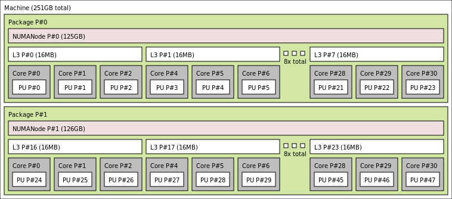

# Module 1: Discovering the node architecture topology

*Edgar A. León* and *Jane E. Herriman*<br>
Lawrence Livermore National Laboratory


## Table of contents

1. Making sense of affinity: Discovering the node architecture topology
   1. [Learning objectives](#learning-objectives)
   1. [Background](#background)
   1. [Example architectures](#example-architectures)
   1. [The hwloc library](#the-hwloc-library)
   1. [Discovering the node topology](#discovering-the-node-topology)
   1. [Calculating CPU masks](#calculating-cpu-masks)
   1. [Binding to CPUs](#binding-to-cpus)
   1. [Extra exercises](#extra-exercises)
   1. [References](#references)
2. Applying automatic affinity: [mpibind](module2.md)
3. Exerting resource manger affinity: [Process affinity with Slurm](module3.md)
4. Exerting thread affinity: [OpenMP](module4.md)
5. Putting it all together: [Adding in GPUs](module5.md)


## Learning objectives

* Learn basics of computer architecture, as needed for this module
* Learn how to use `lstopo` to explore node topology
* Learn how to calculate CPU masks with `hwloc-calc`
* Learn how to bind processes to CPUs (sometimes via CPU masks) with `hwloc-bind`
* Begin to understand "locality"

## Background

Before introducing you to the `hwloc` library, we want to cover some of the computer architecture terminology we'll be using throughout this module and tutorial.

### Computer architecture: Compute only

Let's start by considering compute resources only (and ignoring memory). 


At the bottom of the tree shown above, we see "Processing Units" denoted as "PU"s. A **PU** is the smallest processing unit that can handle a logical thread of execution, i.e. execute its own set of instructions. Multiple PUs are sometimes packaged together into a **core**. PUs have both dedicated and shared hardware resources on a core; for example, floating point units are shared by multiple PUs.

In our tree, we see **GPU**s, Graphical Processing Units, shown at the same level as cores. In contrast to cores and their PUs, GPUs allow for greater data parallelization by working on vectors of data at once.

Multiple cores and possibly one or more GPUs are included on a single processor. Each of these processors is a set of compute resources written onto a single piece of Silicon (a die).

Finally, at the top of our tree is a node, which you can think of as a stand-alone computer. Modern nodes are often built from multiple processors, and the example architectures we'll consider each have two processors. 

#### Comprehension question 1

The number of hardware threads on a processor is equal to

**A)** The number of cores per processor

**B)** The number of PUs per core

**C)** The number of cores per processor x the number of PUs per core

<details>
<summary>
Answer
</summary>
C!

Every core has one hardware thread per PU.

Every processor has one hardware thread for all the PUs across all cores.
</details>


### Computer architecture: Adding in memory

Once we throw memory into the picture, we need to consider not only what resources are available, but how they're physically arranged and, therefore, how easily they can talk to one another.

In the image below, consider a scenario where we have two processors and two stores of memory. In the layout shown, processor 1 is closer to memory 1 than to memory 2; similarly, processor 2 is closer to memory 2 than memory 1. This means that processor 1 can more easily and *more quickly* access data stored in memory 1 than data stored in memory 2 and vice versus. In this case, the processors have Non-Uniform Memory Access (NUMA) and we say that memory 1 and processor 1 are in the same NUMA domain. Processor 2 shares the second NUMA domain with memory 2 and will access data in memory 1 with higher latency.


We can imagine scenarios where memory is laid out to be equidistant from multiple processors and where multiple processors are in the same NUMA domain. In the architectures we'll consider, however, there will be a one-to-one mapping between NUMA domains and processors. So, all computing resources on a Silicon die will be in the same NUMA domain and will have the same "local" memory. 

Our references to "memory" above refer to memory that's transmitted over a frontside bus. In contrast, **cache memory** serves as a faster and closer source of memory, and different cores on the same processor and within the same NUMA domain may have access to different cache. 

In general, cache levels are denoted as `L<N>` where `<N>` denotes the cache level. Lower values of `N` denote smaller and faster levels of cache. In the figure below, we see an example of what the cache hierarchy and layout might look like on a single processor.


In this example cache layout, there are three levels of cache -- `L1`, `L2`, and `L3`. Each core has its own `L1` cache, every two cores share a `L2` cache, and sets of six cores each have a `L3` cache.

Throughout this tutorial, we'll be talking about "locality" and compute resources that are "local" to one another. For example, we might say that a given pair of resources "are local to one another". "Being local" means being on the same NUMA domain -- even if cache is not shared.

#### Comprehension question 2 

How many PUs per core does Corona have?

**A)** 4

**B)** 2

**C)** 8

<details>
<summary>
Answer
</summary>
B.

Corona has two hardware threads per core, which amounts to two PUs per core.
</details>


## Example architectures

The topologies of a few example architectures are summarized and diagramed [here](../common/archs.md).

We'll be using these machines (`Pascal`, `Corona`, and `Lassen`) in examples throughout the coming modules!

## The hwloc library 

### What is hwloc?

The Hardware Locality (`hwloc`) software project is an open source toolkit that helps you better investigate and visualize the resources available to you on a given hardware architecture.

We'll explore some of the basic commands in the sections below.

Note that for this tutorial, `hwloc` is provided, so you won't need to install anything. Also note that a C API is also provied, though we'll be working with `hwloc` exclusively from the command line.

### hwloc objects and indexes 

We concentrate on three classes of objects reported by hwloc objects -- memory objects, normal objects, and I/O objects. The image below summarizes these classes and how they further subdivide into `hwloc` object types, though it is not comprehensive:


Note that the classification of objects in `hwloc` is not mutually exclusive: a single device can register as multiple objets with different classifications depending on how it is configured. For example, a single GPU might register as a GPU, a PCI, and a CoProcessor.

Also note that hwloc reports logical indices in reporting objects. This reporting is self consistent and so can be used when you're working exclusively with hwloc. On the other hand, the OS will report the physical index of objects, as you will encounter when you start working with bindings outside of hwloc.

*Definitions:*

**OS or physical index**: Index the operating system (OS) uses to
identify the object.

**Logical index**: Index, calculated by hwloc, to uniquely identify
  objects of the same type and depth.


## Discovering the node topology

### `hwloc` is your friend

You can discover the topology of a node with `lstopo` and `lstopo-no-graphics`. These tools are provided by a library called `hwloc` and respectively give graphical and textual descriptions of node topology.

The images used to show the topologies for `Corona` and `Pascal` in the [Example Architectures](#example-architectures) section above were produced by `lstopo`. On the other hand, text output on Pascal, for example, looks like

<details>
<summary>

```
janeh@pascal83:~$ lstopo-no-graphics 
```

</summary>

```                           
Machine (126GB total)
  NUMANode L#0 (P#0 63GB)
    Package L#0 + L3 L#0 (45MB)
      L2 L#0 (256KB) + L1d L#0 (32KB) + L1i L#0 (32KB) + Core L#0 + PU L#0 (P#0)
      L2 L#1 (256KB) + L1d L#1 (32KB) + L1i L#1 (32KB) + Core L#1 + PU L#1 (P#1)
      L2 L#2 (256KB) + L1d L#2 (32KB) + L1i L#2 (32KB) + Core L#2 + PU L#2 (P#2)
      L2 L#3 (256KB) + L1d L#3 (32KB) + L1i L#3 (32KB) + Core L#3 + PU L#3 (P#3)
      L2 L#4 (256KB) + L1d L#4 (32KB) + L1i L#4 (32KB) + Core L#4 + PU L#4 (P#4)
      L2 L#5 (256KB) + L1d L#5 (32KB) + L1i L#5 (32KB) + Core L#5 + PU L#5 (P#5)
      L2 L#6 (256KB) + L1d L#6 (32KB) + L1i L#6 (32KB) + Core L#6 + PU L#6 (P#6)
      L2 L#7 (256KB) + L1d L#7 (32KB) + L1i L#7 (32KB) + Core L#7 + PU L#7 (P#7)
      L2 L#8 (256KB) + L1d L#8 (32KB) + L1i L#8 (32KB) + Core L#8 + PU L#8 (P#8)
      L2 L#9 (256KB) + L1d L#9 (32KB) + L1i L#9 (32KB) + Core L#9 + PU L#9 (P#9)
      L2 L#10 (256KB) + L1d L#10 (32KB) + L1i L#10 (32KB) + Core L#10 + PU L#10 (P#10)
      L2 L#11 (256KB) + L1d L#11 (32KB) + L1i L#11 (32KB) + Core L#11 + PU L#11 (P#11)
      L2 L#12 (256KB) + L1d L#12 (32KB) + L1i L#12 (32KB) + Core L#12 + PU L#12 (P#12)
      L2 L#13 (256KB) + L1d L#13 (32KB) + L1i L#13 (32KB) + Core L#13 + PU L#13 (P#13)
      L2 L#14 (256KB) + L1d L#14 (32KB) + L1i L#14 (32KB) + Core L#14 + PU L#14 (P#14)
      L2 L#15 (256KB) + L1d L#15 (32KB) + L1i L#15 (32KB) + Core L#15 + PU L#15 (P#15)
      L2 L#16 (256KB) + L1d L#16 (32KB) + L1i L#16 (32KB) + Core L#16 + PU L#16 (P#16)
      L2 L#17 (256KB) + L1d L#17 (32KB) + L1i L#17 (32KB) + Core L#17 + PU L#17 (P#17)
    HostBridge L#0
      PCIBridge
        PCI 8086:1521
          Net L#0 "eno1"
        PCI 8086:1521
          Net L#1 "eno2"
      PCIBridge
        PCI 15b3:1017
          Net L#2 "hsi0"
          OpenFabrics L#3 "mlx5_0"
      PCI 8086:8d62
      PCIBridge
        PCI 102b:0522
          GPU L#4 "card0"
          GPU L#5 "controlD64"
      PCI 8086:8d02
        Block(Disk) L#6 "sda"
        Block(Disk) L#7 "sdb"
  NUMANode L#1 (P#1 63GB)
    Package L#1 + L3 L#1 (45MB)
      L2 L#18 (256KB) + L1d L#18 (32KB) + L1i L#18 (32KB) + Core L#18 + PU L#18 (P#18)
      L2 L#19 (256KB) + L1d L#19 (32KB) + L1i L#19 (32KB) + Core L#19 + PU L#19 (P#19)
      L2 L#20 (256KB) + L1d L#20 (32KB) + L1i L#20 (32KB) + Core L#20 + PU L#20 (P#20)
      L2 L#21 (256KB) + L1d L#21 (32KB) + L1i L#21 (32KB) + Core L#21 + PU L#21 (P#21)
      L2 L#22 (256KB) + L1d L#22 (32KB) + L1i L#22 (32KB) + Core L#22 + PU L#22 (P#22)
      L2 L#23 (256KB) + L1d L#23 (32KB) + L1i L#23 (32KB) + Core L#23 + PU L#23 (P#23)
      L2 L#24 (256KB) + L1d L#24 (32KB) + L1i L#24 (32KB) + Core L#24 + PU L#24 (P#24)
      L2 L#25 (256KB) + L1d L#25 (32KB) + L1i L#25 (32KB) + Core L#25 + PU L#25 (P#25)
      L2 L#26 (256KB) + L1d L#26 (32KB) + L1i L#26 (32KB) + Core L#26 + PU L#26 (P#26)
      L2 L#27 (256KB) + L1d L#27 (32KB) + L1i L#27 (32KB) + Core L#27 + PU L#27 (P#27)
      L2 L#28 (256KB) + L1d L#28 (32KB) + L1i L#28 (32KB) + Core L#28 + PU L#28 (P#28)
      L2 L#29 (256KB) + L1d L#29 (32KB) + L1i L#29 (32KB) + Core L#29 + PU L#29 (P#29)
      L2 L#30 (256KB) + L1d L#30 (32KB) + L1i L#30 (32KB) + Core L#30 + PU L#30 (P#30)
      L2 L#31 (256KB) + L1d L#31 (32KB) + L1i L#31 (32KB) + Core L#31 + PU L#31 (P#31)
      L2 L#32 (256KB) + L1d L#32 (32KB) + L1i L#32 (32KB) + Core L#32 + PU L#32 (P#32)
      L2 L#33 (256KB) + L1d L#33 (32KB) + L1i L#33 (32KB) + Core L#33 + PU L#33 (P#33)
      L2 L#34 (256KB) + L1d L#34 (32KB) + L1i L#34 (32KB) + Core L#34 + PU L#34 (P#34)
      L2 L#35 (256KB) + L1d L#35 (32KB) + L1i L#35 (32KB) + Core L#35 + PU L#35 (P#35)
    HostBridge L#4
      PCIBridge
        PCI 8086:1572
          Net L#8 "aci0"
        PCI 8086:1572
          Net L#9 "aci1"
```

</details>


### Using synthetic topologies 

In the `lstopo(-no-graphics)` example above, `lstopo` was run on the same node being investigated. `lstopo` also allows you to explore topologies of other machines/systems simply by specifying as an input a `.xml` file that provides information about the system.

For example, you should see a series of `.xml` files in the directory `~/hwloc`:

```
~/hwloc$ ls
corona.xml
lassen.xml
mammoth.xml
pascal.xml
ruby.xml
```

Using these files, you should be able to recreate any of the outputs for `lstopo` shown above, simply by adding `--input <machine name>.xml` to the commands shown above; as an example, 

```
lstopo --input ~/hwloc/corona.xml --no-useless-caches --no-io --physical
```

should allow you to produce the same image shown at the end of the section above, without needing access to `Corona`.

#### Hands-on exercise A: Experimenting with `lstopo`

By default, `lstopo` and `lstopo-no-graphics` show the topology of the machine you're logged into. Alternatively, you can pass an `.xml` file describing the topology of a *different* machine to see the topology of that machine.

From your AWS desktop, try the following:

```
lstopo --input ~/pascal.xml
```

and then try:

```
lstopo-no-graphics --input ~/pascal.xml
```

#### Hands-on exercise B: Investigating AWS nodes with `lstopo`

Let's use `lstopo` to show the topology of the nodes we can see through AWS. The node you see immediately after logging in doesn't have the most interesting topology, but the nodes waiting for you in the "queue" have more features. To see the topology of one of these nodes, use the following command:

```
srun -p<QUEUE> -t1 lstopo
```

How are the features of the node described by `lstopo`'s output different than those of Pascal?

### Customizing `lstopo` output

A few other basic parameters can help to customize outputs, including `--merge`, `--no-useless-caches`,  `--no-io`, `--only <type>`, and `--physical`.

`--merge` and `--no-useless-caches` respectively avoid showing levels and caches that don't have a hierarchical impact, and `--no-io` causes the topology to be described without IO devices.

```
$ lstopo --merge corona-merge.png
```


```
$ lstopo --no-useless-caches --no-io corona-no-cache-io.png
```


`--only <type>` causes the topology of only `type` devices to be described,

```
janeh@pascal83:~$ lstopo-no-graphics --only NUMANode
NUMANode L#0 (P#0 63GB)
NUMANode L#1 (P#1 63GB)
```

and `--physical` causes physical instead of logical indices to be reported.

<details>
<summary>

```
janeh@pascal83:~$ lstopo-no-graphics --no-useless-caches
```

</summary>

```
(...)
  NUMANode L#1 (P#1 63GB)
    Package L#1
      Core L#18 + PU L#18 (P#18)
      Core L#19 + PU L#19 (P#19)
      Core L#20 + PU L#20 (P#20)
      Core L#21 + PU L#21 (P#21)
      Core L#22 + PU L#22 (P#22)
(...)
```

</details>

<details>
<summary>

```
janeh@pascal83:~$ lstopo-no-graphics --no-useless-caches --physical
```

</summary>

```
(...)
 NUMANode P#1 (63GB)
    Package P#1
      Core P#0 + PU P#18
      Core P#1 + PU P#19
      Core P#2 + PU P#20
      Core P#3 + PU P#21
      Core P#4 + PU P#22
(...)
```

</details>

```
janeh@corona211:~$ lstopo --no-useless-caches --no-io --physical
```



*Note: See how the figures in this section differ from `Corona`'s topology as shown under "Example Architectures".*

#### Hands on Exercise C: Experimenting with `--only`

Run

```
lstopo-no-graphics  --input ~/pascal.xml --only core
```

and

```
lstopo-no-graphics  --input ~/pascal.xml --only core | wc -l
```

to see the first the full list of cores on Pascal and then to tally them.

Now try

```
lstopo-no-graphics  --input ~/pascal.xml --only PU | wc -l
```

to see how many hardware threads there are on Pascal. How many hardware threads are there per core on Pascal?

**A)** 2

**B)** 4

**C)** 1

<details>
<summary>
Answer
</summary>

A. There are two hardware threads per core, i.e. twice as many PUs as cores:
```
janeh@pascal5:~$ lstopo-no-graphics --only core | wc -l
36
janeh@pascal5:~$ lstopo-no-graphics --only PU | wc -l
72
```
</details>

#### Hands-on exercise D: Investigating AWS nodes with `--only`

Use the commands

```
srun -p<QUEUE> -t1 lstopo-no-graphics --only core | wc -l
```
and

```
srun -p<QUEUE> -t1 lstopo-no-graphics --only PU | wc -l
```

to identify the number of cores and PUs on our AWS nodes. Do these nodes support Simultaneous Multi-Threading (SMT)? How many hardware threads exist per core?


## Calculating CPU masks

Another tool provided by `hwloc` is `hwloc-calc`, which allows you to create CPU masks. (In case this is an unfamiliar term -- this is basically a hexadecimal string that can be interpreted as a list identifying particular CPUs.) These masks can then be used as inputs to another `hwloc` function, `hwloc-bind`, as we'll see below.

First off, without even worrying about CPU masks, we can use `hwloc-calc` to list, for example, the particular cores or PUs on a given NUMA domain:

```
# Get the cores on the first NUMA node
janeh@pascal11:~$ hwloc-calc NUMAnode:0 --intersect core 
0,1,2,3,4,5,6,7,8,9,10,11,12,13,14,15,16,17
# Get the cores on the second NUMA node
janeh@pascal11:~$ hwloc-calc NUMAnode:1 --intersect core 
18,19,20,21,22,23,24,25,26,27,28,29,30,31,32,33,34,35
# Get the PUs on core 8 of the second NUMA node
janeh@pascal11:~$ hwloc-calc NUMAnode:1.core:8 --intersect PU
52,53
```

If we drop the `--intersect` flag and instead simply run `hwloc-calc <compute resource>:<index>.<compute resource>.<index>`, we'll get a CPU mask in hexadecimal:

```
janeh@pascal11:~$ hwloc-calc NUMAnode:0.core:1
0x00000020,0x00000002
janeh@pascal11:~$ hwloc-calc NUMAnode:0.core:2
0x00000040,0x00000004
```

We can add multiple masks together via the syntax `hwloc <mask 1> <mask 2> ...`. Note that adding the masks for cores 1 and 2 on NUMA domain 0 creates the same mask as if we create a mask for both cores from scratch:

```
janeh@pascal11:~$ hwloc-calc 0x00000020,0x00000002 0x00000040,0x00000004
0x00000060,0x00000006
janeh@pascal11:~$ hwloc-calc NUMAnode:0.core:1-2
0x00000060,0x00000006
```

Note that particular resources can be excluded from the mask calculated by using `~` to specify the resources to exclude. For example, the following CPU mask includes all cores on the first NUMA domain except cores 0, 1, and 2:

```
janeh@pascal19:~$ hwloc-calc NUMAnode:0 ~NUMAnode:0.core:0-2
0x003fff80,0x0003fff8
```

The `--hierarchical` flag can be used to print expanded info about the NUMA domains, cores, and PUs associated with a particular set of compute resources, expressed either with keywords or with a CPU mask. For example, here is expanded info about the PUs on the 2nd and 3rd core of the 1st NUMA domain:

```
janeh@pascal19:~$ hwloc-calc 0x00000060,0x00000006 --hierarchical NUMAnode.core.PU
NUMANode:0.Core:1.PU:0 NUMANode:0.Core:1.PU:1 NUMANode:0.Core:2.PU:0 NUMANode:0.Core:2.PU:1
janeh@pascal19:~$ hwloc-calc NUMAnode:0.core:1-2 --hierarchical NUMAnode.core.PU
NUMANode:0.Core:1.PU:0 NUMANode:0.Core:1.PU:1 NUMANode:0.Core:2.PU:0 NUMANode:0.Core:2.PU:1
```

Finally, observe how the `--taskset` flag changes the format of the mask printed:

```
janeh@pascal22:~$ hwloc-calc NUMAnode:0
0x003ffff0,0x0003ffff
janeh@pascal22:~$ hwloc-calc NUMAnode:0 --taskset
0x3ffff00003ffff
```

The default mask format is specific to `hwloc`, whereas `--taskset` displays the mask in the format recognized by the taskset command-line program (an alternative command line tool for binding).

#### Hands-on exercise E: Determine the PUs associated with a given core

Using `hwloc-calc` with the flag `-i` to specify an input file, determine the PUs associated with core 4 on the second NUMA domain of `Pascal`.

<details>
<summary>

Hint

</summary>

```
hwloc-calc -i pascal.xml <specify core 4 of Pascal here> --intersect <what are you trying to determine on core 4 of Pascal?>
```

</details>

<details>
<summary>

Answer

</summary>

Answer:

```
janeh@pascal10:~$ hwloc-calc -i pascal.xml NUMAnode:1.core:4 --intersect PU
44,45
```

</details>

## Binding to CPUs 

`hwloc-bind` can be used to bind a task to a particular set of compute resources using the syntax `hwloc-bind <compute resources: keywords or mask> -- <command to run on these resources>`:

For example, to bind a shell via `sh` to the first 2 cores on each NUMA domain:

```
hwloc-bind NUMAnode:0.core:0-1 NUMAnode:1.core:0-1 -- sh
```

We can get the mask for the resources running tasks with `hwloc-bind --get`:

```
janeh@pascal19:~$ hwloc-bind --get
0x00c00030,0x000c0003
```

As a sanity check, we can use `hwloc-calc` to see which cores are included in this  mask:

```
janeh@pascal19:~$ hwloc-calc 0x00c00030,0x000c0003 --intersect core
0,1,18,19
```

This should align with our expectations, given that `Pascal` has 18 cores per NUMA domain.

This would also have worked if we had instead calculated the mask first with `hwloc-calc` and passed it to `hwloc-bind` via:

```
hwloc-bind 0x00c00030,0x000c0003 -- sh
```

As another sanity check that this is working as expected, we can use `hwloc-bind --get` to see the mask of the set of compute resources to which this process was bound. The command

```
hwloc-bind <mask> -- hwloc-bind --get
```

should return the same mask provided as an input:

```
janeh@pascal10:~$ hwloc-bind 0x00c00030,0x000c0003 -- hwloc-bind --get
0x00c00030,0x000c0003
```

When a mask is passed to `hwloc-bind`, the default behavior is that the mask is passed to `--cpubind`, so that the supplied mask is used to determine the cpus to which a task is bound. For example,

```
hwloc-bind NUMAnode:1
```

and 

```
hwloc-bind --cpubind NUMAnode:1
```

are therefore equivalent.

On the other hand, the flag `--membind` can be used to specify the memory resources to which a task should be bound. For example,

```
hwloc-bind NUMAnode:1 --membind NUMAnode:0 -- sh
```

specifies that the task created by `sh` should be run on the compute resources of the 2nd NUMA domain, whereas it should use memory from the resources on the first NUMA domain.

#### Hands-on exercise F: Determine the compute resources associated with a given task

To *which cores* on *which NUMA domains* was the last task bound with `hwloc-bind`? Determine what should replace `<complete this with keyword args>` in the following:

```
janeh@pascal22:~$ hwloc-bind <complete this with keyword args> -- sh
janeh@pascal22:~$ hwloc-bind --get
0x00000040,0x00100004,0x00010000
```

<details>
<summary>

Answer

</summary>

Answer:

```
janeh@pascal10:~$ hwloc-calc -i pascal.xml 0x00000040,0x00100004,0x00010000 -H NUMA.core
NUMANode:0.Core:16 NUMANode:1.Core:16
```

Checking that this produces the desired mask,

```
janeh@pascal10:~$ hwloc-calc NUMANode:0.Core:16 NUMANode:1.Core:16
0x00000040,0x00100004,0x00010000
```

So, the keywords passed to `hwloc-bind` were `NUMANode:0.Core:16 NUMANode:1.Core:16`.

</details>


## Extra Exercises

### 1. Describe the memory hierarchy of a compute node.

Use `hwloc/mammoth.xml` to explore the topology of an LC machine called `Mammoth`. In particular,

1. How many NUMA domains does `Mammoth` have?
2. How many cores per NUMA domain does `Mammoth` have?
3. How many PUs per `L3` cache?
4. How many cores per `L2` cache?
5. How many `L1` caches per node?

### 2. Identify the GPUs local to a given NUMA domain.

1. How many GPUs are there in each NUMA domain on `Lassen`?
2. How many GPUs are there in each NUMA domain on `Pascal`?

### 3. Enumerate the local CPUs of a given GPU.

1. Which cores on `Lassen` are local to `CoProc cuda 3`? (Which cores are on the same NUMA domain as `CoProc cuda 3`?)
2. Which cores on `Corona` are local to `GPU rsmi 1`? (Which cores are on the same NUMA domain as `GPU rsmi 1`?)


## References

https://www.open-mpi.org/projects/hwloc/

https://www.open-mpi.org/projects/hwloc/tutorials/

<!--- https://www.open-mpi.org/projects/hwloc/tutorials/20120702-POA-hwloc-tutorial.html --->
