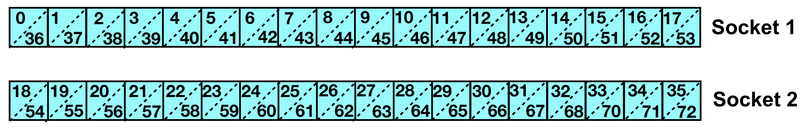
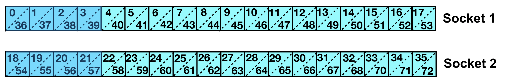
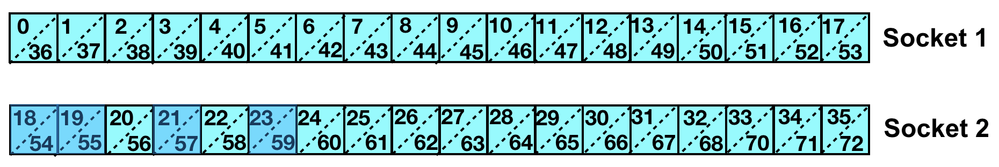

# Module 4: Thread affinity with OpenMP

*Edgar A. León* and *Jane E. Herriman*<br>
Lawrence Livermore National Laboratory


## Table of contents

1. Making sense of affinity: [Discovering the node architecture topology](module1.md)
2. Applying automatic affinity: [mpibind](module2.md)
3. Exerting resource manger affinity: [Process affinity with Slurm](module3.md)
4. Exerting thread affinity: OpenMP
   1. [Learning objectives](#learning-objectives)
   1. [OpenMP thread affinity](#openmp-thread-affinity)
   1. [Examples](#examples)
   1. [Hands-on exercises](#hands-on-exercises)
   1. [References](#references)
5. Putting it all together: [Adding in GPUs](module5.md)


## Learning objectives

* Learn to specify the *places* to which OpenMP threads can be bound (e.g. cores or hardware threads)
* Learn to distribute & bind OpenMP across *places* via the *spread* and *close* policies
* Learn to select exact compute resources (i.e. specific cores) where OpenMP threads can run
* Learn how to specify task binding without thread binding and vice versus

## OpenMP thread affinity

The OpenMP 4+ specification provides two environment variables for
affinity and binding:
```
OMP_PROC_BIND
OMP_PLACES
```

At a high-level, `OMP_PROC_BIND` specifies an easy-to-use policy such
as *spread*, which distributes the threads over a set of hardware resources,
while `OMP_PLACES` specifies the hardware resources where 
the policy is applied.

Because these variables and their associated values are part of the
OpenMP spec, they should work across compilers, e.g., IBM xlc, GNU
gcc, Intel icc, etc. No more compiler-specific variables!

`OMP_PROC_BIND` and `OMP_PLACES` can take the following values: 

```
OMP_PROC_BIND
   true, false, spread, close, master
OMP_PLACES
   threads, cores, sockets, <explicit-places>
```

Thread affinity can be used with or without process affinity. For example, as we'll see in the next section, a common scenario is to bind an MPI task to a socket and then use thread affinity to bind threads to cores within that socket. 

## Examples 


The following examples demonstrate how to use thread affinity with and without process affinity. 

In these examples, we'll use `--mpibind=off` to ensure that `mpibind` is not used, so that we can see the impact of using only OpenMP affinity to place our threads and Slurm's `--cpu_bind` to place tasks.

We'll look at Pascal's architecture, which we'll visualize as follows:



Each row of squares represents one of the two sockets on a Pascal node, with each square representing a single core. A dotted diagonal line separates the index of the core in the upper left corner of each square from the index of the second processing unit (enabled by SMT) in the lower right corner. In similar versions of this image below, additional shading denotes the compute resources to which threads have been assigned. 

Finally, for simplicity, let's use a small number of threads. We'll set

```
$ export OMP_NUM_THREADS=4
```

for all examples.


### Example 1. Bind each task to a socket

Before applying OpenMP affinity, let's bind each task to a socket as
we learned in the previous module. 

```
$ srun --mpibind=off --cpu_bind=sockets -n2 ./mpi-nvidia 
pascal13   Task   0/  2 running on 36 CPUs: 0-17,36-53
pascal13   Task   1/  2 running on 36 CPUs: 18-35,54-71
```

Each task is assigned all of the CPUs on its dedicated socket.

### Example 2. Let the threads run wild!

We carry on with two tasks, each bound to their own socket. Now, though, we bring threads into the picture by swapping out the `mpi-nvidia` binary for `mpi+omp-nvidia`.

The interesting change we make here is adding `OMP_PROC_BIND=false`. With this setting, the execution environment can move OpenMP threads between OpenMP places.  

```
$ OMP_PROC_BIND=false srun --mpibind=off --cpu_bind=sockets -N1 -n2 ./mpi+omp-nvidia
pascal13 Task   0/  2 Thread   0/  4 with 36 cpus: 0-17,36-53
pascal13 Task   0/  2 Thread   1/  4 with 36 cpus: 0-17,36-53
pascal13 Task   0/  2 Thread   2/  4 with 36 cpus: 0-17,36-53
pascal13 Task   0/  2 Thread   3/  4 with 36 cpus: 0-17,36-53
pascal13 Task   1/  2 Thread   0/  4 with 36 cpus: 18-35,54-71
pascal13 Task   1/  2 Thread   1/  4 with 36 cpus: 18-35,54-71
pascal13 Task   1/  2 Thread   2/  4 with 36 cpus: 18-35,54-71
pascal13 Task   1/  2 Thread   3/  4 with 36 cpus: 18-35,54-71
```

In this example, threads from task 0 can run anywhere on the first socket, while threads from task 1 can
run anywhere on the second socket.

We might envision this as


where all cores/PUs are potentially occupied by the threads assigned to their socket.


### Example 3. Place threads on cores and keep them close

Next, we change `OMP_PROC_BIND` from `false` to `close` and add the environment variable `OMP_PLACES`.

With `OMP_PROC_BIND=close`, we assign the threads to places close to the place of the parent thread.

With `OMP_PLACES=cores`, we bind each thread to a core.


```
$ OMP_PROC_BIND=close OMP_PLACES=cores srun --mpibind=off --cpu_bind=sockets -N1 -n2 ./mpi+omp-nvidia 
pascal13 Task   0/  2 Thread   0/  4 with  2 cpus: 0,36
pascal13 Task   0/  2 Thread   1/  4 with  2 cpus: 1,37
pascal13 Task   0/  2 Thread   2/  4 with  2 cpus: 2,38
pascal13 Task   0/  2 Thread   3/  4 with  2 cpus: 3,39
pascal13 Task   1/  2 Thread   0/  4 with  2 cpus: 18,54
pascal13 Task   1/  2 Thread   1/  4 with  2 cpus: 19,55
pascal13 Task   1/  2 Thread   2/  4 with  2 cpus: 20,56
pascal13 Task   1/  2 Thread   3/  4 with  2 cpus: 21,57
```

We might envision this as



In this example, for task 0, we bind thread 0 to core 0, thread 1 to core 1, ..., thread 3 to core 3. For task 1, we bind thread 0 to core 18, thread 1 to core 19, ..., thread 3 to core 21. The four threads associated with each socket are assigned to the first four cores on their socket. (Remember that in this architecture a core is comprised of two hardware threads (CPUs).)


### Example 4. Place threads on hardware threads and keep them close

Leaving `OMP_PROC_BIND=close`, we change `OMP_PLACES` to `OMP_PLACES=threads` to bind each OpenMP thread to a hardware thread, rather than a core.


```
$ OMP_PROC_BIND=close OMP_PLACES=threads srun --mpibind=off --cpu_bind=sockets -N1 -n2 ./mpi+omp-nvidia 
pascal13 Task   0/  2 Thread   0/  4 with  1 cpus: 0
pascal13 Task   0/  2 Thread   1/  4 with  1 cpus: 36
pascal13 Task   0/  2 Thread   2/  4 with  1 cpus: 1
pascal13 Task   0/  2 Thread   3/  4 with  1 cpus: 37
pascal13 Task   1/  2 Thread   0/  4 with  1 cpus: 18
pascal13 Task   1/  2 Thread   1/  4 with  1 cpus: 54
pascal13 Task   1/  2 Thread   2/  4 with  1 cpus: 19
pascal13 Task   1/  2 Thread   3/  4 with  1 cpus: 55
```

In this example, two OpenMP threads are assigned to a single core. For task 0, we bind thread 0 to HW thread 0 (core 0), thread 1 to HW thread 36 (core 0), etc. For task 1, we bind thread 0 to HW thread 18 (core 18), thread 1 to HW thread 54 (core 18), etc. 

We might envision this as


where now only 2 of the 18 cores on each socket are occupied with threads. In this image, the dotted line separating CPUs on a core has been solidified to denote the separation between these resources as they handle *different* tasks.

Note that on Pascal, each core has its own `L1` and `L2` cache, so the two threads sharing a core also share `L1` and `L2` cache.


### Example 5. Place threads on cores and spread them over

Next, we'll return to binding threads to cores via `OMP_PLACES=cores`, but we'll look at the impact of moving from the `close` to the `spread` policy.

With `OMP_PROC_BIND=spread`, we distribute threads across the resources of the partition where the parent thread is placed.

```
$ OMP_PROC_BIND=spread OMP_PLACES=cores srun --mpibind=off --cpu_bind=sockets -N1 -n2 ./mpi+omp-nvidia 
pascal13 Task   0/  2 Thread   0/  4 with  2 cpus: 0,36
pascal13 Task   0/  2 Thread   1/  4 with  2 cpus: 4,40
pascal13 Task   0/  2 Thread   2/  4 with  2 cpus: 9,45
pascal13 Task   0/  2 Thread   3/  4 with  2 cpus: 14,50
pascal13 Task   1/  2 Thread   0/  4 with  2 cpus: 18,54
pascal13 Task   1/  2 Thread   1/  4 with  2 cpus: 22,58
pascal13 Task   1/  2 Thread   2/  4 with  2 cpus: 27,63
pascal13 Task   1/  2 Thread   3/  4 with  2 cpus: 32,68
```

In this example, a single OpenMP thread is assigned to a core. The threads are spread out over the available cores of each socket. For task 0, we bind thread 0 to core 0, thread 1 to core 4, ..., thread 3 to core 14. For task 1, we bind thread 0 to core 18, thread 1 to core 22, ..., thread 3 to core 32.

We can visualize this with


### Example 6. Place threads anywhere you want to...

With `OMP_PLACES` we can specify an arbitrary set of CPUs where each thread should run. Furthermore, we can apply the policies associated with `OMP_PROC_BIND` over those arbitrary resources.

In this example, we bind threads to cores and select a set of cores -- the first six cores on the second socket -- by specifying their hardware thread indices: 

```
$ OMP_PROC_BIND=spread OMP_PLACES={18,54},{19,55},{20,56},{21,57},{22,58},{23,59} srun --mpibind=off --cpu_bind=none -N1 -n1 ./mpi+omp-nvidia 
pascal13 Task   0/  1 Thread   0/  4 with  2 cpus: 18,54
pascal13 Task   0/  1 Thread   1/  4 with  2 cpus: 19,55
pascal13 Task   0/  1 Thread   2/  4 with  2 cpus: 21,57
pascal13 Task   0/  1 Thread   3/  4 with  2 cpus: 23,59
```

We can visualize this thread placement as:



Note that because we used a single task and `OMP_NUM_THREADS=4`, a total of four threads were distributed across these six cores. We disabled process binding (`--cpu_bind=none`) so that it would not interfere with the arbitrary thread mapping. Because we used the `spread` policy, these threads are situated as far apart from one another as they can be while staying within the first six cores on the second socket.


<!-- sketch

* https://lc.llnl.gov/confluence/pages/viewpage.action?pageId=659292776#CustomProcess/ThreadAffinity-OpenMPThreadAffinity

* OMP_PROC_BIND

* OMP_PLACES

* https://pages.tacc.utexas.edu/~eijkhout/pcse/html/omp-affinity.html

--> 


## Hands-on exercises

### 1. Assign OpenMP threads core-wise and threadwise with `OMP_PLACES`.

Consider the output for each of the following three commands run in your AWS environments, in which `mpibind=off`:

```
OMP_NUM_THREADS=3 srun -N1 -n2 -ppvis -t1 --mpibind=off  ./mpi+omp
OMP_NUM_THREADS=3 OMP_PLACES=cores srun -N1 -n2 -ppvis -t1 --mpibind=off  ./mpi+omp
OMP_NUM_THREADS=3 OMP_PLACES=threads srun -N1 -n2 -ppvis -t1 --mpibind=off  ./mpi+omp
```

1. How many CPUs are assigned to each thread when we don't use `OMP_PLACES` to specify how threads should be assigned? How many CPUs are assigned per OpenMP thread when OpenMP threads are assigned (hardware)thread-wise and core-wise?
2. In each of these commands, how many OpenMP threads are assigned to each CPU?
3. Add in the Slurm flag `--cpu_bind=sockets` from Module 3 so that tasks aren't spread across sockets and run

```
OMP_NUM_THREADS=3 OMP_PLACES=cores srun -N1 -n2 -ppvis -t1 --cpu_bind=sockets --mpibind=off  ./mpi+omp
OMP_NUM_THREADS=3 OMP_PLACES=threads srun -N1 -n2 -ppvis -t1 --cpu_bind=sockets --mpibind=off  ./mpi+omp
```

4. Did the number of CPUs per OpenMP thread change? Did the number of OpenMP threads per CPU change?

### 2. Map OpenMP threads to hardware resources using the close and spread policies. Show the mappings.  

1. Add `OMP_PROC_BIND` to the last `srun` command and observe the effects of the `close` and `spread` policies.

```
OMP_PROC_BIND=close OMP_NUM_THREADS=3 OMP_PLACES=threads srun -N1 -n2 -ppvis -t1 --cpu_bind=sockets --mpibind=off  ./mpi+omp
OMP_PROC_BIND=spread OMP_NUM_THREADS=3 OMP_PLACES=threads srun -N1 -n2 -ppvis -t1 --cpu_bind=sockets --mpibind=off  ./mpi+omp
```

2. With the `close` policy, how many OpenMP threads are there **per core**? With the `spread` policy?
3. Compare the resources assigned to the 3 threads of `Task 0` with the `close` and `spread` policy. What dedicated resources do each of these threads have with the `spread` policy that were shared between threads for the `close` policy?

### 3. Replicate the mapping from the close policy via an explicit assignment of threads to cores. 

Reproduce the mapping for 

```
OMP_PROC_BIND=close OMP_NUM_THREADS=3 OMP_PLACES=cores srun -N1 -n2 -ppvis -t1 --cpu_bind=sockets --mpibind=off  ./mpi+omp
```

observed in your AWS environment without the use of `OMP_PROC_BIND=close`. Instead, use `OMP_PLACES` to specify the exact cores where you want to place your threads.

For example, to recreate the mapping for this command observed on `Pascal`,

```
janeh@pascal83:~$ OMP_PROC_BIND=close OMP_NUM_THREADS=3 OMP_PLACES=cores srun -N1 -n2 -ppvis -t1 --cpu_bind=sockets --mpibind=off  ./mpi+omp
pascal18 Task   0/  2 Thread   0/  3 with  2 cpus: 0,36
pascal18 Task   0/  2 Thread   1/  3 with  2 cpus: 1,37
pascal18 Task   0/  2 Thread   2/  3 with  2 cpus: 2,38
pascal18 Task   1/  2 Thread   0/  3 with  2 cpus: 18,54
pascal18 Task   1/  2 Thread   1/  3 with  2 cpus: 19,55
pascal18 Task   1/  2 Thread   2/  3 with  2 cpus: 20,56
```

you would want to use `OMP_PLACES` to specify that `Task 1, Thread 0` maps to core 18, that `TASK 1, Thread 1` maps to core 19, etc.


## References

* [OpenMP](https://www.openmp.org/)
* [OpenMP specification](https://www.openmp.org/specifications/)
* [OMP_PROC_BIND](https://www.openmp.org/spec-html/5.0/openmpse52.html#x291-20580006.4)
* [OMP_PLACES](https://www.openmp.org/spec-html/5.0/openmpse53.html#x292-20600006.5)

