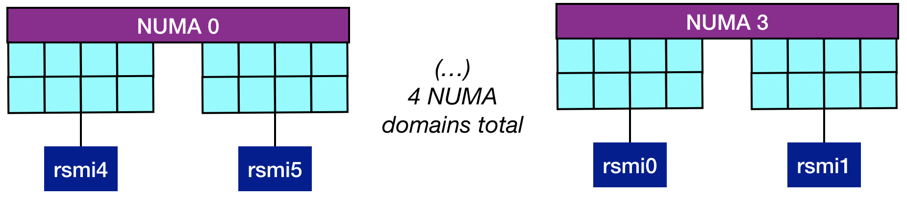

# Module 5: Adding in GPUs

*Edgar A. León* and *Jane E. Herriman*<br>
Lawrence Livermore National Laboratory

## Table of contents

1. Making sense of affinity: [Discovering the node architecture topology](module1.md)
2. Applying automatic affinity: [mpibind](module2.md)
3. Exerting resource manger affinity: [Process affinity with Slurm](module3.md)
4. Exerting thread affinity: [OpenMP](module4.md)
5. Putting it all together: Adding in GPUs
   1. [Learning objectives](#learning-objectives)
   1. [Background](#background)
   1. [Example architecture](#example-architecture)
   1. [Affinity via the resource manager](#affinity-via-the-resource-manager)
   1. [Affinity via environment variables](#affinity-via-environment-variables)
   1. [Hands-on exercises](#hands-on-exercises)
   1. [References](#references)
   
<!--
6. Putting it all together: [Process, thread, and GPU affinity](module6.md)
-->


## Learning objectives

<!--
* Understand the benefits of applying affinity at the resource manager
  level (rather than at the MPI-library level).
-->

* Learn how to map MPI tasks to GPUs via the following:
   * The resource manager
   * Vendor-specific environment variables
* Learn how to apply combined process, thread, and GPU affinity
  policies to hybrid applications.  

## Background

GPU affinity is important for fully leveraging the capabilities of a machine with GPUs. If not used correctly, one can oversubscribe GPUs while others are left idle, incur high latencies, and transfer data to and from a GPU at a small fraction of its achievable bandwidth, among other suboptimalities. In this module, we describe two ways to control GPU affinity: through vendor-specific environment variables and through the resource manager.

Though we focus on these two ways, there are other ways to control affinity. In particular, programming abstractions such as CUDA and HIP provide APIs to accomplish this task. These APIs provide fine control over the GPUs, but require program changes to use them.

The advantages of using environment variables to control affinity is that we don't need to modify our programs. However, if using more than one GPU vendor, we may need to use a different variable that matches that vendor. On the other hand, using the resource manager to control affinity may work well across GPU vendors (as long as they are supported) and MPI libraries. 


## Example architecture

In this module we use the `Tioga` supercomputer. For details please see [Example Architectures](../common/archs.md).

We might consider a simplified schematic of Tioga:

<p align="center">
   
</p>

We attempt to highlight the most important characteristics of Tioga's architecture in this figure: Tioga has 4 NUMA domain, each with 16 cores, 2 `L3` caches and 2 GPUs. Resources are considered *local* when they share a NUMA domain, but each GPU is closest to the 8 cores with which it shares an `L3` cache.

Since our affinity programs use PCI IDs to identify GPUs, we provide the equivalence in ordinal numbers and their associated NUMA domains for `Tioga`. 


<table style="text-align:center;margin-left:auto;margin-right:auto;">
  <tr>
    <td colspan="2">NUMA 0</td>
    <th colspan="2">NUMA 1</th>
    <td colspan="2">NUMA 2</td>
    <td colspan="2">NUMA 3</td>
  </tr>
  <tr>
    <td>L3</td>
    <td>L3</td>
    <th>L3</th>
    <th>L3</th>
    <td>L3</td>
    <td>L3</td>
    <th>L3</th>
    <td>L3</td>    
  </tr>
  <tr>
    <td>Cores<br>0-7</td>
    <td>Cores<br>8-15</td>
    <th>Cores<br>16-23</th>
    <th>Cores<br>24-31</th>
    <td>Cores<br>32-39</td>
    <td>Cores<br>40-47</td>
    <th>Cores<br>48-55</th>
    <td>Cores<br>56-63</td>
  </tr>
  <tr>
    <td>GPU 4<br>0xd1</td>
    <td>GPU 5<br>0xd6</td>
    <th>GPU 2<br>0xc9</th>
    <th>GPU 3<br>0xce</th>
    <td>GPU 6<br>0xd9</td>
    <td>GPU 7<br>0xde</td>
    <th>GPU 0<br>0xc1</th>
    <td>GPU 1<br>0xc6</td>
  </tr>
</table>


<!--
<table style="text-align:center;margin-left:auto;margin-right:auto;">
  <tr>
    <th></th>
    <th colspan="2">NUMA 0</th>
    <th colspan="2">NUMA 1</th>
    <th colspan="2">NUMA 2</th>
    <th colspan="2">NUMA 3</th>
  </tr>
  <tr>
    <td>Ordinal</td>
    <td>rsmi 4</td>
    <td>rsmi 5</td>
    <td>rsmi 2</td>
    <td>rsmi 3</td>
    <td>rsmi 6</td>
    <td>rsmi 7</td>
    <td>rsmi 0</td>
    <td>rsmi 1</td>
  </tr>
  <tr>
    <td>PCI</td>
    <td>0xd1</td>
    <td>0xd6</td>
    <td>0xc9</td>
    <td>0xce</td>
    <td>0xd9</td>
    <td>0xde</td>
    <td>0xc1</td>
    <td>0xc6</td>
  </tr>
</table>
-->

<!--
| Ordinal | PCI | NUMA |
| -------------- | ---------- | -------------- |
| rsmi 4 | 0xd1 | NUMA 0 |
| rsmi 5 | 0xd6 | NUMA 0 |
| rsmi 2 | 0xc9 | NUMA 1 |
| rsmi 3 | 0xce | NUMA 1 |
| rsmi 6 | 0xd9 | NUMA 2 |
| rsmi 7 | 0xde | NUMA 2 |
| rsmi 0 | 0xc1 | NUMA 3 |
| rsmi 1 | 0xc6 | NUMA 3 |
-->

## Affinity via the resource manager

In [Module 3](module3.md) we covered CPU affinity using Slurm. In this section, we extend our coverage of Slurm-enabled CPU affinity to include GPU affinity. 

Slurm provides several parameters to control GPU affinity. Below we
show those parameters as well as the CPU parameters necessary to drive
GPU affinity.  

```
# CPU options
# --cpu-bind=threads|cores
# --threads-per-core=<nthreads>
# -c, --cpus-per-task=<ncpus>
```
```
# GPU options
# --gpus-per-node=<ngpus>
# --gpu-bind=closest
# --gpu-bind=map_gpu:<id0,id1,...>
```

The strategy we follow to apply GPU affinity is based on
locality: *We bind the workers to CPU resources appropriately
and then, use the local GPUs associated with those resources*.

To get started, we allocate one node and tell Slurm we want to use all of the GPUs on that node.

```
$ salloc -N1 --gpus-per-node=8 
salloc: Granted job allocation 3339
salloc: Waiting for resource configuration
salloc: Nodes tioga22 are ready for job

tioga22:~$
```

The commands in the following examples will be run on the node allocated above.

### Example 1. Assigning local GPUs with `--gpu-bind=closest`

A common use case is to use one task per GPU. Since we have 8 GPUs,
let's launch 8 tasks (`-n8`) and spread them over the available cores. Since
we have 64 cores, each task gets 8 cores (`-c8`). For simplicity, we use only one hardware thread from each core.  


<details>
<summary>

```
$ srun -n8 -c8 --cpu-bind=thread ./mpi-tioga 
```
</summary>

```
tioga22    Task   0/  8 running on 8 CPUs: 0-7
           Task   0/  8 has 8 GPUs: 0xc1 0xc6 0xc9 0xce 0xd1 0xd6 0xd9 0xde 
tioga22    Task   1/  8 running on 8 CPUs: 8-15
           Task   1/  8 has 8 GPUs: 0xc1 0xc6 0xc9 0xce 0xd1 0xd6 0xd9 0xde 
tioga22    Task   2/  8 running on 8 CPUs: 16-23
           Task   2/  8 has 8 GPUs: 0xc1 0xc6 0xc9 0xce 0xd1 0xd6 0xd9 0xde 
tioga22    Task   3/  8 running on 8 CPUs: 24-31
           Task   3/  8 has 8 GPUs: 0xc1 0xc6 0xc9 0xce 0xd1 0xd6 0xd9 0xde 
tioga22    Task   4/  8 running on 8 CPUs: 32-39
           Task   4/  8 has 8 GPUs: 0xc1 0xc6 0xc9 0xce 0xd1 0xd6 0xd9 0xde 
tioga22    Task   5/  8 running on 8 CPUs: 40-47
           Task   5/  8 has 8 GPUs: 0xc1 0xc6 0xc9 0xce 0xd1 0xd6 0xd9 0xde 
tioga22    Task   6/  8 running on 8 CPUs: 48-55
           Task   6/  8 has 8 GPUs: 0xc1 0xc6 0xc9 0xce 0xd1 0xd6 0xd9 0xde 
tioga22    Task   7/  8 running on 8 CPUs: 56-63
           Task   7/  8 has 8 GPUs: 0xc1 0xc6 0xc9 0xce 0xd1 0xd6 0xd9 0xde 
```
</details>


Note that each task has access to all of the GPUs, but what we want is to assign a different GPU to each one. Let's do that using `--gpu-bind=closest`, which assigns the closest GPU(s) to CPU resources where a task is bound.


<details>
<summary>

```
$ srun -n8 -c8 --cpu-bind=thread --gpu-bind=closest ./mpi-tioga 
```
</summary>

```
tioga22    Task   0/  8 running on 8 CPUs: 0-7
           Task   0/  8 has 1 GPUs: 0xd1 
tioga22    Task   1/  8 running on 8 CPUs: 8-15
           Task   1/  8 has 1 GPUs: 0xd6 
tioga22    Task   2/  8 running on 8 CPUs: 16-23
           Task   2/  8 has 1 GPUs: 0xc9 
tioga22    Task   3/  8 running on 8 CPUs: 24-31
           Task   3/  8 has 1 GPUs: 0xce 
tioga22    Task   4/  8 running on 8 CPUs: 32-39
           Task   4/  8 has 1 GPUs: 0xd9 
tioga22    Task   5/  8 running on 8 CPUs: 40-47
           Task   5/  8 has 1 GPUs: 0xde 
tioga22    Task   6/  8 running on 8 CPUs: 48-55
           Task   6/  8 has 1 GPUs: 0xc1 
tioga22    Task   7/  8 running on 8 CPUs: 56-63
           Task   7/  8 has 1 GPUs: 0xc6 
```
</details>


Voilà. This is easy because we bound our tasks to CPUs appropriately.

Depending on your Slurm configuration you may or may not need to add `--gpus-per-node=8` to the `srun` command lines above. 


### Example 2. Custom (remote) GPU mappings

While using local GPUs is an easy and efficient way of using these resources, there are cases where custom mappings are needed. As we will show later, we use this capability to benchmark the speed of communication between GPUs. The parameter for this purpose is `--gpu-bind=map_gpu`. If you recall the `--cpu-bind=map_cpu` parameter from [Module 3](module3.md), the GPU parameter works similarly.

First let's use local GPUs again as in Example 1, but for only two tasks.

<details>
<summary>

```
$ srun -n2 -c8 --cpu-bind=thread --gpu-bind=closest ./mpi-tioga 
```
</summary>

```
tioga22    Task   0/  2 running on 8 CPUs: 0-7
           Task   0/  2 has 1 GPUs: 0xd1 
tioga22    Task   1/  2 running on 8 CPUs: 8-15
           Task   1/  2 has 1 GPUs: 0xd6 
```
</details>


Now, let's use remote GPUs, i.e., instead of using the GPUs on the local NUMA domain (domain 0), use GPUs on a remote NUMA domain (domain 1). NUMA domain 1 has GPUs `rsmi 2` and `rsmi 3`. To do this, we change the parameter passed to `--gpu-bind` above from `closest` to `map_gpu:2,3`

<details>
<summary>

```
$ srun -n2 -c8 --cpu-bind=thread --gpu-bind=map_gpu:2,3 ./mpi-tioga
```
</summary>

```
tioga22    Task   0/  2 running on 8 CPUs: 0-7
           Task   0/  2 has 1 GPUs: 0xc9 
tioga22    Task   1/  2 running on 8 CPUs: 8-15
           Task   1/  2 has 1 GPUs: 0xce 
```
</details>


Note that the input to `map_gpu` is a list of ordinals: `id0,id1,...`. Each task is mapped to a single ordinal **in order**, e.g., `(task0, id0)`, `(task1, id1)`, etc. In the example above we assign task 0 to GPU 2 and task 1 to GPU 3. 

### Example 3. Binding tasks to GPUs on and across NUMA domains

To demonstrate that *locality matters*, we use custom mappings to benchmark the speed of communication between GPUs within a single NUMA domain and across NUMA domains.

We use the OSU micro-benchmarks for this purpose in Example 4. These benchmarks measure several communication operations including latency and bandwidth. A nice feature is the ability to choose the source and destination buffers from host memory or device memory. 

First, let's double check we can use GPUs within the same NUMA domain and across NUMA domains. Remember that NUMA domain 0 has GPUs rsmi 4 and rsmi 5, while NUMA domain 2 has GPUs rsmi 6 and rsmi 7. 

With `--gpu-bind=map_gpu:4,5` we grab two GPUs from NUMA domain 0 and with `--gpu-bind=map_gpu:4,6`, we grab GPUs from NUMA domains 0 and 2:

<details>
<summary>

```
# GPUs within the same NUMA domain
$ srun -n2 -c8 --cpu-bind=thread --gpu-bind=map_gpu:4,5 ./mpi-tioga
```
</summary>

```
tioga22    Task   0/  2 running on 8 CPUs: 0-7
           Task   0/  2 has 1 GPUs: 0xd1 
tioga22    Task   1/  2 running on 8 CPUs: 8-15
           Task   1/  2 has 1 GPUs: 0xd6 
```
</details>

<details>
<summary>

```
# GPUs across NUMA domains
$ srun -n2 -c8 --cpu-bind=thread --gpu-bind=map_gpu:4,6 ./mpi-tioga 
```
</summary>

```
tioga22    Task   0/  2 running on 8 CPUs: 0-7
           Task   0/  2 has 1 GPUs: 0xd1 
tioga22    Task   1/  2 running on 8 CPUs: 8-15
           Task   1/  2 has 1 GPUs: 0xd9 
```
</details>


### Example 4. Measuring GPU bandwidth on and across NUMA domains

Now, let's measure bandwidth across GPUs (i.e. sending data from one GPU to another). 

For GPU bandwidth for two GPUs on the same NUMA domain, we see

<details>
<summary>

```
$ srun -n2 -c8 --cpu-bind=thread --gpu-bind=map_gpu:4,5 ./osu_bw-tioga -m 131072:4194304 D D
```
</summary>

```
# OSU MPI-ROCM Bandwidth Test v5.9
# Send Buffer on DEVICE (D) and Receive Buffer on DEVICE (D)
# Size      Bandwidth (MB/s)
131072              14848.95
262144              22728.22
524288              31955.43
1048576             88512.35
2097152            114106.16
4194304            135040.96
```
</details>

and for GPU bandwidth for GPUs on different NUMA domains, we see

<details>
<summary>

```
$ srun -n2 -c8 --cpu-bind=thread --gpu-bind=map_gpu:4,6 ./osu_bw-tioga -m 131072:4194304 D D
```
</summary>

```
# OSU MPI-ROCM Bandwidth Test v5.9
# Send Buffer on DEVICE (D) and Receive Buffer on DEVICE (D)
# Size      Bandwidth (MB/s)
131072              13285.15
262144              19939.48
524288              27143.70
1048576             35419.94
2097152             38663.38
4194304             40689.62
```
</details>

Notice the over 3X difference in bandwidth. *Locality matters*!

To be complete and if we wanted to do things right for this exercise, we would also place the tasks on CPUs so that the communication between CPUs and GPUs is local. Remember we already covered placing tasks on CPUs with `--cpu-bind`. 

We create this mapping via


<details>
<summary>

```
$ srun -n2 --cpu-bind=map_cpu:0,32 --gpu-bind=map_gpu:4,6 ./mpi-tioga 
```
</summary>

```
tioga22    Task   0/  2 running on 1 CPUs: 0
           Task   0/  2 has 1 GPUs: 0xd1 
tioga22    Task   1/  2 running on 1 CPUs: 32
           Task   1/  2 has 1 GPUs: 0xd9 
```
</details>

and test its bandwidth via


<details>
<summary>

```
$ srun -n2 --cpu-bind=map_cpu:0,32 --gpu-bind=map_gpu:4,6 ./osu_bw-tioga -m 131072:4194304 D D
```
</summary>

```
# OSU MPI-ROCM Bandwidth Test v5.9
# Send Buffer on DEVICE (D) and Receive Buffer on DEVICE (D)
# Size      Bandwidth (MB/s)
131072              13270.19
262144              19935.23
524288              27142.33
1048576             35514.51
2097152             38732.84
4194304             40730.63
```
</details>


Can you tell why the bandwidth did not change when using local CPUs (rather than remote CPUs)? 


## Affinity via environment variables

Each GPU vendor provides environment variables to restrict the set of GPUs a process or thread can use. The environment variables AMD and NVIDIA provide for their devices are the following: 

| AMD | NVIDIA |
| --- | ------ |
| ROCR_VISIBLE_DEVICES | CUDA_VISIBLE_DEVICES |

These variables take a comma-separated list of ordinals or UUIDs (Universally Unique Identifiers) associated with GPUs. Since we are working with `Tioga` for this module, we focus on AMD, but both variables work in the same way.

Let's look at a few examples. 

### Example 5. Selecting GPUs via an environment variable

First, let's verify that all 8 GPUs are available to my job. 


<details>
<summary>

```
$ srun -n4 -c8 --cpu-bind=thread ./mpi-tioga  
```
</summary>

```
tioga22    Task   2/  4 running on 8 CPUs: 16-23
           Task   2/  4 has 8 GPUs: 0xc1 0xc6 0xc9 0xce 0xd1 0xd6 0xd9 0xde 
tioga22    Task   0/  4 running on 8 CPUs: 0-7
           Task   0/  4 has 8 GPUs: 0xc1 0xc6 0xc9 0xce 0xd1 0xd6 0xd9 0xde 
tioga22    Task   1/  4 running on 8 CPUs: 8-15
           Task   1/  4 has 8 GPUs: 0xc1 0xc6 0xc9 0xce 0xd1 0xd6 0xd9 0xde 
tioga22    Task   3/  4 running on 8 CPUs: 24-31
           Task   3/  4 has 8 GPUs: 0xc1 0xc6 0xc9 0xce 0xd1 0xd6 0xd9 0xde
```
</details>

Now, let's say that we want to work only with the second GPU associated with each NUMA domain, e.g., rsmi 5, rsmi 3, rsmi 7, and rsmi 1.

<details>
<summary>

```
$ ROCR_VISIBLE_DEVICES=5,3,7,1 srun -n4 -c8 --cpu-bind=thread ./mpi-tioga
```
</summary>

```
tioga22    Task   0/  4 running on 8 CPUs: 0-7
           Task   0/  4 has 4 GPUs: 0xd6 0xce 0xde 0xc6 
tioga22    Task   3/  4 running on 8 CPUs: 24-31
           Task   3/  4 has 4 GPUs: 0xd6 0xce 0xde 0xc6 
tioga22    Task   1/  4 running on 8 CPUs: 8-15
           Task   1/  4 has 4 GPUs: 0xd6 0xce 0xde 0xc6 
tioga22    Task   2/  4 running on 8 CPUs: 16-23
           Task   2/  4 has 4 GPUs: 0xd6 0xce 0xde 0xc6
```
</details>


It works! Each task can see only 4 GPUs. 

But, what we really want is to assign a different GPU to each task. As it stands, four GPUs are available to all tasks. In fact, GPU 0xd6 is the default GPU, meaning that if the tasks start launching GPU kernels, all four will be using the same GPU!


### Example 6. Using a script to assign GPUs to tasks

We resort to the script `assign_gpus` below to address this shortcoming . The idea is to set `ROCR_VISIBLE_DEVICES` based on the task ID. There are several variables we can use to get the task ID of a job, including MPI-library-specific variables. However, we use the variables provided by the resource manager, e.g., `SLURM_LOCALID`, since those are portable across MPI libraries.

```bash
#!/bin/bash

# The GPUs I want to use
visible_devices=(5 3 7 1)

# Number of GPUs
ngpus=${#visible_devices[@]}

# Use the node local ID of each task to assign a GPU to it
if [ -n "$SLURM_LOCALID" ]; then
    index=$(( SLURM_LOCALID % ngpus ))
    gpu=${visible_devices[$index]}

    cmd="ROCR_VISIBLE_DEVICES=$gpu $@"
    eval "$cmd"
fi
```

We execute `assign_gpus` and pass the affinity program as a parameter to it. The script will assign the right value to ROCR_VISIBLE_DEVICES on a per-task basis and execute the input program. 


<details>
<summary>

```
$ srun -n4 -c8 --cpu-bind=thread assign_gpus ./mpi-tioga 
```
</summary>

```
tioga22    Task   0/  4 running on 8 CPUs: 0-7
           Task   0/  4 has 1 GPUs: 0xd6 
tioga22    Task   1/  4 running on 8 CPUs: 8-15
           Task   1/  4 has 1 GPUs: 0xce 
tioga22    Task   2/  4 running on 8 CPUs: 16-23
           Task   2/  4 has 1 GPUs: 0xde 
tioga22    Task   3/  4 running on 8 CPUs: 24-31
           Task   3/  4 has 1 GPUs: 0xc6 
```
</details>


Voilà. We did it! 

To be complete, can you think of how to assign local CPUs as well? For example, task 1 is running on CPUs 8-15, which are in NUMA domain 0, but its GPU, 0xce, is in NUMA domain 1. This assignment incurs remote GPU accesses! 


## Hands-on exercises

### 1. Using Slurm's GPU affinity, run one MPI task per GPU and assign a local GPU to each task. 

Looking to Example 1 for assistance, you'll want to run a command of the form

```
srun -N1 -p<queue> -t1 -n<total tasks> -c<cores per task> --cpu-bind=thread --gpu-bind=closest ./mpi
```

`--gpu-bind=closest` will assign local GPUs only if the tasks are already spread across the NUMA domains that contain GPUs.

1. On your AWS node, determine the total number of GPUs, `X`. You'll create this many tasks via `-nX`.
2. How many cores are on your AWS node? Let's call this number `Y`. Assuming you have the same number of GPUs in each NUMA domain, assign `Y/X` CPUs to each task.

3. Modify the `srun` command above as needed and check that you get local GPUs assigned to all tasks.

### 2. Repeat for OpenMP threads. Hint: Use MPI+OpenMP to leverage locality. 

Assign one OpenMP thread per GPU and assign a local GPU to each task. Here's some guidance:

1. Use the Slurm flags `-n` to specify as many MPI tasks as sockets/NUMA domains and `--cpu_bind=sockets` to spread these tasks across NUMA domains. Refer to the hands-on exercises in [Module 4](module4.md) for more guidance.

2. Use the environment variable `OMP_NUM_THREADS` to specify the number of threads per task -- this should equal the number of GPUs.

3. Ensure local GPUs are assigned to each thread as in Exercise 1, above.


### 3. Using vendor-specific environment variables, run one MPI task per core and assign a local GPU to each task. A GPU may be assigned to more than one task.  

Here is some guidance: 

1. Use `lstopo` to determine which GPUs lie on each NUMA domain.

2. Determine and set the order in which tasks are assigned to GPUs with `ROCR_VISIBLE_DEVICES`. See Example 5 in this module.

3. Use the appropriate flags to ensure that each MPI task is assigned to a dedicated core and that all tasks are assigned to cores in the same NUMA domain as the GPUs to which they'll be assigned. 

4. Check that local GPUs are assigned to each task by running `mpi` on a batch AWS node with the appropriate parameters. 

## References

* Slurm [GPU binding][slurm]

* AMD [ROCR_VISIBLE_DEVICES][amd]

* NVIDIA [CUDA_VISIBLE_DEVICES][nvidia]


[slurm]: https://slurm.schedmd.com/srun.html "Slurm GPU binding"
[amd]: https://rocmdocs.amd.com/en/latest/ROCm_System_Managment/ROCm-System-Managment.html
[nvidia]: https://developer.nvidia.com/blog/cuda-pro-tip-control-gpu-visibility-cuda_visible_devices/


<!--
<details>
<summary>

```
```
</summary>

```
```
</details>
-->