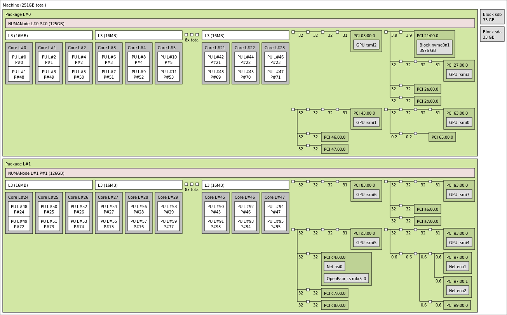
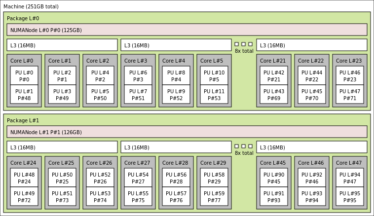
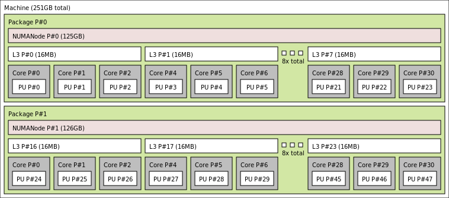

# Machine Topology and Binding

**Edgar A. Leon** and **Jane E. Herriman**<br>
Lawrence Livermore National Laboratory

Los Alamos Parallel Computing Summer Lecture Series<br>
23 June 2022<br>
Virtual 

## Learning objectives

* Learn basics of computer architecture, as needed for this module
* Learn how to use `lstopo` to explore node topology
* Learn how to calculate CPU masks with `hwloc-calc`
* Learn how to bind processes to CPUs (sometimes via CPU masks) with `hwloc-bind`
* Understand the concepts of affinity, binding, and mapping.
* Identify the resources available to the processes and threads of a
hybrid program.


## Table of contents 

1. Computer architecture
1. Example architectures
1. The hwloc library
1. Discovering the node topology
1. Using synthetic topology
1. Mapping, affinity, and binding
1. Example mappings
1. Reporting affinity
1. Calculating CPU masks
1. Binding to CPUs with hwloc


## 1. Computer architecture

Before introducing you to the `hwloc` library, we want to cover some of the computer architecture terminology we'll be using throughout this module and tutorial.

### Compute only

Let's start by considering compute resources only (and ignoring memory). 


At the bottom of the tree shown above, we see "Processing Units" denoted as "PU"s. A **PU** is the smallest processing unit that can handle a logical thread of execution, i.e. execute its own set of instructions. Multiple PUs are sometimes packaged together into a **core**. PUs have both dedicated and shared hardware resources on a core; for example, floating point units are shared by multiple PUs.

In our tree, we see **GPU**s, Graphical Processing Units, shown at the same level as cores. In contrast to cores and their PUs, GPUs allow for greater data parallelization by working on vectors of data at once.

Multiple cores and possibly one or more GPUs are included on a single processor. Each of these processors is a set of compute resources written onto a single piece of Silicon (a die).

Finally, at the top of our tree is a node, which you can think of as a stand-alone computer. Modern nodes are often built from multiple processors, and the example architectures we'll consider each have two processors. 

#### Exercise 1

The number of hardware threads on a processor is equal to

**A)** The number of cores per processor

**B)** The number of PUs per core

**C)** The number of cores per processor x the number of PUs per core

<details>
<summary>
Answer
</summary>
C!

Every core has one hardware thread per PU.

Every processor has one hardware thread for all the PUs across all cores.
</details>

### Adding in memory

Once we throw memory into the picture, we need to consider not only what resources are available, but how they're physically arranged and, therefore, how easily they can talk to one another.

In the image below, consider a scenario where we have two processors and two stores of memory. In the layout shown, processor 1 is closer to memory 1 than to memory 2; similarly, processor 2 is closer to memory 2 than memory 1. This means that processor 1 can more easily and *more quickly* access data stored in memory 1 than data stored in memory 2 and vice versus. In this case, the processors have Non-Uniform Memory Access (NUMA) and we say that memory 1 and processor 1 are in the same NUMA domain. Processor 2 shares the second NUMA domain with memory 2 and will access data in memory 1 with higher latency.


We can imagine scenarios where memory is laid out to be equidistant from multiple processors and where multiple processors are in the same NUMA domain. In the architectures we'll consider, however, there will be a one-to-one mapping between NUMA domains and processors; all computing resources on a Silicon die will be in the same NUMA domain and different processors will have different "local" memory.

Our references to "memory" above refer to memory that's transmitted over a frontside bus. In contrast, **cache memory** serves as a faster and closer source of memory, and different cores on the same processor and within the same NUMA domain may have access to different cache. 

In general, cache levels are denoted as `L<N>` where `<N>` denotes the cache level. Lower values of `N` denote smaller and faster levels of cache. In the figure below, we see an example of what the cache hierarchy and layout might look like on a single processor.


In this example cache layout, there are three levels of cache -- `L1`, `L2`, and `L3`. Each core has its own `L1` cache, every two cores share a `L2` cache, and sets of six cores each have a `L3` cache.

#### Exercise 2

“Cores with different L2 cache have ‘non-uniform memory access’.”

**A)** True

**B)** False

<details>
<summary>
Answer
</summary>
B!

Non-uniform memory access typically refers to heterogenous access to *main memory*.

We'd say that all cores on the same processor share local memory (for example, the same local RAM) even if different cores have access to different cache.
</details>


## 2. Example architectures

The topologies of a few example architectures are summarized and diagramed [here](../common/archs.md).

We'll be using these machines (`Pascal`, `Corona`, and `Lassen`) in examples throughout the coming modules!

#### Exercise 3 

How many PUs per core does Lassen have?

**A)** 4

**B)** 2

**C)** 8

Lassen has 20 cores per processor. How many L3 caches per processor does Lassen have?

**A)** 1

**B)** 20

**C)** 10

<details>
<summary>
Answer
</summary>
Part 1 -- A; Part 2 -- C

Lassen has four PUs on each core (see diagram). 

Every two cores share an L3 cache, so we'd expect the 20 cores on a single processor to need 10 L3 caches.
</details>

## 3. The hwloc library 

### What is hwloc?

The Hardware Locality (`hwloc`) software project is an open source toolkit that helps you better investigate and visualize the resources available to you on a given hardware architecture.

We'll explore some of the basic commands in the sections below.

Note that for this tutorial, `hwloc` is provided, so you won't need to install anything. Also note that a C API is also provied, though we'll be working with `hwloc` exclusively from the command line.

### hwloc objects and indexes 

We concentrate on three classes of objects reported by hwloc objects -- memory objects, normal objects, and I/O objects. The image below summarizes these classes and how they further subdivide into `hwloc` object types, though it is not comprehensive:


Note that the classification of objects in `hwloc` is not mutually exclusive: a single device can register as multiple objets with different classifications depending on how it is configured. For example, a single GPU might register as a GPU, a PCI, and a CoProcessor.

Also note that hwloc reports logical indices in reporting objects. This reporting is self consistent and so can be used when you're working exclusively with hwloc. On the other hand, the OS will report the physical index of objects, as you will encounter when you start working with bindings outside of hwloc.

*Definitions:*

**OS or physical index**: Index the operating system (OS) uses to
identify the object.

**Logical index**: Index, calculated by hwloc, to uniquely identify
  objects of the same type and depth.


## 4. Discovering the node topology

One of the tools provided by `hwloc` is `lstopo`. By default, `lstopo` produces an image that depicts the topology of the node you're working on, and the related `lstopo-no-graphics` instead provides textual output to describe node topology.

Output formats include X11, pdf, png, xml, and text. Examples of images produced include those used to show the topologies for `Corona`, `Lassen`, and `Pascal` in the **"Example Architectures"** section above. Similar images can be generated by running `lstopo <machine>.png` on the relevant machine. On the other hand, text output on Pascal, for example, looks like

<details>
<summary>

```
janeh@pascal83:~$ lstopo-no-graphics 
```

</summary>

```                           
Machine (126GB total)
  NUMANode L#0 (P#0 63GB)
    Package L#0 + L3 L#0 (45MB)
      L2 L#0 (256KB) + L1d L#0 (32KB) + L1i L#0 (32KB) + Core L#0 + PU L#0 (P#0)
      L2 L#1 (256KB) + L1d L#1 (32KB) + L1i L#1 (32KB) + Core L#1 + PU L#1 (P#1)
      L2 L#2 (256KB) + L1d L#2 (32KB) + L1i L#2 (32KB) + Core L#2 + PU L#2 (P#2)
      L2 L#3 (256KB) + L1d L#3 (32KB) + L1i L#3 (32KB) + Core L#3 + PU L#3 (P#3)
      L2 L#4 (256KB) + L1d L#4 (32KB) + L1i L#4 (32KB) + Core L#4 + PU L#4 (P#4)
      L2 L#5 (256KB) + L1d L#5 (32KB) + L1i L#5 (32KB) + Core L#5 + PU L#5 (P#5)
      L2 L#6 (256KB) + L1d L#6 (32KB) + L1i L#6 (32KB) + Core L#6 + PU L#6 (P#6)
      L2 L#7 (256KB) + L1d L#7 (32KB) + L1i L#7 (32KB) + Core L#7 + PU L#7 (P#7)
      L2 L#8 (256KB) + L1d L#8 (32KB) + L1i L#8 (32KB) + Core L#8 + PU L#8 (P#8)
      L2 L#9 (256KB) + L1d L#9 (32KB) + L1i L#9 (32KB) + Core L#9 + PU L#9 (P#9)
      L2 L#10 (256KB) + L1d L#10 (32KB) + L1i L#10 (32KB) + Core L#10 + PU L#10 (P#10)
      L2 L#11 (256KB) + L1d L#11 (32KB) + L1i L#11 (32KB) + Core L#11 + PU L#11 (P#11)
      L2 L#12 (256KB) + L1d L#12 (32KB) + L1i L#12 (32KB) + Core L#12 + PU L#12 (P#12)
      L2 L#13 (256KB) + L1d L#13 (32KB) + L1i L#13 (32KB) + Core L#13 + PU L#13 (P#13)
      L2 L#14 (256KB) + L1d L#14 (32KB) + L1i L#14 (32KB) + Core L#14 + PU L#14 (P#14)
      L2 L#15 (256KB) + L1d L#15 (32KB) + L1i L#15 (32KB) + Core L#15 + PU L#15 (P#15)
      L2 L#16 (256KB) + L1d L#16 (32KB) + L1i L#16 (32KB) + Core L#16 + PU L#16 (P#16)
      L2 L#17 (256KB) + L1d L#17 (32KB) + L1i L#17 (32KB) + Core L#17 + PU L#17 (P#17)
    HostBridge L#0
      PCIBridge
        PCI 8086:1521
          Net L#0 "eno1"
        PCI 8086:1521
          Net L#1 "eno2"
      PCIBridge
        PCI 15b3:1017
          Net L#2 "hsi0"
          OpenFabrics L#3 "mlx5_0"
      PCI 8086:8d62
      PCIBridge
        PCI 102b:0522
          GPU L#4 "card0"
          GPU L#5 "controlD64"
      PCI 8086:8d02
        Block(Disk) L#6 "sda"
        Block(Disk) L#7 "sdb"
  NUMANode L#1 (P#1 63GB)
    Package L#1 + L3 L#1 (45MB)
      L2 L#18 (256KB) + L1d L#18 (32KB) + L1i L#18 (32KB) + Core L#18 + PU L#18 (P#18)
      L2 L#19 (256KB) + L1d L#19 (32KB) + L1i L#19 (32KB) + Core L#19 + PU L#19 (P#19)
      L2 L#20 (256KB) + L1d L#20 (32KB) + L1i L#20 (32KB) + Core L#20 + PU L#20 (P#20)
      L2 L#21 (256KB) + L1d L#21 (32KB) + L1i L#21 (32KB) + Core L#21 + PU L#21 (P#21)
      L2 L#22 (256KB) + L1d L#22 (32KB) + L1i L#22 (32KB) + Core L#22 + PU L#22 (P#22)
      L2 L#23 (256KB) + L1d L#23 (32KB) + L1i L#23 (32KB) + Core L#23 + PU L#23 (P#23)
      L2 L#24 (256KB) + L1d L#24 (32KB) + L1i L#24 (32KB) + Core L#24 + PU L#24 (P#24)
      L2 L#25 (256KB) + L1d L#25 (32KB) + L1i L#25 (32KB) + Core L#25 + PU L#25 (P#25)
      L2 L#26 (256KB) + L1d L#26 (32KB) + L1i L#26 (32KB) + Core L#26 + PU L#26 (P#26)
      L2 L#27 (256KB) + L1d L#27 (32KB) + L1i L#27 (32KB) + Core L#27 + PU L#27 (P#27)
      L2 L#28 (256KB) + L1d L#28 (32KB) + L1i L#28 (32KB) + Core L#28 + PU L#28 (P#28)
      L2 L#29 (256KB) + L1d L#29 (32KB) + L1i L#29 (32KB) + Core L#29 + PU L#29 (P#29)
      L2 L#30 (256KB) + L1d L#30 (32KB) + L1i L#30 (32KB) + Core L#30 + PU L#30 (P#30)
      L2 L#31 (256KB) + L1d L#31 (32KB) + L1i L#31 (32KB) + Core L#31 + PU L#31 (P#31)
      L2 L#32 (256KB) + L1d L#32 (32KB) + L1i L#32 (32KB) + Core L#32 + PU L#32 (P#32)
      L2 L#33 (256KB) + L1d L#33 (32KB) + L1i L#33 (32KB) + Core L#33 + PU L#33 (P#33)
      L2 L#34 (256KB) + L1d L#34 (32KB) + L1i L#34 (32KB) + Core L#34 + PU L#34 (P#34)
      L2 L#35 (256KB) + L1d L#35 (32KB) + L1i L#35 (32KB) + Core L#35 + PU L#35 (P#35)
    HostBridge L#4
      PCIBridge
        PCI 8086:1572
          Net L#8 "aci0"
        PCI 8086:1572
          Net L#9 "aci1"
```

</details>

A few other basic parameters can help to customize outputs, including `--merge`, `--no-useless-caches`,  `--no-io`, `--only <type>`, and `--physical`.

`--merge` and `--no-useless-caches` respectively avoid showing levels and caches that don't have a hierarchical impact, and `--no-io` causes the topology to be described without IO devices.

```
$ lstopo --merge corona-merge.png
```



```
$ lstopo --no-useless-caches --no-io corona-no-cache-io.png
```




`--only <type>` causes the topology of only `type` devices to be described,

```
janeh@pascal83:~$ lstopo-no-graphics --only NUMANode
NUMANode L#0 (P#0 63GB)
NUMANode L#1 (P#1 63GB)
```

and `--physical` causes physical instead of logical indices to be reported.

<details>
<summary>

```
janeh@pascal83:~$ lstopo-no-graphics --no-useless-caches
```

</summary>

```
(...)
  NUMANode L#1 (P#1 63GB)
    Package L#1
      Core L#18 + PU L#18 (P#18)
      Core L#19 + PU L#19 (P#19)
      Core L#20 + PU L#20 (P#20)
      Core L#21 + PU L#21 (P#21)
      Core L#22 + PU L#22 (P#22)
(...)
```

</details>

<details>
<summary>

```
janeh@pascal83:~$ lstopo-no-graphics --no-useless-caches --physical
```

</summary>

```
(...)
 NUMANode P#1 (63GB)
    Package P#1
      Core P#0 + PU P#18
      Core P#1 + PU P#19
      Core P#2 + PU P#20
      Core P#3 + PU P#21
      Core P#4 + PU P#22
(...)
```

</details>

```
janeh@corona211:~$ lstopo --no-useless-caches --no-io --physical
```



*Note: See how the figures in this section differ from `Corona`'s topology as shown under "Example Architectures".*

#### Exercise 4

Running `$ lstopo --merge` removes caches that have no hierarchical impact. On Corona, these are

**A)** L1

**B)** L2

**C)** L3

<details>
<summary>
Answer
</summary>
A & B: L1 and L2 cache are removed from the diagram. 
</details>

#### Exercise 5

The removed caches don’t contribute to the hierarchy because…

**A)** They were shared by all cores.

**B)** They were shared by only some cores.

**C)** They were local only to individual cores.

<details>
<summary>
Answer
</summary>
C. Each core has its own L1 and L2 cache.

In contrast to L3 cache on Corona, which creates groups of three cores that all share L3 cache, L1 and L2 cache don't add structure to the cache hierachy because they don't create new subgroups of cores.
</details>

#### Exercise 6

“Physical and logical core indexes are equivalent.”

**A)** True

**B)** False

<details>
<summary>
Answer
</summary>
B, False.

Note that with physical indexing on Corona, the first core on **each** processor is labeled "Core 0". 
With logical indexing, this redundancy between processors doesn't exist. In this case, the first core on the second processor is "Core 24".
</details>


## 5. Using synthetic topologies 

In all the `lstopo(-no-graphics)` examples so far, `lstopo` was run on the same node being investigated. `lstopo` also allows you to explore topologies of other machines/systems simply by specifying as an input a `.xml` file that provides information about the system.

For example, you should see a series of `.xml` files in the directory `~/hwloc`:

```
~/hwloc$ ls
corona.xml
lassen.xml
mammoth.xml
pascal.xml
ruby.xml
```

Using these files, you should be able to recreate any of the outputs for `lstopo` shown above, simply by adding `--input <machine name>.xml` to the commands shown above; as an example, 

```
lstopo --input ~/hwloc/corona.xml --no-useless-caches --no-io --physical
```

should allow you to produce the same image shown at the end of the section above, without needing access to `Corona`.


## 6. Mapping, affinity, and binding 

**Mapping**: A function from the worker set (our set of tasks and/or threads) to the hardware resource set. 

**Affinity**: Policies for how computational tasks map to hardware.

**Binding**: Mechanism for implementing and changing the mappings of a given affinity policy. 

*Mappings*, *affinity*, and *bindings* are key and interrelated concepts in this tutorial, and so we want to define and distinguish between them. When we know a program's hardware mapping, we know which hardware resources (for example, which cores and which caches) are available to each of the workers executing the program. The affinity is a policy that informs the mapping used for a particular combination of hardware and workers, and then workers are bound to hardware resources as defined by the mapping. 

For example, an affinity policy asking processes to spread out may result in a mapping where Process 1 is assigned to Core 1 and Process 2 maps to Core 16. After binding to Core 16, Process 2 can start performing computational work there.

Since we're just getting started, these concepts may still feel abstract, but our hope is that after seeing some concrete examples in this module, these definitions will start to feel more straightforward.


## 7. Example mappings

#### Example 1: MPI mappings
##### Example 1.A
Suppose we have an affinity policy that specifies **one MPI task per `Core` on `Pascal`**. We might get the following mapping:

* <i>Task 0: PU 0,36</i>
* <i>Task 1: PU 1,37</i>
* <i>...</i>
* <i>Task 18: PU 18,54</i>
* <i>... </i>
* <i>Task 35: PU 35,71</i>

Note that each core on `Pascal` has two processing units (PUs), so every task assigned to a single core is assigned to two PUs. Each `Pascal` node has 2 processors each with 18 cores for a total of 36 cores per node, so we can have a max of 36 tasks on a single node given the "one task per core" affinity policy.

##### Example 1.B
Next, suppose we had an affinity policy with **one MPI task per `L3` on `Corona`**. In the image depicting `Corona`'s topology above, we see that each `L3` cache on `Corona` has 3 cores. Since one `Corona` node has 48 cores, we'd expect to see 16 tasks on a node with 3 cores per task, perhaps with the following mapping:

* <i>Task 0: PU 0-2,48-50</i>
* <i>Task 1: PU 3-5,51-53</i>
* <i>...</i>
* <i>Task 8: PU 24-26,72-74</i>
* <i>...</i>
* <i>Task 15: PU 45-47,93-95</i>

The auxiliary commands

```
lstopo -i pascal.xml -p --only core 
lstopo -i corona.xml -p --only l3 
``` 

can be used to reproduce these mappings for yourself using the provied `.xml` files that describe the topology of `Pascal` and `Corona`.

#### Example 2: OpenMP mappings

Consider an affinity policy with **one OpenMP thread per `Core` on `Lassen`**:

* <i>Thread 0: PU 8</i>
* <i>Thread 1: PU 12</i>
* <i>...</i>
* <i>Thread 19: PU 92</i>
* <i>...</i>
* <i>Thread 39: PU 172</i>

and how this compares to an affinity policy with **one OpenMP thread per `PU` on `Lassen`**:

* <i>Thread 0: PU 8</i>
* <i>Thread 1: PU 9</i>
* <i>Thread 2: PU 10</i>
* <i>Thread 3: PU 11</i>
* <i>...</i>
* <i>Thread 78: PU 86</i>
* <i>Thread 79: PU 87</i>
* <i>...</i>
* <i>Thread 80: PU 96</i>
* <i>Thread 81: PU 97</i>
* <i>...</i>
* <i>Thread 159: PU 174</i>
* <i>Thread 160: PU 175</i>

Auxiliary commands

```
lstopo -i lassen.xml -p --only core  
lstopo -i lassen.xml -p --only pu  
```

#### Example 3: GPU mappings
##### Example 3.A
On `Corona`, consider an affinity policy with **one task per GPU**:

* <i>Task 0: rsmi0</i>
* <i>Task 1: rsmi1</i>
* <i>... </i>
* <i>Task 6: rsmi6</i>
* <i>Task 7: rsmi7</i>

##### Example 3.B
For an affinity policy with **one thread per GPU** on `Corona`, observe how many tasks we see:

* <i>Task 0, thread 0: rsmi0</i>
* <i>Task 0, thread 1: rsmi1</i>
* <i>Task 0, thread 2: rsmi2</i>
* <i>Task 0, thread 3: rsmi3</i>
* <i>Task 1, thread 0: rsmi4</i>
* <i>Task 1, thread 1: rsmi5</i>
* <i>Task 1, thread 2: rsmi6</i>
* <i>Task 1, thread 3: rsmi7</i>

We see that our affinity policy of one thread per GPU gave us 8 threads, each assigned to one of two tasks. Why do you think **two** tasks were created?

Auxiliary commands
```
lstopo -i corona.xml -p | grep -i -e numa -e gpu 
```

#### Exercise 7

Match the following:

“Task 8 —> PUs 24-26 and 72-74”

“Policy for one openMP thread per L3 on corona”

**A)** Affinity

**B)** Mapping

<details>
<summary>
Answer
</summary>

B. Mapping: “Task 8 —> PUs 24-26 and 72-74”

A. Affinity: “Policy for one openMP thread per L3 on corona”
</details>

## 8. Reporting affinity

`mpibind` provides programs to report the mapping of each process and thread
to the CPUs and GPUs of a node. There are three variants:

* MPI: `mpi`
* OpenMP: `omp`
* MPI+OpenMP: `mpi+omp`

Usage is straightforward. Use the `-v` option for verbose GPU output and
the `-h` option for help.

The examples below are already using `mpibind`, but we will talk about that a little later.  

##### Example 5

`Corona` has 48 cores and 8 GPUs split across 2 processors. A program run with 4 MPI tasks gets 12 CPUs and 2 GPUs per task.

<details>
<summary>

```
$ srun -n4 ./mpi
```

</summary>

```
corona236  Task   0/  4 running on 12 CPUs: 0-11
           Task   0/  4 has 2 GPUs: 0x63 0x43
corona236  Task   1/  4 running on 12 CPUs: 12-23
           Task   1/  4 has 2 GPUs: 0x3 0x27 
corona236  Task   2/  4 running on 12 CPUs: 24-35
           Task   2/  4 has 2 GPUs: 0xe3 0xc3 
corona236  Task   3/  4 running on 12 CPUs: 36-47
           Task   3/  4 has 2 GPUs: 0x83 0xa3 
```

</details>

When we run with the `-v` flag to get "verbose" output, we see more information about the GPUs assigned to each task.

<details>
<summary>

```
$ srun -n4 ./mpi -v
```

</summary>

```
corona236  Task   0/  4 running on 12 CPUs: 0-11
           Task   0/  4 has 2 GPUs: 0x63 0x43 
	Default device: 0x63
	0x63: , 31 GB Mem, 60 Multiprocessors, 1.725 GHZ, 9.0 CC
	0x43: , 31 GB Mem, 60 Multiprocessors, 1.725 GHZ, 9.0 CC
corona236  Task   1/  4 running on 12 CPUs: 12-23
           Task   1/  4 has 2 GPUs: 0x3 0x27 
	Default device: 0x3
	0x03: , 31 GB Mem, 60 Multiprocessors, 1.725 GHZ, 9.0 CC
	0x27: , 31 GB Mem, 60 Multiprocessors, 1.725 GHZ, 9.0 CC
corona236  Task   2/  4 running on 12 CPUs: 24-35
           Task   2/  4 has 2 GPUs: 0xe3 0xc3 
	Default device: 0xe3
	0xe3: , 31 GB Mem, 60 Multiprocessors, 1.725 GHZ, 9.0 CC
	0xc3: , 31 GB Mem, 60 Multiprocessors, 1.725 GHZ, 9.0 CC
corona236  Task   3/  4 running on 12 CPUs: 36-47
           Task   3/  4 has 2 GPUs: 0x83 0xa3 
	Default device: 0x83
	0x83: , 31 GB Mem, 60 Multiprocessors, 1.725 GHZ, 9.0 CC
	0xa3: , 31 GB Mem, 60 Multiprocessors, 1.725 GHZ, 9.0 CC
```
</details>

##### Example 6

Still on `Corona`, let's look at the bindings we see when we run a program with 2 processes while `OMP_NUM_THREADS=4`. This means we'll create 4 OpenMP threads *per process*. Note that since we're not using MPI here, each process is independent.

We see below that, with 4 threads and 4 GPUs per process, *each thread gets its own GPU*:

<details>
<summary>

```
$ OMP_NUM_THREADS=4 srun -n2 ./omp
```

</summary>

```
Process running on 8 CPUs: 0,3,6,9,12,15,18,21
Process has 4 GPUs: 0x63 0x43 0x3 0x27 
	Default device: 0x63
	0x63: , 31 GB Mem, 60 Multiprocessors, 1.725 GHZ, 9.0 CC
	0x43: , 31 GB Mem, 60 Multiprocessors, 1.725 GHZ, 9.0 CC
	0x03: , 31 GB Mem, 60 Multiprocessors, 1.725 GHZ, 9.0 CC
	0x27: , 31 GB Mem, 60 Multiprocessors, 1.725 GHZ, 9.0 CC
Thread   0/  4 running on 1 CPUs: 0
Thread   0/  4 assigned to GPU: 0x63
Thread   1/  4 running on 1 CPUs: 6
Thread   1/  4 assigned to GPU: 0x43
Thread   2/  4 running on 1 CPUs: 12
Thread   2/  4 assigned to GPU: 0x3
Thread   3/  4 running on 1 CPUs: 18
Thread   3/  4 assigned to GPU: 0x27

Process running on 8 CPUs: 24,27,30,33,36,39,42,45
Process has 4 GPUs: 0xe3 0xc3 0x83 0xa3 
	Default device: 0xe3
	0xe3: , 31 GB Mem, 60 Multiprocessors, 1.725 GHZ, 9.0 CC
	0xc3: , 31 GB Mem, 60 Multiprocessors, 1.725 GHZ, 9.0 CC
	0x83: , 31 GB Mem, 60 Multiprocessors, 1.725 GHZ, 9.0 CC
	0xa3: , 31 GB Mem, 60 Multiprocessors, 1.725 GHZ, 9.0 CC
Thread   0/  4 running on 1 CPUs: 24
Thread   0/  4 assigned to GPU: 0xe3
Thread   1/  4 running on 1 CPUs: 30
Thread   1/  4 assigned to GPU: 0xc3
Thread   2/  4 running on 1 CPUs: 36
Thread   2/  4 assigned to GPU: 0x83
Thread   3/  4 running on 1 CPUs: 42
Thread   3/  4 assigned to GPU: 0xa3  
```

</details>

**Auxiliary links**
```
https://github.com/LLNL/mpibind/tree/master/affinity
```

#### Exercise 8 

Which command produced the following output?

```
pascal26   Task   0/  3 running on 9 CPUs: 0-8
pascal26   Task   2/  3 running on 18 CPUs: 18-35
pascal26   Task   1/  3 running on 9 CPUs: 9-17
```

**A)** srun -n2 mpi

**B)** srun -n3 mpi

**C)** srun -n2 omp

**D)** srun -n3 omp

<details>
<summary>
Answer
</summary>
B! 

Only tasks are created (not threads), so this is a program running MPI.

Three tasks are created (numbered 0 to 2), so `srun -n3 mpi` generated this output.
</details>

## 9. Calculating CPU masks

Another tool provided by `hwloc` is `hwloc-calc`, which allows you to create CPU masks. (In case this is an unfamiliar term -- this is basically a hexadecimal string that can be interpreted as a list identifying particular CPUs.) These masks can then be used as inputs to another `hwloc` function, `hwloc-bind`, as we'll see below.

First off, without even worrying about CPU masks, we can use `hwloc-calc` to list, for example, the particular cores or PUs on a given NUMA domain:

```
# Get the cores on the first NUMA node of Pascal
$ hwloc-calc NUMAnode:0 --intersect core 
0,1,2,3,4,5,6,7,8,9,10,11,12,13,14,15,16,17
```
```
# Get the cores on the second NUMA node
$ hwloc-calc NUMAnode:1 --intersect core 
18,19,20,21,22,23,24,25,26,27,28,29,30,31,32,33,34,35
```
```
# Get the PUs on core 8 of the second NUMA node
$ hwloc-calc NUMAnode:1.core:8 --intersect PU
52,53
```

If we drop the `--intersect` flag and instead simply run `hwloc-calc <compute resource>:<index>.<compute resource>.<index>`, we'll get a CPU mask in hexadecimal:

```
$ hwloc-calc NUMAnode:0.core:1
0x00000020,0x00000002
```
```
$ hwloc-calc NUMAnode:0.core:2
0x00000040,0x00000004
```

We can add multiple masks together via the syntax `hwloc <mask 1> <mask 2> ...`. Note that adding the masks for cores 1 and 2 on NUMA domain 0 creates the same mask as if we create a mask for both cores from scratch:

```
$ hwloc-calc 0x00000020,0x00000002 0x00000040,0x00000004
0x00000060,0x00000006
```
```
$ hwloc-calc NUMAnode:0.core:1-2
0x00000060,0x00000006
```

Note that particular resources can be excluded from the mask calculated by using `~` to specify the resources to exclude. For example, the following CPU mask includes all cores on the first NUMA domain except cores 0, 1, and 2:

```
$ hwloc-calc NUMAnode:0 ~NUMAnode:0.core:0-2
0x003fff80,0x0003fff8
```

The `--hierarchical` flag can be used to print expanded info about the NUMA domains, cores, and PUs associated with a particular set of compute resources, expressed either with keywords or with a CPU mask. For example, here is expanded info about the PUs on the 2nd and 3rd core of the 1st NUMA domain:

```
$ hwloc-calc 0x00000060,0x00000006 --hierarchical NUMAnode.core.PU
NUMANode:0.Core:1.PU:0 NUMANode:0.Core:1.PU:1 NUMANode:0.Core:2.PU:0 NUMANode:0.Core:2.PU:1
```
```
$ hwloc-calc NUMAnode:0.core:1-2 --hierarchical NUMAnode.core.PU
NUMANode:0.Core:1.PU:0 NUMANode:0.Core:1.PU:1 NUMANode:0.Core:2.PU:0 NUMANode:0.Core:2.PU:1
```

Finally, observe how the `--taskset` flag changes the format of the mask printed:

```
$ hwloc-calc NUMAnode:0
0x003ffff0,0x0003ffff
```
```
$ hwloc-calc NUMAnode:0 --taskset
0x3ffff00003ffff
```

The default mask format is specific to `hwloc`, whereas `--taskset` displays the mask in the format recognized by the taskset command-line program (an alternative command line tool for binding).

#### Exercise 9

`hwloc-calc NUMAnode:1 --intersect core`

**A)** gives a list of cores on the first NUMA node

**B)** gives a mask for the cores on the first NUMA node

**C)** gives a list of cores on the second NUMA node

**D)** gives a mask for the cores on the second NUMA node

<details>
<summary>
Answer
</summary>
C!

`hwloc-calc NUMAnode:1` would produce a mask, but the `--intersect core` flag changes the output to a list of cores.

Because of 0-indexing, the fist NUMA node is `NUMAnode:0` and the second is `NUMAnode:1`.
</details>

## 10. Binding to CPUs 

`hwloc-bind` can be used to bind a task to a particular set of compute resources using the syntax `hwloc-bind <compute resources: keywords or mask> -- <command to run on these resources>`:

For example, to bind a shell via `sh` to the first 2 cores on each NUMA domain:

```
hwloc-bind NUMAnode:0.core:0-1 NUMAnode:1.core:0-1 -- sh
```

We can get the mask for the resources running tasks with `hwloc-bind --get`:

```
$ hwloc-bind --get
0x00c00030,0x000c0003
```

As a sanity check, we can use `hwloc-calc` to see which cores are included in this  mask:

```
$ hwloc-calc 0x00c00030,0x000c0003 --intersect core
0,1,18,19
```

This should align with our expectations, given that `Pascal` has 18 cores per NUMA domain.

This would also have worked if we had instead calculated the mask first with `hwloc-calc` and passed it to `hwloc-bind` via:

```
hwloc-bind 0x00c00030,0x000c0003 -- sh
```

As another sanity check that this is working as expected, we can use `hwloc-bind --get` to see the mask of the set of compute resources to which this process was bound. The command

```
hwloc-bind <mask> -- hwloc-bind --get
```

should return the same mask provided as an input:

```
$ hwloc-bind 0x00c00030,0x000c0003 -- hwloc-bind --get
0x00c00030,0x000c0003
```

When a mask is passed to `hwloc-bind`, the default behavior is that the mask is passed to `--cpubind`, so that the supplied mask is used to determine the cpus to which a task is bound. For example,

```
hwloc-bind NUMAnode:1
```

and 

```
hwloc-bind --cpubind NUMAnode:1
```

are therefore equivalent.

On the other hand, the flag `--membind` can be used to specify the memory resources to which a task should be bound. For example,

```
hwloc-bind NUMAnode:1 --membind NUMAnode:0 -- sh
```

specifies that the task created by `sh` should be run on the compute resources of the 2nd NUMA domain, whereas it should use memory from the resources on the first NUMA domain.

#### Exercise 10

```
$ hwloc-calc NUMAnode:0 ~NUMAnode:0.core:0-2 --intersect core 
3,4,5,6,7,8,9,10,11,12,13,14,15,16,17
$ hwloc-calc NUMAnode:0 ~NUMAnode:0.core:0-2
0x003fff80,0x0003fff8
$ hwloc-bind 0x003fff80,0x0003fff8 -- echo “hello”
```

In the above, `echo “hello”` runs on

**A)** All of NUMA node 0

**B)** Cores 0-2 of NUMA node 0

**C)** Cores 3-17 of NUMA node 0

<details>
<summary>
Answer
</summary>
C!

We see in the first line that `~NUMAnode:0.core:0-2` excludes cores 0-2 from the first NUMA node, printing cores 3-17.

In the second line, we create a mask for cores 3-17.

In the third line, we use that mask to run `echo "hello"` on cores 3-17.
</details>

<!--
## Hands-on exercises

### 1. Describe the memory hierarchy of a compute node.

Use `~/hwloc/mammoth.xml` to explore the topology of a LC machine called `Mammoth`. In particular,

1. How many NUMA domains does `Mammoth` have?
2. How many cores per NUMA domain does `Mammoth` have?
3. How many PUs per `L3` cache?
4. How many cores per `L2` cache?
5. How many `L1` caches per node?

### 2. Identify the GPUs local to a given NUMA domain.

1. How many GPUs are there in each NUMA domain on `Lassen`?
2. How many GPUs are there in each NUMA domain on `Pascal`?

### 3. Enumerate the local CPUs of a given GPU.

1. Which cores on `Lassen` are local to `CoProc cuda 3`?
2. Which cores on `Corona` are local to `GPU rsmi 1`?

### 4. Determine the PUs associated with a given core

<details>
<summary>

Using `hwloc-calc` with the flag `-i` to specify an input file, determine the PUs associated with core 4 on the second NUMA domain of `Mammoth`.

</summary>

Answer:

```
janeh@pascal10:~$ hwloc-calc NUMAnode:1.core:4 -i mammoth.xml --intersect PU
44,45
```

</details>

### 5. Determine the compute resources associated with a given task

<details>
<summary>

To *which cores* on *which NUMA domains* was the last task bound with `hwloc-bind`? Determine what should replace `<complete this with keyword args>` in the following:

```
janeh@pascal22:~$ hwloc-bind <complete this with keyword args> -- sh
janeh@pascal22:~$ hwloc-bind --get
0x00000040,0x00100004,0x00010000
```

</summary>

Answer:

```
janeh@pascal10:~$ hwloc-calc 0x00000040,0x00100004,0x00010000 -i pascal.xml -H NUMA.core
NUMANode:0.Core:16 NUMANode:1.Core:16
```

Checking that this produces the desired mask,

```
janeh@pascal10:~$ hwloc-calc NUMANode:0.Core:16 NUMANode:1.Core:16
0x00000040,0x00100004,0x00010000
```

So, the keywords passed to `hwloc-bind` were `NUMANode:0.Core:16 NUMANode:1.Core:16`.

</details>

-->

## Bibliography and references

[hwloc] https://www.open-mpi.org/projects/hwloc

[mpibind] https://github.com/LLNL/mpibind


<!--- https://www.open-mpi.org/projects/hwloc/tutorials/20120702-POA-hwloc-tutorial.html --->
