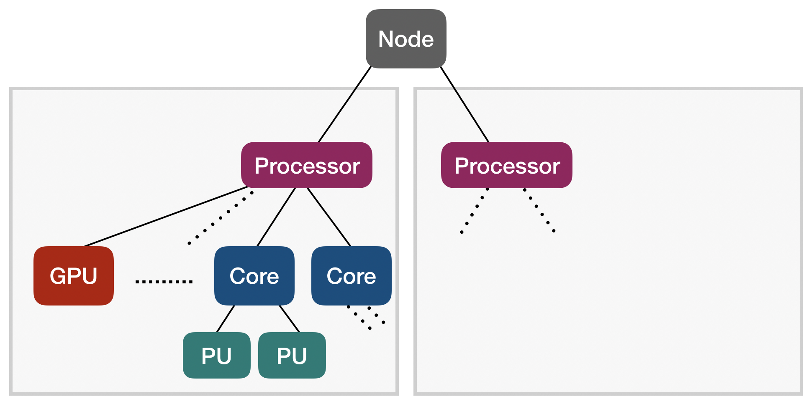

# Supercomputing Systems 101

**Edgar A. León** and **Jane E. Herriman**<br>
Lawrence Livermore National Laboratory<br>

Distributed under the terms of the MIT license<br>
See https://github.com/LLNL/mpibind for details<br>
LLNL-CODE-812647

Tech Workshop @[Tapia Conference](https://tapiaconference.cmd-it.org/)<br>
Friday 9 September 2022<br>
Washington, DC

Short link for this module: [shorturl.at/boru4](shorturl.at/boru4)

## AWS environment instructions

Please see [our instructions](tapia-setup-instructions.md) for ssh'ing to AWS.

## Table of contents 

1. [Learning objectives](#1-learning-objectives)
1. [Computer architecture](#2-computer-architecture)
1. [Example architectures](#3-example-architectures)
1. [Discovering node topology](#4-discovering-node-topology)
1. [Mapping, affinity, and binding](#5-mapping-affinity-and-binding)
1. [Running parallel jobs and reporting affinity](#6-running-parallel-jobs-and-reporting-affinity)
1. [Setting affinity](#7-setting-affinity)
1. [Bibliography and references](#8-bibliography-and-references)


## 1. Learning objectives

* Learn basics of computer architecture, as needed for this workshop
* Learn how to use `hwloc` to explore node topology
* Understand the concepts of *affinity*, *binding*, and *mapping*
* Run a parallel program using `Slurm`
* Identify the resources available to the tasks of MPI programs using
`mpibind` 
* Learn how to set affinity implicitly and explicitly with `Slurm`


## 2. Computer architecture

Before introducing you to the `hwloc` library, we want to cover some of the computer architecture terminology we'll be using throughout this module and tutorial.

### Compute only

Let's start by considering compute resources only (and ignoring memory). 



At the bottom of the tree shown above, we see "Processing Units" denoted as "PU"s. A **PU** is the smallest processing unit that can handle a logical thread of execution, i.e. execute its own set of instructions. Multiple PUs are sometimes packaged together into a **core**. PUs have both dedicated and shared hardware resources on a core; for example, floating point units are shared by multiple PUs.

In our tree, we see **GPU**s, Graphical Processing Units, shown at the same level as cores. In contrast to cores and their PUs, GPUs allow for greater data parallelization by working on vectors of data at once.

Multiple cores and possibly one or more GPUs are included on a single processor. Each of these processors is a set of compute resources written onto a single piece of Silicon (a die).

Finally, at the top of our tree is a node, which you can think of as a stand-alone computer. Modern nodes are often built from multiple processors, and the example architectures we'll consider each have two processors. 

#### Comprehension question 1

The number of hardware threads on a processor is equal to

**A)** The number of cores per processor

**B)** The number of PUs per core

**C)** The number of cores per processor x the number of PUs per core

<details>
<summary>
Answer
</summary>
C!

Every core has one hardware thread per PU.

Every processor has one hardware thread for all the PUs across all cores.
</details>

### Adding in memory

Once we throw memory into the picture, we need to consider not only what resources are available, but how they're physically arranged and, therefore, how easily they can talk to one another.

In the image below, consider a scenario where we have two processors and two stores of memory. In the layout shown, processor 1 is closer to memory 1 than to memory 2; similarly, processor 2 is closer to memory 2 than memory 1. This means that processor 1 can more easily and *more quickly* access data stored in memory 1 than data stored in memory 2 and vice versus. In this case, the processors have Non-Uniform Memory Access (NUMA) and we say that memory 1 and processor 1 are in the same NUMA domain. Processor 2 shares the second NUMA domain with memory 2 and will access data in memory 1 with higher latency.


We can imagine scenarios where memory is laid out to be equidistant from multiple processors and where multiple processors are in the same NUMA domain. In the architectures we'll consider, however, there will be a one-to-one mapping between NUMA domains and processors; all computing resources on a Silicon die will be in the same NUMA domain and different processors will have different "local" memory.

Our references to "memory" above refer to memory that's transmitted over a frontside bus. In contrast, **cache memory** serves as a faster and closer source of memory, and different cores on the same processor and within the same NUMA domain may have access to different cache. 

In general, cache levels are denoted as `L<N>` where `<N>` denotes the cache level. Lower values of `N` denote smaller and faster levels of cache. In the figure below, we see an example of what the cache hierarchy and layout might look like on a single processor.


In this example cache layout, there are three levels of cache -- `L1`, `L2`, and `L3`. Each core has its own `L1` cache, every two cores share a `L2` cache, and sets of six cores each have a `L3` cache.

## 3. Example architectures

The topologies of a few example architectures are summarized and diagramed [here](archs.md).

In examples throughout the coming modules, we'll be focusing on Pascal and sometimes Corona!

#### Comprehension question 2 

How many PUs per core does Corona have?

**A)** 4

**B)** 2

**C)** 8

<details>
<summary>
Answer
</summary>
B.

Corona has two hardware threads per core, which amounts to two PUs per core.
</details>

## 4. Discovering node topology

### `hwloc` is your friend

You can discover the topology of a node with `lstopo` and `lstopo-no-graphics`. These tools are provided by a library called `hwloc` and respectively give graphical and textual descriptions of node topology.

The images used to show the topologies for `Corona` and `Pascal` in the [Example Architectures](#3-example-architectures) section above were produced by `lstopo`. On the other hand, text output on Pascal, for example, looks like

<details>
<summary>

```
janeh@pascal83:~$ lstopo-no-graphics 
```

</summary>

```                           
Machine (126GB total)
  NUMANode L#0 (P#0 63GB)
    Package L#0 + L3 L#0 (45MB)
      L2 L#0 (256KB) + L1d L#0 (32KB) + L1i L#0 (32KB) + Core L#0 + PU L#0 (P#0)
      L2 L#1 (256KB) + L1d L#1 (32KB) + L1i L#1 (32KB) + Core L#1 + PU L#1 (P#1)
      L2 L#2 (256KB) + L1d L#2 (32KB) + L1i L#2 (32KB) + Core L#2 + PU L#2 (P#2)
      L2 L#3 (256KB) + L1d L#3 (32KB) + L1i L#3 (32KB) + Core L#3 + PU L#3 (P#3)
      L2 L#4 (256KB) + L1d L#4 (32KB) + L1i L#4 (32KB) + Core L#4 + PU L#4 (P#4)
      L2 L#5 (256KB) + L1d L#5 (32KB) + L1i L#5 (32KB) + Core L#5 + PU L#5 (P#5)
      L2 L#6 (256KB) + L1d L#6 (32KB) + L1i L#6 (32KB) + Core L#6 + PU L#6 (P#6)
      L2 L#7 (256KB) + L1d L#7 (32KB) + L1i L#7 (32KB) + Core L#7 + PU L#7 (P#7)
      L2 L#8 (256KB) + L1d L#8 (32KB) + L1i L#8 (32KB) + Core L#8 + PU L#8 (P#8)
      L2 L#9 (256KB) + L1d L#9 (32KB) + L1i L#9 (32KB) + Core L#9 + PU L#9 (P#9)
      L2 L#10 (256KB) + L1d L#10 (32KB) + L1i L#10 (32KB) + Core L#10 + PU L#10 (P#10)
      L2 L#11 (256KB) + L1d L#11 (32KB) + L1i L#11 (32KB) + Core L#11 + PU L#11 (P#11)
      L2 L#12 (256KB) + L1d L#12 (32KB) + L1i L#12 (32KB) + Core L#12 + PU L#12 (P#12)
      L2 L#13 (256KB) + L1d L#13 (32KB) + L1i L#13 (32KB) + Core L#13 + PU L#13 (P#13)
      L2 L#14 (256KB) + L1d L#14 (32KB) + L1i L#14 (32KB) + Core L#14 + PU L#14 (P#14)
      L2 L#15 (256KB) + L1d L#15 (32KB) + L1i L#15 (32KB) + Core L#15 + PU L#15 (P#15)
      L2 L#16 (256KB) + L1d L#16 (32KB) + L1i L#16 (32KB) + Core L#16 + PU L#16 (P#16)
      L2 L#17 (256KB) + L1d L#17 (32KB) + L1i L#17 (32KB) + Core L#17 + PU L#17 (P#17)
    HostBridge L#0
      PCIBridge
        PCI 8086:1521
          Net L#0 "eno1"
        PCI 8086:1521
          Net L#1 "eno2"
      PCIBridge
        PCI 15b3:1017
          Net L#2 "hsi0"
          OpenFabrics L#3 "mlx5_0"
      PCI 8086:8d62
      PCIBridge
        PCI 102b:0522
          GPU L#4 "card0"
          GPU L#5 "controlD64"
      PCI 8086:8d02
        Block(Disk) L#6 "sda"
        Block(Disk) L#7 "sdb"
  NUMANode L#1 (P#1 63GB)
    Package L#1 + L3 L#1 (45MB)
      L2 L#18 (256KB) + L1d L#18 (32KB) + L1i L#18 (32KB) + Core L#18 + PU L#18 (P#18)
      L2 L#19 (256KB) + L1d L#19 (32KB) + L1i L#19 (32KB) + Core L#19 + PU L#19 (P#19)
      L2 L#20 (256KB) + L1d L#20 (32KB) + L1i L#20 (32KB) + Core L#20 + PU L#20 (P#20)
      L2 L#21 (256KB) + L1d L#21 (32KB) + L1i L#21 (32KB) + Core L#21 + PU L#21 (P#21)
      L2 L#22 (256KB) + L1d L#22 (32KB) + L1i L#22 (32KB) + Core L#22 + PU L#22 (P#22)
      L2 L#23 (256KB) + L1d L#23 (32KB) + L1i L#23 (32KB) + Core L#23 + PU L#23 (P#23)
      L2 L#24 (256KB) + L1d L#24 (32KB) + L1i L#24 (32KB) + Core L#24 + PU L#24 (P#24)
      L2 L#25 (256KB) + L1d L#25 (32KB) + L1i L#25 (32KB) + Core L#25 + PU L#25 (P#25)
      L2 L#26 (256KB) + L1d L#26 (32KB) + L1i L#26 (32KB) + Core L#26 + PU L#26 (P#26)
      L2 L#27 (256KB) + L1d L#27 (32KB) + L1i L#27 (32KB) + Core L#27 + PU L#27 (P#27)
      L2 L#28 (256KB) + L1d L#28 (32KB) + L1i L#28 (32KB) + Core L#28 + PU L#28 (P#28)
      L2 L#29 (256KB) + L1d L#29 (32KB) + L1i L#29 (32KB) + Core L#29 + PU L#29 (P#29)
      L2 L#30 (256KB) + L1d L#30 (32KB) + L1i L#30 (32KB) + Core L#30 + PU L#30 (P#30)
      L2 L#31 (256KB) + L1d L#31 (32KB) + L1i L#31 (32KB) + Core L#31 + PU L#31 (P#31)
      L2 L#32 (256KB) + L1d L#32 (32KB) + L1i L#32 (32KB) + Core L#32 + PU L#32 (P#32)
      L2 L#33 (256KB) + L1d L#33 (32KB) + L1i L#33 (32KB) + Core L#33 + PU L#33 (P#33)
      L2 L#34 (256KB) + L1d L#34 (32KB) + L1i L#34 (32KB) + Core L#34 + PU L#34 (P#34)
      L2 L#35 (256KB) + L1d L#35 (32KB) + L1i L#35 (32KB) + Core L#35 + PU L#35 (P#35)
    HostBridge L#4
      PCIBridge
        PCI 8086:1572
          Net L#8 "aci0"
        PCI 8086:1572
          Net L#9 "aci1"
```

</details>

#### Hands-on exercise A: Experimenting with `lstopo`

By default, `lstopo` and `lstopo-no-graphics` show the topology of the machine you're logged into. Alternatively, you can pass an `.xml` file describing the topology of a *different* machine to see the topology of that machine.

**Note**: on your AWS desktop, graphics are not configured so you will not be able to generate images with `lstopo`. `lstopo` will behave the same as `lstopo-no-graphics`.

From your AWS desktop, try the following:

<details>
<summary>
```
lstopo --input /home/tutorial/topo-xml/pascal.xml
```
</summary>

```
Machine (251GB total)
  Package L#0
    NUMANode L#0 (P#0 126GB)
    L3 L#0 (45MB)
      L2 L#0 (256KB) + L1d L#0 (32KB) + L1i L#0 (32KB) + Core L#0
        PU L#0 (P#0)
        PU L#1 (P#36)
      L2 L#1 (256KB) + L1d L#1 (32KB) + L1i L#1 (32KB) + Core L#1
        PU L#2 (P#1)
        PU L#3 (P#37)
      L2 L#2 (256KB) + L1d L#2 (32KB) + L1i L#2 (32KB) + Core L#2
        PU L#4 (P#2)
        PU L#5 (P#38)
      L2 L#3 (256KB) + L1d L#3 (32KB) + L1i L#3 (32KB) + Core L#3
        PU L#6 (P#3)
        PU L#7 (P#39)
      L2 L#4 (256KB) + L1d L#4 (32KB) + L1i L#4 (32KB) + Core L#4
        PU L#8 (P#4)
        PU L#9 (P#40)
      L2 L#5 (256KB) + L1d L#5 (32KB) + L1i L#5 (32KB) + Core L#5
        PU L#10 (P#5)
        PU L#11 (P#41)
      L2 L#6 (256KB) + L1d L#6 (32KB) + L1i L#6 (32KB) + Core L#6
        PU L#12 (P#6)
        PU L#13 (P#42)
      L2 L#7 (256KB) + L1d L#7 (32KB) + L1i L#7 (32KB) + Core L#7
        PU L#14 (P#7)
        PU L#15 (P#43)
      L2 L#8 (256KB) + L1d L#8 (32KB) + L1i L#8 (32KB) + Core L#8
        PU L#16 (P#8)
        PU L#17 (P#44)
      L2 L#9 (256KB) + L1d L#9 (32KB) + L1i L#9 (32KB) + Core L#9
        PU L#18 (P#9)
        PU L#19 (P#45)
      L2 L#10 (256KB) + L1d L#10 (32KB) + L1i L#10 (32KB) + Core L#10
        PU L#20 (P#10)
        PU L#21 (P#46)
      L2 L#11 (256KB) + L1d L#11 (32KB) + L1i L#11 (32KB) + Core L#11
        PU L#22 (P#11)
        PU L#23 (P#47)
      L2 L#12 (256KB) + L1d L#12 (32KB) + L1i L#12 (32KB) + Core L#12
        PU L#24 (P#12)
        PU L#25 (P#48)
      L2 L#13 (256KB) + L1d L#13 (32KB) + L1i L#13 (32KB) + Core L#13
        PU L#26 (P#13)
        PU L#27 (P#49)
      L2 L#14 (256KB) + L1d L#14 (32KB) + L1i L#14 (32KB) + Core L#14
        PU L#28 (P#14)
        PU L#29 (P#50)
      L2 L#15 (256KB) + L1d L#15 (32KB) + L1i L#15 (32KB) + Core L#15
        PU L#30 (P#15)
        PU L#31 (P#51)
      L2 L#16 (256KB) + L1d L#16 (32KB) + L1i L#16 (32KB) + Core L#16
        PU L#32 (P#16)
        PU L#33 (P#52)
      L2 L#17 (256KB) + L1d L#17 (32KB) + L1i L#17 (32KB) + Core L#17
        PU L#34 (P#17)
        PU L#35 (P#53)
    HostBridge
      PCIBridge
        PCIBridge
          PCIBridge
            PCI 04:00.0 (3D)
              CoProc(OpenCL) "opencl0d0"
              CoProc(CUDA) "cuda0"
              GPU "nvml0"
          PCIBridge
            PCI 07:00.0 (3D)
              CoProc(OpenCL) "opencl0d1"
              CoProc(CUDA) "cuda1"
              GPU "nvml1"
          PCIBridge
            PCI 08:00.0 (InfiniBand)
              Net "hsi0"
              OpenFabrics "mlx5_0"
      PCIBridge
        PCIBridge
          PCI 0b:00.0 (VGA)
      PCIBridge
        PCI 0c:00.0 (Ethernet)
          Net "enp12s0f0"
        PCI 0c:00.1 (Ethernet)
          Net "enp12s0f1"
  Package L#1
    NUMANode L#1 (P#1 126GB)
    L3 L#1 (45MB)
      L2 L#18 (256KB) + L1d L#18 (32KB) + L1i L#18 (32KB) + Core L#18
        PU L#36 (P#18)
        PU L#37 (P#54)
      L2 L#19 (256KB) + L1d L#19 (32KB) + L1i L#19 (32KB) + Core L#19
        PU L#38 (P#19)
        PU L#39 (P#55)
      L2 L#20 (256KB) + L1d L#20 (32KB) + L1i L#20 (32KB) + Core L#20
        PU L#40 (P#20)
        PU L#41 (P#56)
      L2 L#21 (256KB) + L1d L#21 (32KB) + L1i L#21 (32KB) + Core L#21
        PU L#42 (P#21)
        PU L#43 (P#57)
      L2 L#22 (256KB) + L1d L#22 (32KB) + L1i L#22 (32KB) + Core L#22
        PU L#44 (P#22)
        PU L#45 (P#58)
      L2 L#23 (256KB) + L1d L#23 (32KB) + L1i L#23 (32KB) + Core L#23
        PU L#46 (P#23)
        PU L#47 (P#59)
      L2 L#24 (256KB) + L1d L#24 (32KB) + L1i L#24 (32KB) + Core L#24
        PU L#48 (P#24)
        PU L#49 (P#60)
      L2 L#25 (256KB) + L1d L#25 (32KB) + L1i L#25 (32KB) + Core L#25
        PU L#50 (P#25)
        PU L#51 (P#61)
      L2 L#26 (256KB) + L1d L#26 (32KB) + L1i L#26 (32KB) + Core L#26
        PU L#52 (P#26)
        PU L#53 (P#62)
      L2 L#27 (256KB) + L1d L#27 (32KB) + L1i L#27 (32KB) + Core L#27
        PU L#54 (P#27)
        PU L#55 (P#63)
      L2 L#28 (256KB) + L1d L#28 (32KB) + L1i L#28 (32KB) + Core L#28
        PU L#56 (P#28)
        PU L#57 (P#64)
      L2 L#29 (256KB) + L1d L#29 (32KB) + L1i L#29 (32KB) + Core L#29
        PU L#58 (P#29)
        PU L#59 (P#65)
      L2 L#30 (256KB) + L1d L#30 (32KB) + L1i L#30 (32KB) + Core L#30
        PU L#60 (P#30)
        PU L#61 (P#66)
      L2 L#31 (256KB) + L1d L#31 (32KB) + L1i L#31 (32KB) + Core L#31
        PU L#62 (P#31)
        PU L#63 (P#67)
      L2 L#32 (256KB) + L1d L#32 (32KB) + L1i L#32 (32KB) + Core L#32
        PU L#64 (P#32)
        PU L#65 (P#68)
      L2 L#33 (256KB) + L1d L#33 (32KB) + L1i L#33 (32KB) + Core L#33
        PU L#66 (P#33)
        PU L#67 (P#69)
      L2 L#34 (256KB) + L1d L#34 (32KB) + L1i L#34 (32KB) + Core L#34
        PU L#68 (P#34)
        PU L#69 (P#70)
      L2 L#35 (256KB) + L1d L#35 (32KB) + L1i L#35 (32KB) + Core L#35
        PU L#70 (P#35)
        PU L#71 (P#71)
  Block(Disk) "sda"
  ```

</details>

#### Hands-on exercise B: Investigating AWS nodes with `lstopo`

Let's use `lstopo` to show the topology of the nodes we can see through AWS. The node you see immediately after logging in doesn't have the most interesting topology, but the nodes waiting for you in the "queue" have more features. To see the topology of one of these nodes, use the following command:

<details>
<summary>
```
srun lstopo
```
</summary>

```
Machine (240GB total)
  Package L#0
    NUMANode L#0 (P#0 240GB)
    L3 L#0 (45MB)
      L2 L#0 (256KB) + L1d L#0 (32KB) + L1i L#0 (32KB) + Core L#0
        PU L#0 (P#0)
        PU L#1 (P#16)
      L2 L#1 (256KB) + L1d L#1 (32KB) + L1i L#1 (32KB) + Core L#1
        PU L#2 (P#1)
        PU L#3 (P#17)
      L2 L#2 (256KB) + L1d L#2 (32KB) + L1i L#2 (32KB) + Core L#2
        PU L#4 (P#2)
        PU L#5 (P#18)
      L2 L#3 (256KB) + L1d L#3 (32KB) + L1i L#3 (32KB) + Core L#3
        PU L#6 (P#3)
        PU L#7 (P#19)
      L2 L#4 (256KB) + L1d L#4 (32KB) + L1i L#4 (32KB) + Core L#4
        PU L#8 (P#4)
        PU L#9 (P#20)
      L2 L#5 (256KB) + L1d L#5 (32KB) + L1i L#5 (32KB) + Core L#5
        PU L#10 (P#5)
        PU L#11 (P#21)
      L2 L#6 (256KB) + L1d L#6 (32KB) + L1i L#6 (32KB) + Core L#6
        PU L#12 (P#6)
        PU L#13 (P#22)
      L2 L#7 (256KB) + L1d L#7 (32KB) + L1i L#7 (32KB) + Core L#7
        PU L#14 (P#7)
        PU L#15 (P#23)
      L2 L#8 (256KB) + L1d L#8 (32KB) + L1i L#8 (32KB) + Core L#8
        PU L#16 (P#8)
        PU L#17 (P#24)
      L2 L#9 (256KB) + L1d L#9 (32KB) + L1i L#9 (32KB) + Core L#9
        PU L#18 (P#9)
        PU L#19 (P#25)
      L2 L#10 (256KB) + L1d L#10 (32KB) + L1i L#10 (32KB) + Core L#10
        PU L#20 (P#10)
        PU L#21 (P#26)
      L2 L#11 (256KB) + L1d L#11 (32KB) + L1i L#11 (32KB) + Core L#11
        PU L#22 (P#11)
        PU L#23 (P#27)
      L2 L#12 (256KB) + L1d L#12 (32KB) + L1i L#12 (32KB) + Core L#12
        PU L#24 (P#12)
        PU L#25 (P#28)
      L2 L#13 (256KB) + L1d L#13 (32KB) + L1i L#13 (32KB) + Core L#13
        PU L#26 (P#13)
        PU L#27 (P#29)
      L2 L#14 (256KB) + L1d L#14 (32KB) + L1i L#14 (32KB) + Core L#14
        PU L#28 (P#14)
        PU L#29 (P#30)
      L2 L#15 (256KB) + L1d L#15 (32KB) + L1i L#15 (32KB) + Core L#15
        PU L#30 (P#15)
        PU L#31 (P#31)
  HostBridge
    PCI 00:01.1 (IDE)
    PCI 00:02.0 (VGA)
    PCI 00:03.0 (Ethernet)
      Net "eth0"
    PCI 00:1d.0 (VGA)
      CoProc(CUDA) "cuda0"
      GPU(NVML) "nvml0"
    PCI 00:1e.0 (VGA)
      CoProc(CUDA) "cuda1"
      GPU(NVML) "nvml1"
    CoProc(OpenCL) "opencl0d0"
    CoProc(OpenCL) "opencl0d1"
  Block "xvda"
```

</details>

How are the features of the node described by `lstopo`'s output different than those of Pascal?

### Customizing `lstopo` output

A few other basic parameters can help to customize outputs, such as `--only <type>`.

`--only <type>` causes the topology of only `type` devices to be described:

```
janeh@pascal83:~$ lstopo-no-graphics --only NUMANode
NUMANode L#0 (P#0 63GB)
NUMANode L#1 (P#1 63GB)
```

Possible options to pass to `only` include `NUMANode`, `core`, `PU`, and `OSDevice`.

#### Hands on Exercise C: Experimenting with `--only`

Run

<details>
<summary>
```
lstopo --input /home/tutorial/topo-xml/pascal.xml --only core
```
</summary>

```
Core L#0
Core L#1
Core L#2
Core L#3
Core L#4
Core L#5
Core L#6
Core L#7
Core L#8
Core L#9
Core L#10
Core L#11
Core L#12
Core L#13
Core L#14
Core L#15
Core L#16
Core L#17
Core L#18
Core L#19
Core L#20
Core L#21
Core L#22
Core L#23
Core L#24
Core L#25
Core L#26
Core L#27
Core L#28
Core L#29
Core L#30
Core L#31
Core L#32
Core L#33
Core L#34
Core L#35
```

</details>

and

<details>
<summary>
```
lstopo --input /home/tutorial/topo-xml/pascal.xml --only core | wc -l
```
</summary>

`36`

</details>

to see the first the full list of cores on Pascal and then to tally them.

Now try

<details>
<summary>
```
lstopo --input /home/tutorial/topo-xml/pascal.xml --only PU | wc
```
</summary>

`72`

</details>


to see how many hardware threads there are on Pascal. How many hardware threads are there per core on Pascal?

**A)** 2

**B)** 4

**C)** 1

<details>
<summary>
Answer
</summary>

A. There are two hardware threads per core, i.e. twice as many PUs as cores:
```
janeh@pascal5:~$ lstopo-no-graphics --only core | wc -l
36
janeh@pascal5:~$ lstopo-no-graphics --only PU | wc -l
72
```
</details>

#### Hands-on exercise D: Investigating AWS nodes with `--only`

Use the following commands on your AWS desktop

```
srun lstopo --only core | wc -l
```

```
srun lstopo --only PU | wc -l
```

to identify the number of cores and PUs on our AWS nodes. Do these nodes support Simultaneous Multi-Threading (SMT)? How many hardware threads exist per core?

**Bonus:** On `Pascal` there are two sockets on each node. How many are there on our AWS nodes? Try running

```
srun lstopo --only socket | wc -l 
```

## 5. Mapping, affinity, and binding 

**Mapping**: A function from the worker set (our set of tasks and/or threads) to the hardware resource set. 

**Affinity**: Policies for how computational tasks map to hardware.

**Binding**: Mechanism for implementing and changing the mappings of a given affinity policy. 

*Mappings*, *affinity*, and *bindings* are key and interrelated concepts in this tutorial, and so we want to define and distinguish between them. When we know a program's hardware mapping, we know which hardware resources (for example, which cores and which caches) are available to each of the workers executing the program. The affinity is a policy that informs the mapping used for a particular combination of hardware and workers, and then workers are bound to hardware resources as defined by the mapping. 

For example, an affinity policy asking processes to spread out may result in a mapping where Process 1 is assigned to Core 1 and Process 2 maps to Core 16. After binding to Core 16, Process 2 can start performing computational work there.

Since we're just getting started, these concepts may still feel abstract, but our hope is that after seeing some concrete examples in this module, these definitions will start to feel more straightforward.


### MPI mapping 1
Suppose we have an affinity policy that specifies **one MPI task per `Core` on `Pascal`**. We might get the following mapping:

* <i>Task 0: PU 0,36</i>
* <i>Task 1: PU 1,37</i>
* <i>...</i>
* <i>Task 18: PU 18,54</i>
* <i>... </i>
* <i>Task 35: PU 35,71</i>

Note that each core on `Pascal` has two processing units (PUs), so every task assigned to a single core is assigned to two PUs. Each `Pascal` node has 2 processors each with 18 cores for a total of 36 cores per node, so we can have a max of 36 tasks on a single node given the "one task per core" affinity policy.

### MPI mapping 2
Next, suppose we had an affinity policy with **two MPI tasks per `NUMANode` on `Corona`**. In the image depicting `Pascal`'s topology above, we see that each of two NUMA domains on `Pascal` has 18 cores and 36 PUs, so we get 9 cores and 18 PUs per task:

* <i>Task 0: PU 0-8,36-44</i>
* <i>Task 1: PU 9-17,45-53</i>
* <i>Task 2: PU 18-26,54-62</i>
* <i>Task 3: PU 27-35,63-72</i>

<!---The auxiliary commands

```
lstopo -i pascal.xml -p --only core 
lstopo -i pascal.xml -p --only l3 
``` 

can be used to reproduce these mappings for yourself using the provied `.xml` files that describe the topology of `Pascal` and `Corona`.
-->

#### Comprehension question 3

Match the following:

“Task 8 —> PUs 24-26 and 72-74”

“Policy for one openMP thread per L3 on Corona”

**A)** Affinity

**B)** Mapping

<details>
<summary>
Answer
</summary>

B. Mapping: “Task 8 —> PUs 24-26 and 72-74”

A. Affinity: “Policy for one openMP thread per L3 on Corona”
</details>

## 6. Running parallel jobs and reporting affinity

### Using Slurm to run a parallel job

In Hands-On Exercises B & D, we used commands that began with `srun -p<QUEUE> -t1`. `srun` is a command that comes from a piece of software called Slurm and allows us to run parallel programs. In order to run parallel programs, we often need to request special resources. For example, if we want to run a program across several nodes, we first need to request access to use several nodes at once. Slurm helps manage requests like this, and figures out how to "schedule" jobs in environments where many users can make requests for the same resources. 

#### Hands-on exercise E: Serial *Hello World*

First, let's try running a serial version of "Hello world". You should see the binary `hello` at `/home/tutorial/install/bin/hello`. Run this binary by simply typing `hello` and **Enter** at the command prompt. You should receive a single greeting from a single node.

<details>
<summary>
```
hello
```
</summary>

```
Hello from task 0 of 1.
```

</details>

#### Hands-on exercise F: Parallel *Hello World*

Now, try running 

```
srun -n8 hello
```

and then

```
srun -n4 hello
```

**How many greetings did you receive for each of these runs?**

<details>
<summary>
You probably saw something like the following.
</summary>

```
[user1@ip-10-0-1-39 ~]$ srun -n8 ./hello
Hello from task 2 of 8.
Hello from task 1 of 8.
Hello from task 4 of 8.
Hello from task 7 of 8.
Hello from task 0 of 8.
Hello from task 6 of 8.
Hello from task 3 of 8.
Hello from task 5 of 8.
[user1@ip-10-0-1-39 ~]$ srun -n4 ./hello
Hello from task 0 of 4.
Hello from task 1 of 4.
Hello from task 3 of 4.
Hello from task 2 of 4.
```

</details>

`-n` specifies the number of tasks that will run your program.

If you're interested in seeing jobs that are either waiting or running in the queue, you can use the command `squeue`. You might see jobs like the following listed:

```
[user1@ip-10-0-1-39 ~]$ squeue
             JOBID PARTITION     NAME     USER ST       TIME  NODES NODELIST(REASON)
                13       gpu    hello    user1  R       0:01      1 gpu-st-g38xlarge-1
```

**Additional notes:**

On these AWS desktops, `srun -pgpu -N1 -n4 -t1 hello` generates the same output as `srun -n4 hello`.

The flags `-N`, `-p`, and `-t` are using reasonable defaults and so they don't need to be called explicitly here.

In particular, `-N` specifies the number of nodes you want Slurm to use to run your program, `hello`.

The flags `-pgpu` and `-t1` tell Slurm which set of nodes to draw from and for how many minutes you expect your job to run.

*If you leave the value passed to `-n` fixed, does changing the value passed to `-N` change the number of greetings?*

### Reporting affinity

Next, we'll run a few parallel jobs that use multiple tasks to execute a binary named `mpi` instead of `hello`. The program `mpi` reports affinity. In other words, the output of `mpi` will tell us where & with which resources the tasks executing `mpi` were run. For example, if we run `mpi` on a single node and with 2 tasks:

```
$ srun -ppvis -t1 -N1 -n2 ./mpi
pascal5    Task   0/  2 running on 18 CPUs: 0-17
pascal5    Task   1/  2 running on 18 CPUs: 18-35
```

Note that the CPUs on the node `pascal5` were split evenly between the two tasks created. 

Similarly, if we increase the number of tasks to 4 and other keep the command, we see 

```
$ srun -ppvis -t1 -N1 -n4 ./mpi
pascal6    Task   0/  4 running on 9 CPUs: 0-8
pascal6    Task   3/  4 running on 9 CPUs: 27-35
pascal6    Task   1/  4 running on 9 CPUs: 9-17
pascal6    Task   2/  4 running on 9 CPUs: 18-26
```

A new node, `pascal6` was assigned to this job, and the cores on Pascal were split evenly between the tasks.

#### Comprehension question 4

Now let's throw a second node into the mix. We run the same two commands above but change `-N1` to `N2`:

```
$ srun -ppvis -t1 -N2 -n2 ./mpi
pascal10   Task   1/  2 running on 72 CPUs: 0-71
pascal9    Task   0/  2 running on 72 CPUs: 0-71
$ srun -ppvis -t1 -N2 -n4 ./mpi
pascal8    Task   2/  4 running on 18 CPUs: 0-17
pascal8    Task   3/  4 running on 18 CPUs: 18-35
pascal7    Task   0/  4 running on 18 CPUs: 0-17
pascal7    Task   1/  4 running on 18 CPUs: 18-35
```

The total number of tasks doesn't change, but the assignment of tasks to cores does. When we have two tasks and two nodes, each task gets its own node. 

<details>
<summary>
If we ran `srun -ppvis -t1 -N2 -n8 ./mpi` on Pascal, how many tasks would run `mpi`? How many cores would each task have access to?
</summary>

With `-n8`, we'd still have a total of 8 tasks. Because we'd be working with 2 nodes, each with 36 cores, each task would have access to **9** cores.

</details>


#### Hands-on exercise G: Reporting affinity

From your AWS instance, run

```
srun -n2 mpi
```

and then 

```
srun -n8 mpi
```

<details>
<summary>
Hopefully you'll see output like the following.
</summary>

```
[user1@ip-10-0-1-39 ~]$ srun -n2 mpi
gpu-st-g38xlarge-1 Task   1/  2 running on 32 CPUs: 0-31
           Task   1/  2 has 2 GPUs: 0x0 0x0
gpu-st-g38xlarge-1 Task   0/  2 running on 32 CPUs: 0-31
           Task   0/  2 has 2 GPUs: 0x0 0x0

[user1@ip-10-0-1-39 ~]$ srun -n8 mpi
gpu-st-g38xlarge-1 Task   3/  8 running on 32 CPUs: 0-31
           Task   3/  8 has 2 GPUs: 0x0 0x0
gpu-st-g38xlarge-1 Task   5/  8 running on 32 CPUs: 0-31
           Task   5/  8 has 2 GPUs: 0x0 0x0
gpu-st-g38xlarge-1 Task   0/  8 running on 32 CPUs: 0-31
           Task   0/  8 has 2 GPUs: 0x0 0x0
gpu-st-g38xlarge-1 Task   7/  8 running on 32 CPUs: 0-31
           Task   7/  8 has 2 GPUs: 0x0 0x0
gpu-st-g38xlarge-1 Task   2/  8 running on 32 CPUs: 0-31
           Task   2/  8 has 2 GPUs: 0x0 0x0
gpu-st-g38xlarge-1 Task   4/  8 running on 32 CPUs: 0-31
           Task   4/  8 has 2 GPUs: 0x0 0x0
gpu-st-g38xlarge-1 Task   1/  8 running on 32 CPUs: 0-31
           Task   1/  8 has 2 GPUs: 0x0 0x0
gpu-st-g38xlarge-1 Task   6/  8 running on 32 CPUs: 0-31
           Task   6/  8 has 2 GPUs: 0x0 0x0
```

</details>

How many cores are assigned to each task in each case?

Note that the default assignment strategy -- *the affinity policy* -- is different here than on Pascal!

## 7. Setting Affinity


In HPC environments, the resource manager controls, manages, and assigns computational resources to user
jobs. The resource manager both assigns compute nodes to jobs and on-node resources to the job's tasks.
*Resource managers are also a way to provide affinity.*

A key benefit of applying affinity through the resource manager is
that this approach works across MPI libraries. We could instead handle affinity at the MPI-library level, but because each MPI library has its own interface and policies that provide affinity, this is not a portable solution when we switch from one MPI library to another.
For this reason, we prefer to handle affinity at the resource manager level
rather than at the MPI-library level.

In this section, we focus on the **Slurm** resource manager and delve into
two aspects:
1. User-friendly bindings using high-level abstractions.
1. Binding using low-level abstractions, which provide the most
flexibility.

Before diving into the technical details, let's agree on some
terminology:

- When a user submits a job, the resource manager will
allocate a set of compute nodes to run the job; we call these nodes
the `node allocation`. 
- Within this allocation a user may run a single
job or multiple jobs; Slurm refers to these as `job steps`, but in
this module, unless specified otherwise, we will simply call them
`jobs`. 
- In addition, to be consistent with Linux, we use the term `CPU` to
refer to a hardware thread.


### Simple (implicit) binding 

Once the tasks have been distributed and ordered among compute nodes,
the next natural step is to assign on-node resources to each task. For
this step we will leverage the following options:

```
-c, --cpus-per-task=<ncpus>
--cpu-bind=none|threads|cores|sockets|rank
```

Let's review a few examples.


#### Binding to threads

When `-c` is used with `--cpu-bind`, `-c` specifies the number of objects to be bound to each task and `-cpu-bind` specifies the type of object. 

We see that below, where `--cpu-bind=thread` specifies thread as the object considered by `-c`. `-c6` therefore specifies that each task should be assigned to 6 threads. Contrast this with the behavior in the next example.

```
# Bind each task to 6 hardware threads 
$ srun  -N1 -n4 -c6 --cpu-bind=thread ./mpi  
corona294  Task   0/  4 running on 6 CPUs: 0-5
corona294  Task   1/  4 running on 6 CPUs: 6-11
corona294  Task   2/  4 running on 6 CPUs: 12-17
corona294  Task   3/  4 running on 6 CPUs: 18-23
```

#### Binding to cores

As in the example above, `-c6` means that each task will be assigned to 6 objects. Here, `--cpu-bind=core` specifies `core` as the object type, so each task will be assigned to 6 cores.

On `Corona`, each core has two hardware threads, so each task will be assigned to 12 threads. For example, Task 3 is assigned to the threads `18-23` and `66-71`.

```
# Bind each task to 6 cores
# Remember that each core is comprised of 2 hardware threads
# For example, the first core has CPUs 0,48
$ srun  -N1 -n4 -c6 --cpu-bind=core ./mpi  
corona294  Task   0/  4 running on 12 CPUs: 0-5,48-53
corona294  Task   1/  4 running on 12 CPUs: 6-11,54-59
corona294  Task   2/  4 running on 12 CPUs: 12-17,60-65
corona294  Task   3/  4 running on 12 CPUs: 18-23,66-71
```

#### No binding

With `--cpu-bind=none`, no binding occurs and tasks are not bound to specific resources. Instead, all tasks are distributed across all threads. In this case, 4 threads are distributed across 96 threads.

```
# No binding, everybody runs wild! 
$ srun  -N1 -n4 --cpu-bind=none ./mpi 
corona294  Task   0/  4 running on 96 CPUs: 0-95
corona294  Task   1/  4 running on 96 CPUs: 0-95
corona294  Task   2/  4 running on 96 CPUs: 0-95
corona294  Task   3/  4 running on 96 CPUs: 0-95
```


#### Hands-on exercise H: Setting affinity implicitly

From your AWS instance, run

```
srun  -N1 -n4 -c1 --cpu-bind=thread mpi
```

and then

```
srun  -N1 -n4 -c1 --cpu-bind=core mpi
```

*Are the CPUs assigned to each task the same in each case? Why?*

Now try 

```
srun  -N1 -n4 -c2 --cpu-bind=thread ./mpi
```

and

```
srun  -N1 -n4 -c2 --cpu-bind=core ./mpi
```

to see if `core` and `thread` binding produce the same results in this case.

<details>
<summary>
Example output
</summary>

```
[user1@ip-10-0-1-39 ~]$ srun  -N1 -n4 -c1 --cpu-bind=thread mpi
gpu-st-g38xlarge-1 Task   0/  4 running on 1 CPUs: 0
           Task   0/  4 has 2 GPUs: 0x0 0x0
gpu-st-g38xlarge-1 Task   1/  4 running on 1 CPUs: 16
           Task   1/  4 has 2 GPUs: 0x0 0x0
gpu-st-g38xlarge-1 Task   2/  4 running on 1 CPUs: 1
           Task   2/  4 has 2 GPUs: 0x0 0x0
gpu-st-g38xlarge-1 Task   3/  4 running on 1 CPUs: 17
           Task   3/  4 has 2 GPUs: 0x0 0x0


[user1@ip-10-0-1-39 ~]$ srun  -N1 -n4 -c1 --cpu-bind=core mpi
gpu-st-g38xlarge-1 Task   1/  4 running on 2 CPUs: 1,17
           Task   1/  4 has 2 GPUs: 0x0 0x0
gpu-st-g38xlarge-1 Task   0/  4 running on 2 CPUs: 0,16
           Task   0/  4 has 2 GPUs: 0x0 0x0
gpu-st-g38xlarge-1 Task   2/  4 running on 2 CPUs: 2,18
           Task   2/  4 has 2 GPUs: 0x0 0x0
gpu-st-g38xlarge-1 Task   3/  4 running on 2 CPUs: 3,19
           Task   3/  4 has 2 GPUs: 0x0 0x0


[user1@ip-10-0-1-39 ~]$ srun  -N1 -n4 -c2 --cpu-bind=thread mpi
gpu-st-g38xlarge-1 Task   0/  4 running on 2 CPUs: 0,16
           Task   0/  4 has 2 GPUs: 0x0 0x0
gpu-st-g38xlarge-1 Task   2/  4 running on 2 CPUs: 2,18
           Task   2/  4 has 2 GPUs: 0x0 0x0
gpu-st-g38xlarge-1 Task   3/  4 running on 2 CPUs: 3,19
           Task   3/  4 has 2 GPUs: 0x0 0x0
gpu-st-g38xlarge-1 Task   1/  4 running on 2 CPUs: 1,17
           Task   1/  4 has 2 GPUs: 0x0 0x0


[user1@ip-10-0-1-39 ~]$ srun  -N1 -n4 -c2 --cpu-bind=core mpi
gpu-st-g38xlarge-1 Task   0/  4 running on 2 CPUs: 0,16
           Task   0/  4 has 2 GPUs: 0x0 0x0
gpu-st-g38xlarge-1 Task   2/  4 running on 2 CPUs: 2,18
           Task   2/  4 has 2 GPUs: 0x0 0x0
gpu-st-g38xlarge-1 Task   1/  4 running on 2 CPUs: 1,17
           Task   1/  4 has 2 GPUs: 0x0 0x0
gpu-st-g38xlarge-1 Task   3/  4 running on 2 CPUs: 3,19
           Task   3/  4 has 2 GPUs: 0x0 0x0
```

</details>


### More elaborate (explicit) binding 


More advanced use cases may require placing tasks on
specific CPUs. For example, one may want a monitoring daemon running
on the *system cores* or, say, the last core of the second socket. To
do this explicit binding, Slurm provides the following parameters to
an already familiar option:

```
--cpu-bind=map_cpu:<list>
--cpu-bind=mask_cpu:<list>
```

With `map_cpu` one specifies a 1:1 mapping of tasks to
CPUs, one CPU per task. The first task is placed on the first CPU in
the list and so on. With `mask_cpu` one specifies a 1:1 mapping of
tasks to sets of CPUs, one CPU set per task. The first task is placed
on the first CPU set in the list and so on. A set of CPUs is
specified with a CPU mask.

While these options provide the flexibility to implement custom
mappings, the downside is the user must know the topology to determine
the CPU ids of the resources of interest. Thus, this is not a portable
solution across systems and architectures.

We will resort to more examples for ease of exposition. 


#### Custom bindings with `map_cpu`

In this first example with `map_cpu`, we want to use the first three cores of both the first and second socket. Cores `0,1,2` on socket 1 will be assigned to tasks `0-2` and cores `24,25,26` from socket 2 will be assigned to tasks `3-5`:

```
# Place tasks 0-2 to the first three cores of the first socket
# Place tasks 3-5 to the first three cores of the second socket 
$ srun  -N1 -n6 --cpu-bind=map_cpu:0,1,2,24,25,26 ./mpi
corona191  Task   0/  6 running on 1 CPUs: 0
corona191  Task   1/  6 running on 1 CPUs: 1
corona191  Task   2/  6 running on 1 CPUs: 2
corona191  Task   3/  6 running on 1 CPUs: 24
corona191  Task   4/  6 running on 1 CPUs: 25
corona191  Task   5/  6 running on 1 CPUs: 26
```

Notice that in the above example we merely specified the set of CPUs to use and the number of tasks; the ordering of the cores in the list passed to `--cpu-bind=map_cpu:` determined the exact assignment of tasks to cores.

#### Round robin tasks with `map_cpu`

As in the last example, we'll assign 6 tasks to the same 6 cores. This time, we'll manually assign these tasks in a round robin fashion between the two sockets by changing the order of the list of cores passed to `--cpu-bind=map_cpu`. This means that alternating tasks are assigned to sockets 0 and 1:

```
# Round robin the tasks between the two sockets
$ srun  -N1 -n6 --cpu-bind=map_cpu:0,24,1,25,2,26 ./mpi 
corona191  Task   0/  6 running on 1 CPUs: 0
corona191  Task   1/  6 running on 1 CPUs: 24
corona191  Task   2/  6 running on 1 CPUs: 1
corona191  Task   3/  6 running on 1 CPUs: 25
corona191  Task   4/  6 running on 1 CPUs: 2
corona191  Task   5/  6 running on 1 CPUs: 26
```


#### Hands-on exercise I: Setting affinity explicitly 

On your AWS instance, run the `mpi` program with 6 tasks (`-n6`) so that the
tasks run on the first three cores (`0,1,2`) and the
last three cores (`13,14,15`). 

Next, run `mpi` again with 6 tasks so that the tasks round robin between the first three and last three cores. In other words, the first, third, and fifth task are
assigned to the first three cores, and the second, fourth, and sixth
tasks are assigned to the last three cores. Make sure that tasks do
not overlap places.  


<details>
<summary>

</summary>


</details>


## 8. Bibliography and references


* The `hwloc` library 
   * `hwloc-calc -h`
   * `man 7 hwloc`
   * [hwloc project](https://www.open-mpi.org/projects/hwloc/)
   * [hwloc tutorials](https://www.open-mpi.org/projects/hwloc/tutorials/)

* The `Slurm` resource manager 
   * `srun --cpu-bind=help`
   * `man srun`
   * [Slurm srun](https://slurm.schedmd.com/srun.html)
   * [Slurm support for multi-core/multi-thread architectures](https://slurm.schedmd.com/mc_support.html)

* The `mpibind` affinity library
   * [Github repo](https://github.com/LLNL/mpibind)
   * [Reporting affinity](https://github.com/LLNL/mpibind/tree/master/affinity)


